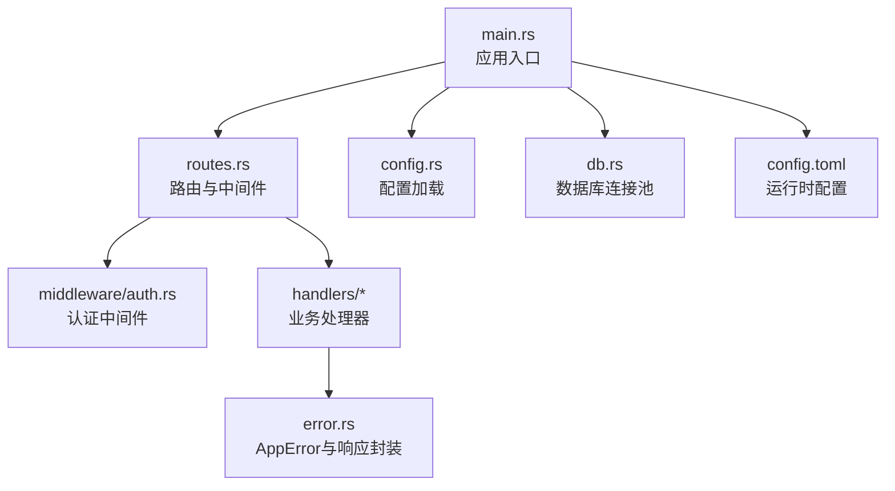
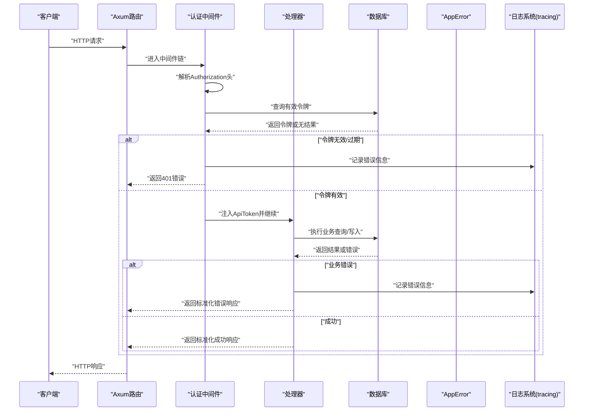
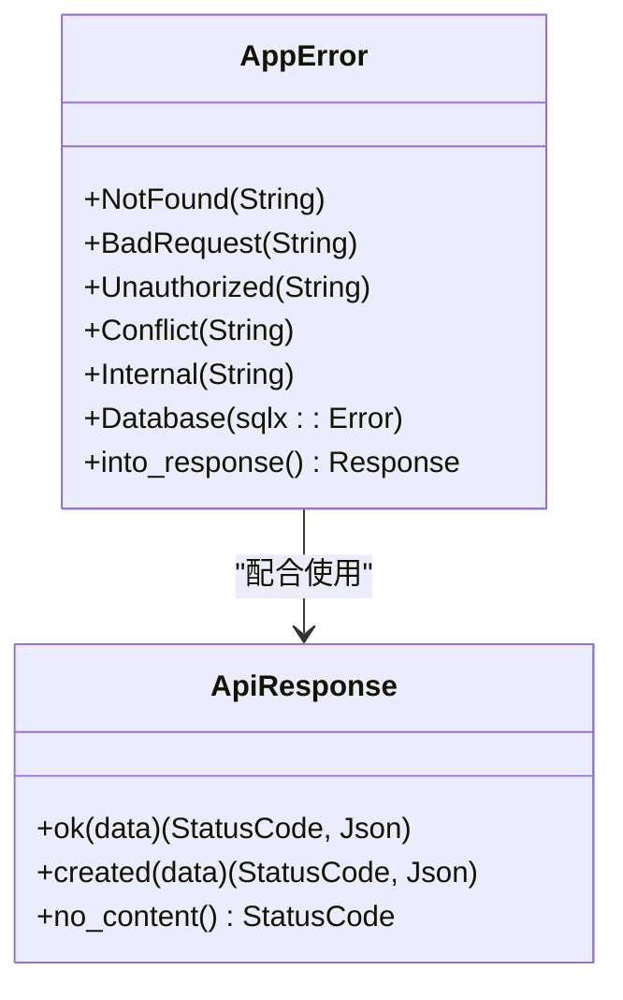
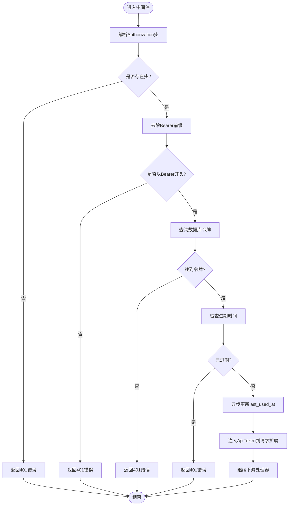
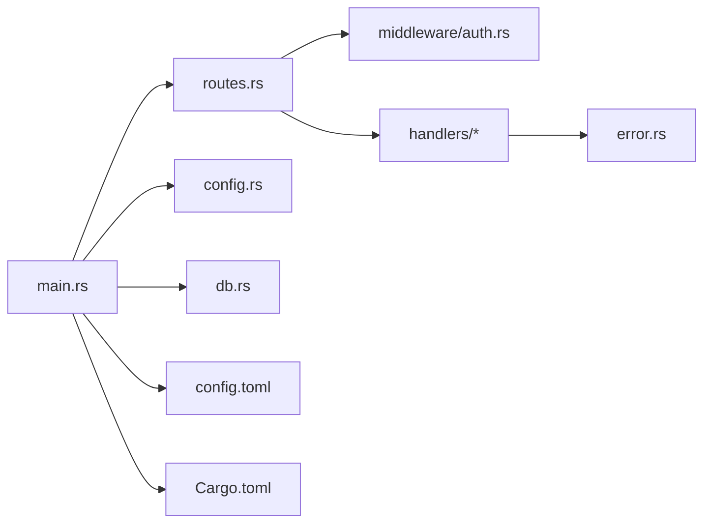

# 错误处理与日志

<cite>
**本文档引用的文件**
- [src/error.rs](file://src/error.rs)
- [src/main.rs](file://src/main.rs)
- [src/config.rs](file://src/config.rs)
- [src/middleware/auth.rs](file://src/middleware/auth.rs)
- [src/routes.rs](file://src/routes.rs)
- [src/db.rs](file://src/db.rs)
- [src/handlers/token.rs](file://src/handlers/token.rs)
- [config.toml](file://config.toml)
- [Cargo.toml](file://Cargo.toml)
</cite>

## 目录
1. [简介](#简介)
2. [项目结构](#项目结构)
3. [核心组件](#核心组件)
4. [架构总览](#架构总览)
5. [详细组件分析](#详细组件分析)
6. [依赖关系分析](#依赖关系分析)
7. [性能考虑](#性能考虑)
8. [故障排查指南](#故障排查指南)
9. [结论](#结论)

## 简介
本文件面向AI趋势监控系统的错误处理与日志系统，目标是：
- 统一错误处理机制：AppError类型定义、错误响应格式标准化、错误分类与HTTP状态码映射
- 日志系统配置与使用：日志级别设置、输出格式定制、结构化日志记录
- 错误恢复策略与故障转移机制：数据库连接池、后台任务重试策略
- 常见错误场景诊断与解决步骤
- 性能监控指标与告警配置建议
- 日志轮转与存储管理策略

## 项目结构
系统采用模块化组织，关键模块如下：
- 错误处理：统一的AppError枚举与IntoResponse实现
- 日志系统：基于tracing与tracing-subscriber，通过环境变量控制日志级别
- 路由与中间件：Axum路由注册与认证中间件
- 数据访问：SQLite连接池初始化与基础查询
- 配置管理：TOML配置解析为强类型结构体

图表来源
- [src/main.rs:63-96](file://src/main.rs#L63-L96)
- [src/routes.rs:14-50](file://src/routes.rs#L14-L50)
- [src/middleware/auth.rs:18-59](file://src/middleware/auth.rs#L18-L59)
- [src/error.rs:8-79](file://src/error.rs#L8-L79)
- [src/config.rs:52-59](file://src/config.rs#L52-L59)
- [src/db.rs:11-25](file://src/db.rs#L11-L25)
- [config.toml:1-27](file://config.toml#L1-L27)

章节来源
- [src/main.rs:63-96](file://src/main.rs#L63-L96)
- [src/routes.rs:14-50](file://src/routes.rs#L14-L50)
- [src/config.rs:52-59](file://src/config.rs#L52-L59)
- [src/db.rs:11-25](file://src/db.rs#L11-L25)
- [config.toml:1-27](file://config.toml#L1-L27)

## 核心组件
- AppError：统一错误类型，覆盖常见HTTP语义错误与数据库错误，并提供IntoResponse实现以标准化错误响应
- ApiResponse：统一成功响应封装，提供200/201/204等常用状态
- 认证中间件：从Authorization头提取Bearer令牌，校验有效性、过期时间，注入ApiToken到请求扩展
- 日志系统：通过tracing-subscriber初始化，使用环境变量过滤日志级别
- 配置系统：AppConfig结构体解析config.toml，包含服务器、数据库、认证、解析器、过滤器、推送器等配置

章节来源
- [src/error.rs:8-79](file://src/error.rs#L8-L79)
- [src/middleware/auth.rs:18-59](file://src/middleware/auth.rs#L18-L59)
- [src/main.rs:63-96](file://src/main.rs#L63-L96)
- [src/config.rs:52-59](file://src/config.rs#L52-L59)

## 架构总览
下图展示了错误处理与日志在系统中的交互路径，包括请求进入、中间件处理、处理器调用、数据库操作以及错误返回的完整流程。

图表来源
- [src/routes.rs:14-50](file://src/routes.rs#L14-L50)
- [src/middleware/auth.rs:18-59](file://src/middleware/auth.rs#L18-L59)
- [src/error.rs:23-50](file://src/error.rs#L23-L50)
- [src/db.rs:11-25](file://src/db.rs#L11-L25)

## 详细组件分析

### AppError统一错误模型
- 错误分类与HTTP映射
  - 400：BadRequest
  - 401：Unauthorized
  - 404：NotFound
  - 409：Conflict
  - 500：Internal
  - 数据库错误：自动转换为Database变体，并记录详细错误信息
- IntoResponse实现
  - 将错误映射为标准JSON响应体，包含错误码与消息字段
  - 数据库错误统一返回内部错误消息，避免泄露底层细节
- From<sqlx::Error>实现
  - RowNotFound自动映射为404
  - 其他sqlx错误映射为数据库错误

图表来源
- [src/error.rs:8-79](file://src/error.rs#L8-L79)

章节来源
- [src/error.rs:8-79](file://src/error.rs#L8-L79)

### 认证中间件与错误传播
- 功能要点
  - 从Authorization头提取Bearer令牌
  - 校验令牌存在性与格式
  - 查询数据库验证令牌有效性与未撤销状态
  - 检查过期时间
  - 更新最后使用时间（异步）
  - 注入ApiToken到请求扩展供下游处理器使用
- 错误传播
  - 任何环节失败均返回AppError，由统一错误处理层转换为HTTP响应

图表来源
- [src/middleware/auth.rs:18-59](file://src/middleware/auth.rs#L18-L59)

章节来源
- [src/middleware/auth.rs:18-59](file://src/middleware/auth.rs#L18-L59)

### 处理器中的错误与成功响应
- 成功响应
  - 使用ApiResponse封装数据，统一返回JSON结构
  - 支持200/201/204等状态码
- 错误处理
  - 处理器内部可直接返回AppError
  - 数据库查询错误通过From<sqlx::Error>自动转换
  - 示例：撤销令牌接口在确认资源不存在时返回404

章节来源
- [src/error.rs:61-79](file://src/error.rs#L61-L79)
- [src/handlers/token.rs:18-66](file://src/handlers/token.rs#L18-L66)

### 日志系统配置与使用
- 初始化方式
  - 在main中通过tracing_subscriber::fmt().with_env_filter("info").init()初始化
  - 日志级别由环境变量控制，默认info级别
- 结构化日志
  - 使用tracing::info!/warn!/error!宏进行结构化日志记录
  - 示例：启动日志、初始令牌生成提示、数据库错误记录
- 输出格式
  - 默认使用fmt格式化输出，可结合环境变量调整级别

章节来源
- [src/main.rs:63-96](file://src/main.rs#L63-L96)
- [src/error.rs:31-38](file://src/error.rs#L31-L38)

### 数据库连接池与错误恢复
- 连接池初始化
  - 最大连接数限制为5
  - 启用WAL模式与外键强制
- 错误恢复
  - AppError::Database统一捕获sqlx错误
  - 对RowNotFound自动映射为404，其他错误统一为500
  - 通过连接池重用与WAL模式提升稳定性

章节来源
- [src/db.rs:11-25](file://src/db.rs#L11-L25)
- [src/error.rs:52-59](file://src/error.rs#L52-L59)

## 依赖关系分析
- 关键依赖
  - tracing/tracing-subscriber：日志系统
  - axum/tower-http：Web框架与中间件栈
  - sqlx：数据库访问与迁移
  - serde/toml：配置解析
- 模块耦合
  - 错误处理模块被所有处理器依赖
  - 中间件依赖数据库模块进行令牌校验
  - 主程序负责日志初始化与配置加载

图表来源
- [src/main.rs:63-96](file://src/main.rs#L63-L96)
- [src/routes.rs:14-50](file://src/routes.rs#L14-L50)
- [src/error.rs:8-79](file://src/error.rs#L8-L79)
- [Cargo.toml:6-44](file://Cargo.toml#L6-L44)

章节来源
- [Cargo.toml:6-44](file://Cargo.toml#L6-L44)
- [src/main.rs:63-96](file://src/main.rs#L63-L96)

## 性能考虑
- 日志级别控制
  - 生产环境建议使用warn/info级别，减少I/O开销
  - 通过环境变量动态调整，避免重启
- 数据库连接池
  - 当前最大连接数为5，可根据并发需求调整
  - WAL模式提升读写性能，但需注意磁盘空间管理
- 异步更新
  - 令牌最后使用时间更新采用fire-and-forget，避免阻塞主请求链路

## 故障排查指南
- 常见错误场景与诊断步骤
  - 401 未授权
    - 检查Authorization头格式是否为Bearer
    - 核对令牌是否有效、未撤销、未过期
    - 查看日志中关于令牌校验的信息
  - 404 资源不存在
    - 确认请求路径与资源ID是否正确
    - 检查数据库中对应记录是否存在
  - 500 内部错误
    - 查看数据库错误日志，定位具体SQL问题
    - 检查连接池状态与WAL模式配置
- 解决步骤
  - 重新生成有效令牌并替换请求头
  - 核对配置文件路径与权限
  - 增加日志级别到debug以获取更详细上下文
  - 检查磁盘空间与数据库文件权限

章节来源
- [src/middleware/auth.rs:18-59](file://src/middleware/auth.rs#L18-L59)
- [src/error.rs:23-50](file://src/error.rs#L23-L50)
- [src/db.rs:11-25](file://src/db.rs#L11-L25)

## 结论
本系统通过AppError实现了统一的错误模型与标准化响应格式，结合tracing日志系统提供了清晰的可观测性。认证中间件确保了API访问的安全性，数据库层通过连接池与WAL模式提升了稳定性。建议在生产环境中进一步完善：
- 配置独立的日志轮转策略与保留周期
- 增加健康检查与性能指标上报
- 完善告警规则与故障转移机制