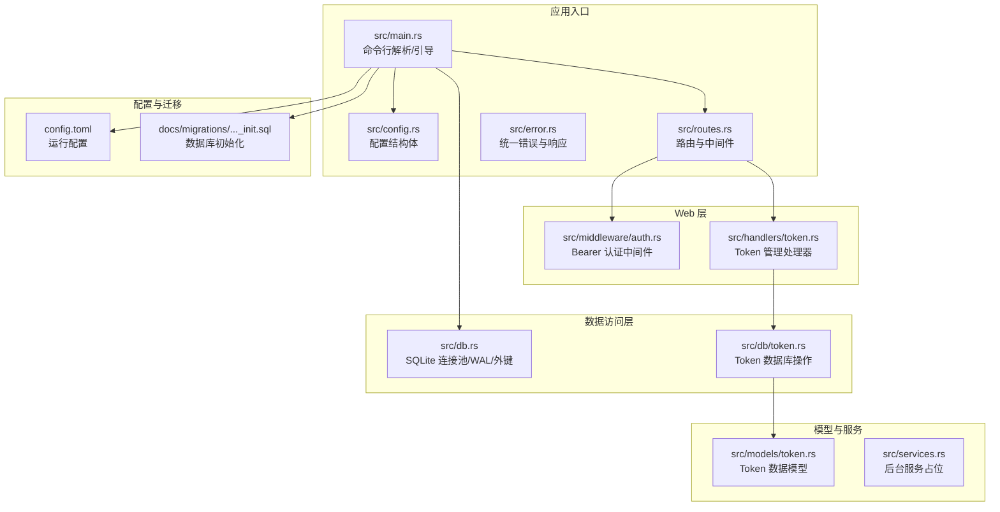
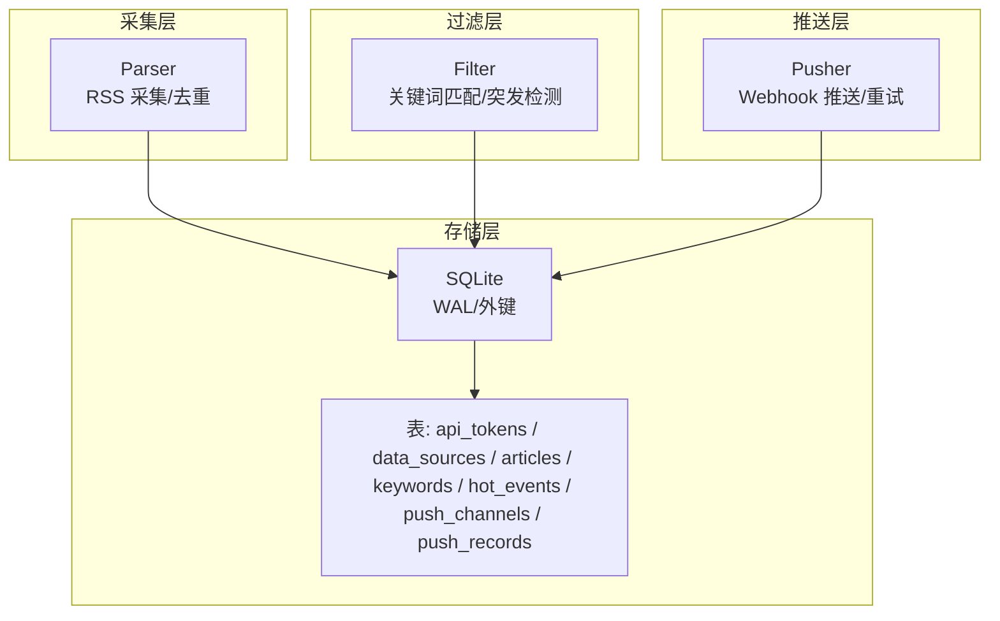
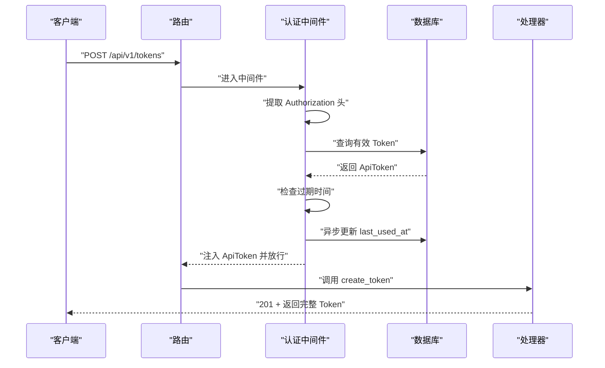
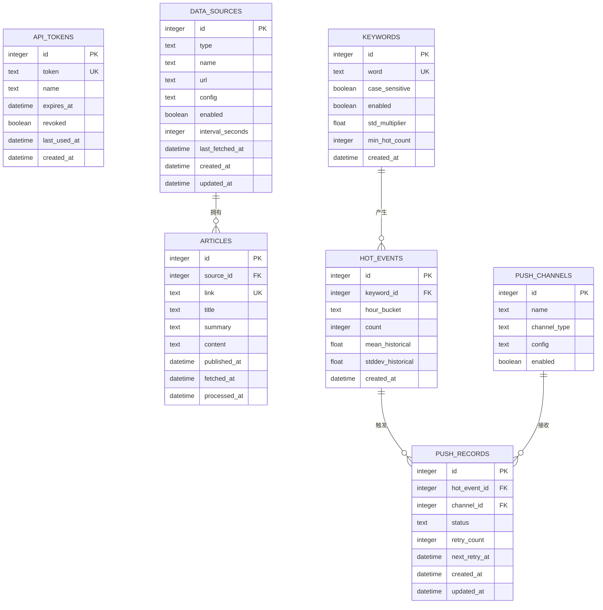
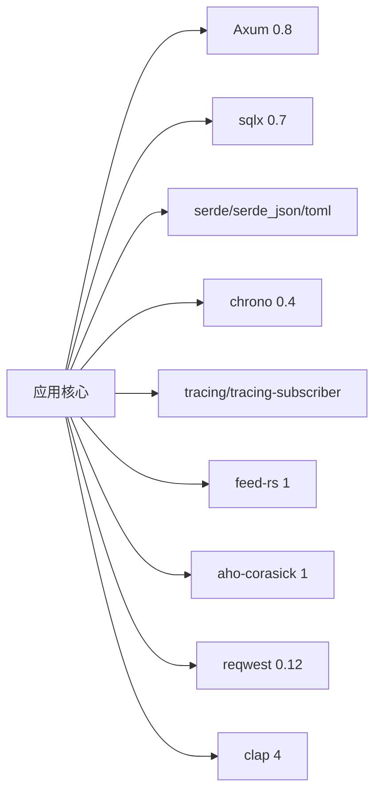

# 项目概述

<cite>
**本文引用的文件**
- [README.md](file://README.md)
- [Cargo.toml](file://Cargo.toml)
- [src/main.rs](file://src/main.rs)
- [src/db.rs](file://src/db.rs)
- [src/routes.rs](file://src/routes.rs)
- [src/config.rs](file://src/config.rs)
- [src/error.rs](file://src/error.rs)
- [src/middleware/auth.rs](file://src/middleware/auth.rs)
- [src/handlers/token.rs](file://src/handlers/token.rs)
- [src/models/token.rs](file://src/models/token.rs)
- [src/db/token.rs](file://src/db/token.rs)
- [src/services.rs](file://src/services.rs)
- [config.toml](file://config.toml)
- [docs/migrations/20260607044921_init.sql](file://docs/migrations/20260607044921_init.sql)
</cite>

## 目录
1. [引言](#引言)
2. [项目结构](#项目结构)
3. [核心组件](#核心组件)
4. [架构总览](#架构总览)
5. [详细组件分析](#详细组件分析)
6. [依赖分析](#依赖分析)
7. [性能考虑](#性能考虑)
8. [故障排除指南](#故障排除指南)
9. [结论](#结论)
10. [附录](#附录)

## 引言
AI-Trend-Tool 是一个基于 Rust 的 AI 趋势监测与告警平台，旨在自动采集 RSS 内容，通过关键词匹配与统计突发检测识别热点事件，并通过 Webhook 推送到钉钉/飞书等即时通讯平台。项目采用模块化的后台流水线设计，支持独立或组合运行多个后台模块，具备完善的认证与授权体系、统一的错误与响应格式，以及基于 SQLite 的轻量级持久化方案。

本项目的核心价值在于：
- 自动化：从 RSS 采集到热点检测再到告警推送，形成完整的自动化流水线。
- 可靠性：通过指数退避重试、乐观锁与 WAL 模式提升稳定性与一致性。
- 可扩展性：模块化设计便于后续扩展 CRUD API、前端可视化与更复杂的分析算法。
- 易用性：提供初始 Token 引导、健康检查与统一 API 规范，降低部署与集成成本。

## 项目结构
项目采用按职责分层的模块化组织方式，核心目录与文件如下：
- 配置与入口
  - 配置文件：config.toml
  - 应用入口：src/main.rs
  - 配置解析：src/config.rs
- Web 层
  - 路由注册：src/routes.rs
  - 中间件：src/middleware/auth.rs
  - 处理器：src/handlers/token.rs
- 数据访问层
  - 连接池初始化：src/db.rs
  - 数据库操作：src/db/*.rs
- 模型定义
  - 数据模型：src/models/*.rs
- 服务模块
  - 后台服务占位：src/services.rs
- 数据库迁移
  - 初始化迁移：docs/migrations/20260607044921_init.sql
- 依赖与技术栈
  - 依赖清单：Cargo.toml

**图表来源**
- [src/main.rs:1-96](file://src/main.rs#L1-L96)
- [src/config.rs:1-59](file://src/config.rs#L1-L59)
- [src/routes.rs:1-48](file://src/routes.rs#L1-L48)
- [src/error.rs:1-79](file://src/error.rs#L1-L79)
- [src/middleware/auth.rs:1-60](file://src/middleware/auth.rs#L1-L60)
- [src/handlers/token.rs:1-66](file://src/handlers/token.rs#L1-L66)
- [src/db.rs:1-26](file://src/db.rs#L1-L26)
- [src/db/token.rs:1-107](file://src/db/token.rs#L1-L107)
- [src/models/token.rs:1-46](file://src/models/token.rs#L1-L46)
- [src/services.rs:1-6](file://src/services.rs#L1-L6)
- [config.toml:1-27](file://config.toml#L1-L27)
- [docs/migrations/20260607044921_init.sql:1-118](file://docs/migrations/20260607044921_init.sql#L1-L118)

**章节来源**
- [README.md:216-257](file://README.md#L216-L257)
- [src/main.rs:63-96](file://src/main.rs#L63-L96)
- [src/routes.rs:14-48](file://src/routes.rs#L14-L48)
- [src/db.rs:11-26](file://src/db.rs#L11-L26)
- [docs/migrations/20260607044921_init.sql:1-118](file://docs/migrations/20260607044921_init.sql#L1-L118)

## 核心组件
- 应用入口与引导
  - 命令行参数解析：支持 --config 与运行模式（all/api/parser/filter/pusher）
  - 首次启动引导：确保至少存在一个 API Token，必要时自动生成并打印
  - 数据库初始化：创建目录、初始化连接池、执行迁移
- 配置系统
  - TOML 配置文件映射为结构体，包含服务器、数据库、认证、采集、过滤、推送等配置段
- Web 服务
  - 健康检查 /health
  - Token 管理 API：创建、列表、撤销
  - Bearer Token 认证中间件：校验、过期检查、最后使用时间更新
- 数据层
  - SQLite 连接池：WAL 模式、外键约束
  - Token 表：唯一 token、可选过期时间、软撤销、最后使用时间
- 服务模块（开发中）
  - Parser/Filter/Pusher 占位，后续实现 RSS 采集、关键词匹配与热点检测、Webhook 推送

**章节来源**
- [src/main.rs:16-61](file://src/main.rs#L16-L61)
- [src/config.rs:52-59](file://src/config.rs#L52-L59)
- [src/routes.rs:14-48](file://src/routes.rs#L14-L48)
- [src/middleware/auth.rs:18-59](file://src/middleware/auth.rs#L18-L59)
- [src/handlers/token.rs:18-66](file://src/handlers/token.rs#L18-L66)
- [src/db.rs:11-26](file://src/db.rs#L11-L26)
- [src/db/token.rs:6-107](file://src/db/token.rs#L6-L107)
- [src/services.rs:1-6](file://src/services.rs#L1-L6)

## 架构总览
系统采用“管道模式”的后台流水线，三个模块独立运行：
- Parser：按配置周期拉取 RSS，去重后写入 articles 表
- Filter：每 5 分钟运行，关键词匹配（Aho-Corasick）、小时桶计数、统计突发检测，生成 hot_events 与待推送记录
- Pusher：每 10 秒轮询 push_records（status=pending），POST Webhook，指数退避重试（最多 3 次），乐观锁防重复

**图表来源**
- [README.md:7-23](file://README.md#L7-L23)
- [docs/migrations/20260607044921_init.sql:1-118](file://docs/migrations/20260607044921_init.sql#L1-L118)

**章节来源**
- [README.md:7-23](file://README.md#L7-L23)

## 详细组件分析

### 认证与 Token 管理
- 认证中间件
  - 提取 Authorization 头，校验 Bearer 格式
  - 查询数据库验证 Token（非撤销）
  - 检查过期时间
  - 异步更新 last_used_at
  - 将 ApiToken 注入请求上下文
- Token 管理 API
  - 创建：生成 64 字节随机十六进制 Token，返回明文一次
  - 列表：返回 ApiTokenInfo（隐藏明文）
  - 撤销：软删除（revoked=1）

**图表来源**
- [src/middleware/auth.rs:18-59](file://src/middleware/auth.rs#L18-L59)
- [src/db/token.rs:40-59](file://src/db/token.rs#L40-L59)
- [src/handlers/token.rs:18-30](file://src/handlers/token.rs#L18-L30)

**章节来源**
- [src/middleware/auth.rs:18-59](file://src/middleware/auth.rs#L18-L59)
- [src/handlers/token.rs:18-66](file://src/handlers/token.rs#L18-L66)
- [src/db/token.rs:6-107](file://src/db/token.rs#L6-L107)
- [src/models/token.rs:5-46](file://src/models/token.rs#L5-L46)

### 数据库与模型
- 连接池初始化
  - sqlite: 路径 + rwc 模式
  - WAL 模式与外键约束开启
- 表结构要点
  - api_tokens：唯一 token、可选过期、软撤销、最后使用时间
  - data_sources：RSS/Atom/JSON Feed 类型、拉取间隔、启用状态
  - articles：link 唯一、source_id 外键、processed_at 追踪处理状态
  - keywords：关键词、大小写敏感、统计阈值参数
  - hot_events：小时桶统计、历史均值与标准差
  - push_channels：Webhook 配置
  - push_records：热点-渠道组合的推送状态与重试追踪

**图表来源**
- [docs/migrations/20260607044921_init.sql:4-118](file://docs/migrations/20260607044921_init.sql#L4-L118)

**章节来源**
- [src/db.rs:11-26](file://src/db.rs#L11-L26)
- [docs/migrations/20260607044921_init.sql:4-118](file://docs/migrations/20260607044921_init.sql#L4-L118)

### 错误处理与统一响应
- 错误类型覆盖常见 HTTP 状态：400/401/404/409/500
- 数据库错误统一转换为内部错误并记录日志
- 成功响应统一包装为 { "data": ... }，空响应返回 204

**章节来源**
- [src/error.rs:8-79](file://src/error.rs#L8-L79)

## 依赖分析
- 语言与运行时
  - Rust 2021 Edition + Tokio 全功能运行时
- Web 框架
  - Axum 0.8 + Tower + Tower-HTTP（CORS、Trace）
- 数据库
  - sqlx 0.7（SQLite、WAL、迁移）
- 序列化与配置
  - serde、serde_json、toml
- 时间与时序
  - chrono
- 日志与可观测性
  - tracing + tracing-subscriber
- RSS 解析与字符串匹配
  - feed-rs、aho-corasick
- HTTP 客户端
  - reqwest（Webhook 推送）
- CLI
  - clap 4

**图表来源**
- [Cargo.toml:6-44](file://Cargo.toml#L6-L44)

**章节来源**
- [Cargo.toml:6-44](file://Cargo.toml#L6-L44)

## 性能考虑
- 数据库
  - 使用 WAL 模式提升并发读写性能
  - 外键约束保证数据一致性
  - 为 articles、hot_events、push_records 等关键字段建立索引
- 网络与并发
  - Parser 支持最大并发采集数配置
  - Pusher 使用指数退避与乐观锁，避免重复推送与抖动
- 时间与统计
  - Filter 以小时桶聚合，滑动窗口计算均值与标准差，兼顾实时性与稳定性

**章节来源**
- [src/db.rs:18-25](file://src/db.rs#L18-L25)
- [docs/migrations/20260607044921_init.sql:45-118](file://docs/migrations/20260607044921_init.sql#L45-L118)
- [README.md:273-289](file://README.md#L273-L289)

## 故障排除指南
- 首次启动无 Token
  - 系统会在 api_tokens 为空时自动创建初始管理员 Token，并通过日志警告输出
- 认证失败
  - 检查 Authorization 头是否为 Bearer 格式
  - 确认 Token 未撤销且未过期
  - 查看 last_used_at 是否正常更新
- 数据库问题
  - 确认数据库路径存在且可写
  - 检查 WAL 模式与外键约束是否生效
  - 核对迁移是否成功执行
- API 响应
  - 统一错误响应包含 code 与 message，便于定位问题

**章节来源**
- [src/main.rs:29-61](file://src/main.rs#L29-L61)
- [src/middleware/auth.rs:23-46](file://src/middleware/auth.rs#L23-L46)
- [src/error.rs:23-50](file://src/error.rs#L23-L50)
- [src/db.rs:18-25](file://src/db.rs#L18-L25)

## 结论
AI-Trend-Tool 以 Rust 为核心，结合 Axum、sqlx、feed-rs、aho-corasick 等成熟生态，构建了一个可扩展、可维护的 AI 趋势监测平台。其模块化流水线设计与完善的认证、错误处理、数据库约束，为后续扩展 CRUD API、可视化界面与更复杂的分析算法奠定了坚实基础。项目适合需要自动化热点监测与告警的团队与个人使用。

## 附录
- 快速开始
  - 构建与运行：cargo build --release；cargo run -- --config config.toml all
  - 仅运行 API 服务：cargo run -- --config config.toml api
  - 仅运行 Parser/Filter/Pusher：分别传入相应模式
- 配置说明
  - server：监听地址与端口
  - database：SQLite 路径
  - auth：initial_token（可选）
  - parser/filter/pusher：各模块运行参数
- API 接口
  - /health：健康检查
  - /api/v1/tokens：创建、列表、撤销 Token
  - 其余接口按开发计划逐步实现

**章节来源**
- [README.md:38-121](file://README.md#L38-L121)
- [config.toml:1-27](file://config.toml#L1-L27)
- [src/main.rs:63-96](file://src/main.rs#L63-L96)