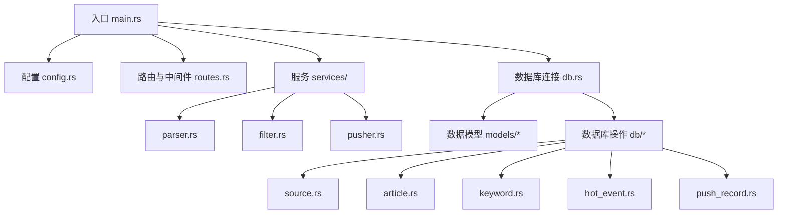
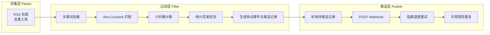
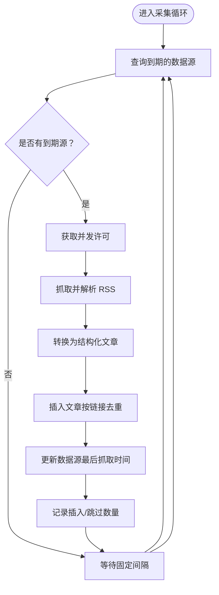
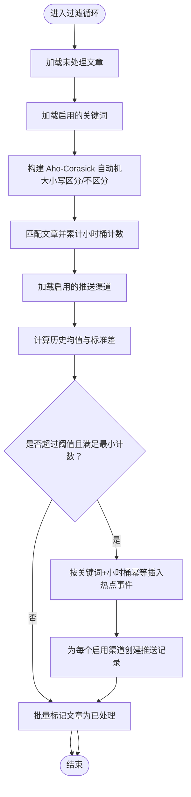
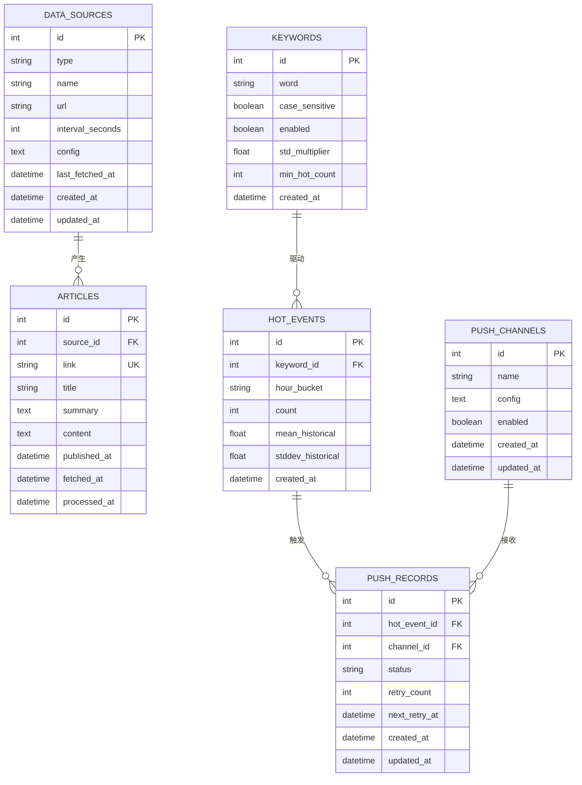
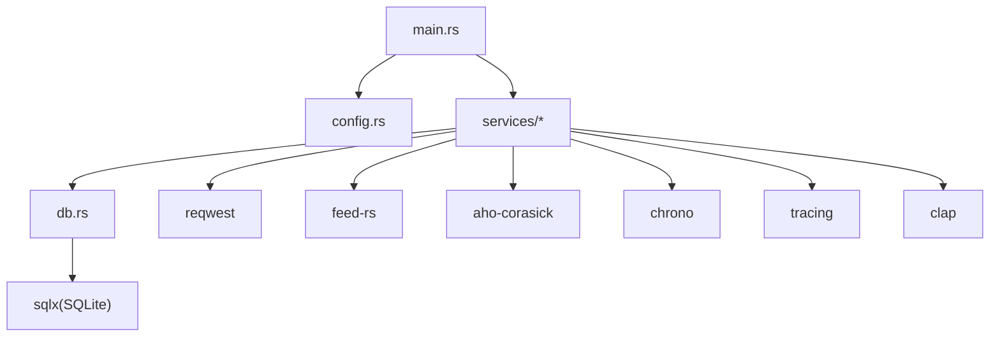

# 项目概述

<cite>
**本文引用的文件**
- [README.md](file://README.md)
- [Cargo.toml](file://Cargo.toml)
- [src/main.rs](file://src/main.rs)
- [src/config.rs](file://src/config.rs)
- [src/services/parser.rs](file://src/services/parser.rs)
- [src/services/filter.rs](file://src/services/filter.rs)
- [src/services/pusher.rs](file://src/services/pusher.rs)
- [src/db.rs](file://src/db.rs)
- [src/db/source.rs](file://src/db/source.rs)
- [src/db/article.rs](file://src/db/article.rs)
- [src/db/keyword.rs](file://src/db/keyword.rs)
- [src/db/hot_event.rs](file://src/db/hot_event.rs)
- [src/db/push_record.rs](file://src/db/push_record.rs)
- [src/models/article.rs](file://src/models/article.rs)
- [src/models/keyword.rs](file://src/models/keyword.rs)
- [src/models/hot_event.rs](file://src/models/hot_event.rs)
- [src/models/push_record.rs](file://src/models/push_record.rs)
</cite>

## 目录
1. [简介](#简介)
2. [项目结构](#项目结构)
3. [核心组件](#核心组件)
4. [架构总览](#架构总览)
5. [详细组件分析](#详细组件分析)
6. [依赖分析](#依赖分析)
7. [性能考虑](#性能考虑)
8. [故障排查指南](#故障排查指南)
9. [结论](#结论)
10. [附录](#附录)

## 简介
本项目是一个基于 Rust 的 AI 趋势热点监控系统，采用管道模式（Pipeline）架构，通过 RSS 内容采集、关键词匹配（Aho-Corasick 算法）与统计突发检测，识别 AI 领域的趋势热点，并通过 Webhook 推送告警。系统支持独立或组合运行多个后台模块，具备高内聚、低耦合、可扩展的特性，适合在企业内部或研究团队中用于持续跟踪 AI 相关动态。

- 系统目标：自动化采集、关键词识别、热点检测、可靠推送
- 架构理念：模块化管道、异步并发、幂等与重试、可观测性
- 功能特性：RSS 采集、多模式关键词匹配、小时级突发检测、Webhook 推送、令牌认证、数据库迁移

**章节来源**
- [README.md:1-293](file://README.md#L1-L293)

## 项目结构
项目采用“分层 + 模块化”的组织方式，核心目录与职责如下：
- src/main.rs：入口点、CLI 参数解析、模块编排与 API 服务器启动
- src/config.rs：应用配置结构体与 TOML 解析
- src/services/：业务逻辑层（Parser/Filter/Pusher）
- src/db/ 与 src/models/：数据库访问层与数据模型
- docs/：数据库迁移、API 设计与实施计划
- Cargo.toml：依赖与构建配置



**图表来源**
- [src/main.rs:64-164](file://src/main.rs#L64-L164)
- [src/config.rs:1-58](file://src/config.rs#L1-L58)
- [src/db.rs:1-27](file://src/db.rs#L1-L27)

**章节来源**
- [README.md:216-257](file://README.md#L216-L257)
- [Cargo.toml:1-67](file://Cargo.toml#L1-L67)

## 核心组件
- 管道模块（Parser/Filter/Pusher）：三段式流水线，分别负责采集、过滤与推送
- 配置系统：集中管理服务端、数据库、认证、采集、过滤、推送的配置项
- 数据模型与数据库层：围绕文章、关键词、热点事件、推送记录与数据源进行建模与持久化
- API 与认证：基于 Axum 的 REST API，配合 Bearer Token 认证与中间件

**章节来源**
- [src/main.rs:87-160](file://src/main.rs#L87-L160)
- [src/config.rs:3-58](file://src/config.rs#L3-L58)
- [src/services/parser.rs:94-185](file://src/services/parser.rs#L94-L185)
- [src/services/filter.rs:13-277](file://src/services/filter.rs#L13-L277)
- [src/services/pusher.rs:11-259](file://src/services/pusher.rs#L11-L259)

## 架构总览
系统采用“管道模式（Pipeline）”：
- Parser：周期性拉取 RSS，去重入库，标记已处理
- Filter：批量读取未处理文章，Aho-Corasick 匹配关键词，小时桶计数，统计突发检测，生成热点事件与推送记录
- Pusher：轮询待推送记录，POST Webhook，指数退避重试，乐观锁防重复



**图表来源**
- [src/services/parser.rs:94-185](file://src/services/parser.rs#L94-L185)
- [src/services/filter.rs:13-277](file://src/services/filter.rs#L13-L277)
- [src/services/pusher.rs:11-259](file://src/services/pusher.rs#L11-L259)

## 详细组件分析

### Parser 模块（RSS 采集）
- 职责：按配置周期拉取 RSS，解析为结构化文章，去重写入 articles 表，更新数据源最后抓取时间
- 并发控制：信号量限制最大并发抓取数
- 错误处理：抓取失败仍更新 last_fetched，避免频繁重试
- 时间策略：固定周期轮询待抓取数据源



**图表来源**
- [src/services/parser.rs:94-185](file://src/services/parser.rs#L94-L185)
- [src/db/source.rs:119-133](file://src/db/source.rs#L119-L133)
- [src/db/article.rs:6-29](file://src/db/article.rs#L6-L29)

**章节来源**
- [src/services/parser.rs:94-185](file://src/services/parser.rs#L94-L185)
- [src/db/source.rs:119-133](file://src/db/source.rs#L119-L133)
- [src/db/article.rs:6-29](file://src/db/article.rs#L6-L29)

### Filter 模块（关键词匹配与突发检测）
- 职责：批量处理未处理文章，构建 Aho-Corasick 自动机，匹配关键词，按小时桶统计，计算历史均值与标准差，触发热点并生成推送记录，最后批量标记文章为已处理
- 关键词匹配：区分大小写与不区分大小写的两套自动机
- 突发检测：滑动窗口（默认 24 小时）计算均值与标准差，阈值 = 均值 + 标准差倍数 × 标准差，同时满足最小热点计数
- 幂等与去重：热点事件按关键词+小时桶唯一，避免重复



**图表来源**
- [src/services/filter.rs:13-277](file://src/services/filter.rs#L13-L277)
- [src/db/keyword.rs:27-31](file://src/db/keyword.rs#L27-L31)
- [src/db/hot_event.rs:105-124](file://src/db/hot_event.rs#L105-L124)
- [src/db/push_record.rs:20-43](file://src/db/push_record.rs#L20-L43)

**章节来源**
- [src/services/filter.rs:13-277](file://src/services/filter.rs#L13-L277)
- [src/db/keyword.rs:27-31](file://src/db/keyword.rs#L27-L31)
- [src/db/hot_event.rs:105-124](file://src/db/hot_event.rs#L105-L124)
- [src/db/push_record.rs:20-43](file://src/db/push_record.rs#L20-L43)

### Pusher 模块（Webhook 推送与重试）
- 职责：轮询待推送与可重试记录，构造钉钉/飞书文本消息，POST Webhook，根据结果更新状态
- 重试策略：指数退避（基础秒数 × 2^重试次数），最多重试指定次数
- 幂等与并发：乐观锁（期望状态匹配）防止并发重复推送；失败时设置下次重试时间
- 渠道配置：从渠道配置 JSON 中提取 Webhook URL

```mermaid
sequenceDiagram
participant Loop as "Pusher 循环"
participant DB as "数据库"
participant Ch as "推送渠道"
participant Ev as "热点事件"
participant KW as "关键词"
participant HTTP as "Webhook 服务"
Loop->>DB : 查询待推送/可重试记录
DB-->>Loop : 返回可推送列表
loop 对每条记录
Loop->>DB : 读取渠道配置
DB-->>Loop : 返回渠道信息
Loop->>DB : 读取热点事件与关键词
DB-->>Loop : 返回事件与关键词
Loop->>HTTP : POST 文本消息
alt 成功
Loop->>DB : 乐观锁更新为成功
else 失败
Loop->>DB : 更新失败状态与下次重试时间
end
end
```

**图表来源**
- [src/services/pusher.rs:11-259](file://src/services/pusher.rs#L11-L259)
- [src/db/push_record.rs:45-109](file://src/db/push_record.rs#L45-L109)
- [src/db/channel.rs:1-200](file://src/db/channel.rs#L1-L200)
- [src/db/hot_event.rs:50-58](file://src/db/hot_event.rs#L50-L58)
- [src/db/keyword.rs:33-38](file://src/db/keyword.rs#L33-L38)

**章节来源**
- [src/services/pusher.rs:11-259](file://src/services/pusher.rs#L11-L259)
- [src/db/push_record.rs:45-109](file://src/db/push_record.rs#L45-L109)

### 数据模型与数据库层
- 数据模型：Article、Keyword、HotEvent、PushRecord、DataSource 等
- 数据库层：封装 CRUD 操作，支持分页、过滤、批量更新、幂等插入
- 连接与模式：SQLite 连接池、WAL 模式、外键约束



**图表来源**
- [src/models/article.rs:5-25](file://src/models/article.rs#L5-L25)
- [src/models/keyword.rs:5-32](file://src/models/keyword.rs#L5-L32)
- [src/models/hot_event.rs:5-15](file://src/models/hot_event.rs#L5-L15)
- [src/models/push_record.rs:5-16](file://src/models/push_record.rs#L5-L16)
- [src/db/source.rs:5-22](file://src/db/source.rs#L5-L22)
- [src/db/article.rs:6-29](file://src/db/article.rs#L6-L29)
- [src/db/keyword.rs:5-19](file://src/db/keyword.rs#L5-L19)
- [src/db/hot_event.rs:5-24](file://src/db/hot_event.rs#L5-L24)
- [src/db/push_record.rs:6-18](file://src/db/push_record.rs#L6-L18)

**章节来源**
- [src/models/article.rs:5-25](file://src/models/article.rs#L5-L25)
- [src/models/keyword.rs:5-32](file://src/models/keyword.rs#L5-L32)
- [src/models/hot_event.rs:5-15](file://src/models/hot_event.rs#L5-L15)
- [src/models/push_record.rs:5-16](file://src/models/push_record.rs#L5-L16)
- [src/db.rs:10-27](file://src/db.rs#L10-L27)

## 依赖分析
- Web 框架与中间件：Axum + Tower（路由、CORS、trace）
- 数据库：sqlx + SQLite（WAL 模式、外键）
- RSS 解析：feed-rs
- 字符串匹配：Aho-Corasick
- HTTP 客户端：reqwest（Webhook 推送）
- 序列化：serde / serde_json / toml
- 时间与日志：chrono / tracing
- CLI：clap
- 并发与异步：tokio、async-trait



**图表来源**
- [Cargo.toml:6-46](file://Cargo.toml#L6-L46)
- [src/main.rs:64-164](file://src/main.rs#L64-L164)

**章节来源**
- [Cargo.toml:6-46](file://Cargo.toml#L6-L46)

## 性能考虑
- 并发抓取：Parser 使用信号量限制最大并发，避免资源争用
- 批量处理：Filter 使用批大小限制一次性处理的文章数，降低内存压力
- 数据库优化：SQLite WAL 模式提升并发写入性能；批量更新文章处理状态避免变量上限
- 统计效率：小时桶计数与滑动窗口统计，减少全表扫描
- 推送幂等：乐观锁与唯一约束，避免重复推送与死锁竞争

**章节来源**
- [src/services/parser.rs:94-185](file://src/services/parser.rs#L94-L185)
- [src/services/filter.rs:13-277](file://src/services/filter.rs#L13-L277)
- [src/db/article.rs:124-140](file://src/db/article.rs#L124-L140)
- [src/db/push_record.rs:20-43](file://src/db/push_record.rs#L20-L43)

## 故障排查指南
- 初始化 Token 问题：首次启动若未配置初始 Token，系统会自动生成并在日志中输出，请妥善保存
- 数据库迁移：首次启动自动执行迁移，确认数据库路径与权限正确
- Parser 抓取失败：检查 RSS 地址、网络连通性与超时设置；失败也会更新 last_fetched 避免频繁重试
- Filter 无热点：确认关键词已启用、历史窗口足够、阈值参数合理
- Pusher 推送失败：查看渠道配置 JSON 是否包含有效 URL；关注重试次数与下次重试时间；乐观锁失败表示被其他进程抢先更新

**章节来源**
- [src/main.rs:27-62](file://src/main.rs#L27-L62)
- [src/main.rs:80-84](file://src/main.rs#L80-L84)
- [src/services/parser.rs:170-181](file://src/services/parser.rs#L170-L181)
- [src/services/pusher.rs:115-128](file://src/services/pusher.rs#L115-L128)
- [src/db/push_record.rs:86-109](file://src/db/push_record.rs#L86-L109)

## 结论
本项目以管道模式为核心，将 RSS 采集、关键词匹配与统计突发检测有机结合，形成从数据采集到热点发现再到可靠推送的完整闭环。通过模块化设计与幂等、重试、乐观锁等机制，系统在可靠性与可维护性方面具备良好表现。结合 SQLite 与 Rust 的高性能特性，适合中小规模到中等规模的 AI 趋势监控场景。

## 附录
- 快速开始与配置参考见 README
- API 设计与错误响应格式见 README
- 数据库迁移与表结构见 docs/migrations 与 README

**章节来源**
- [README.md:38-293](file://README.md#L38-L293)