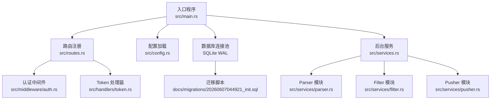
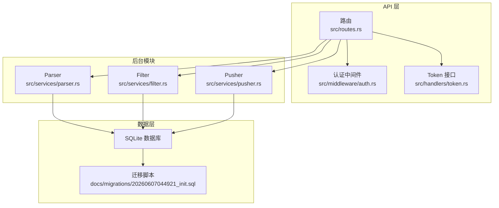
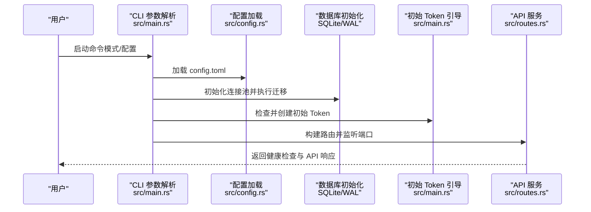
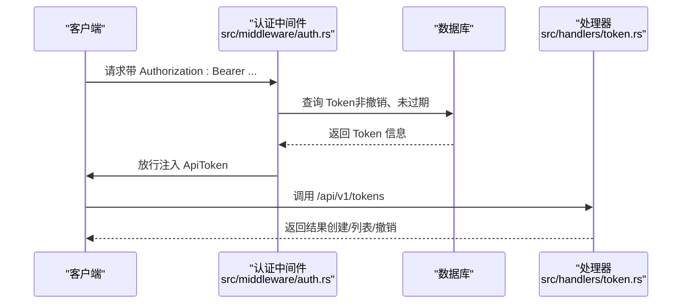
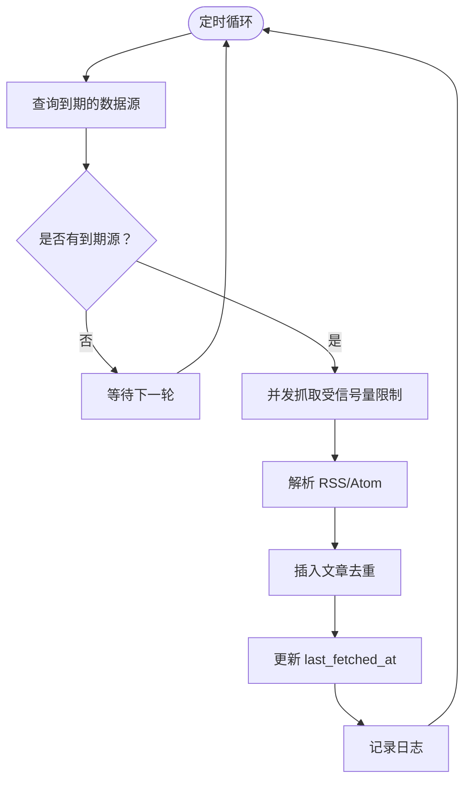
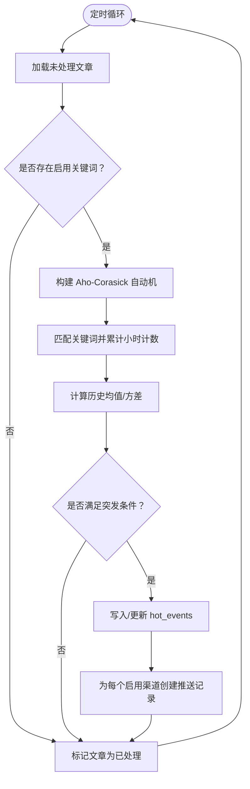
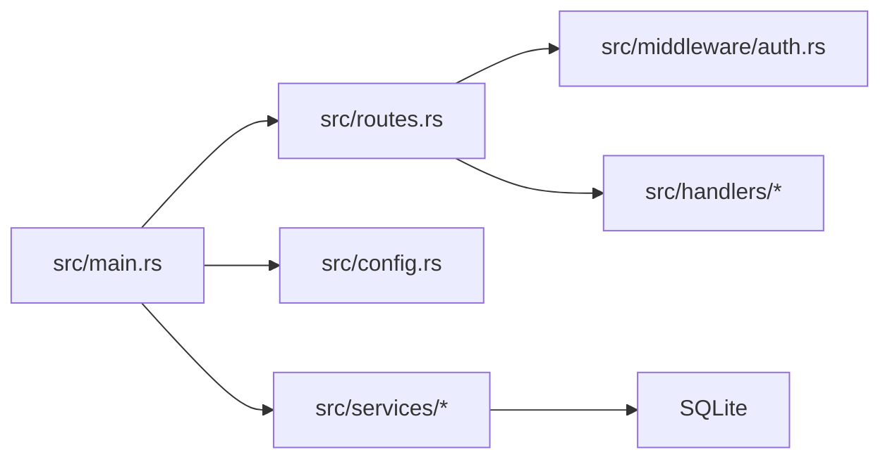

# 快速开始

<cite>
**本文引用的文件**
- [README.md](file://README.md)
- [Cargo.toml](file://Cargo.toml)
- [config.toml](file://config.toml)
- [src/main.rs](file://src/main.rs)
- [src/config.rs](file://src/config.rs)
- [src/routes.rs](file://src/routes.rs)
- [src/services.rs](file://src/services.rs)
- [src/services/parser.rs](file://src/services/parser.rs)
- [src/services/filter.rs](file://src/services/filter.rs)
- [src/services/pusher.rs](file://src/services/pusher.rs)
- [src/middleware/auth.rs](file://src/middleware/auth.rs)
- [src/handlers/token.rs](file://src/handlers/token.rs)
- [docs/migrations/20260607044921_init.sql](file://docs/migrations/20260607044921_init.sql)
</cite>

## 目录
1. [简介](#简介)
2. [项目结构](#项目结构)
3. [核心组件](#核心组件)
4. [架构总览](#架构总览)
5. [详细组件分析](#详细组件分析)
6. [依赖关系分析](#依赖关系分析)
7. [性能考虑](#性能考虑)
8. [故障排查指南](#故障排查指南)
9. [结论](#结论)
10. [附录](#附录)

## 简介
本指南面向首次部署与运行 AI 趋势监控系统的用户，覆盖环境准备、项目克隆、构建与运行、配置文件编辑、初始 Token 获取与使用、多运行模式示例、常见问题排查以及简单测试验证步骤。系统采用 Rust 与 SQLite，支持独立或组合运行 Parser、Filter、Pusher 三大后台模块，并提供 REST API 与认证中间件。

## 项目结构
- 顶层配置与文档
  - 配置文件：config.toml（默认路径）
  - 迁移脚本：docs/migrations/20260607044921_init.sql
  - 项目说明：README.md
- 源代码组织
  - 入口与配置：src/main.rs、src/config.rs
  - 路由与中间件：src/routes.rs、src/middleware/auth.rs
  - 业务服务：src/services.rs 及其子模块（parser、filter、pusher）
  - API 处理器：src/handlers/token.rs（Token 管理）
  - 数据库与模型：src/db/*.rs、src/models/*.rs
  - 依赖声明：Cargo.toml



图表来源
- [src/main.rs:63-96](file://src/main.rs#L63-L96)
- [src/routes.rs:14-67](file://src/routes.rs#L14-L67)
- [src/config.rs:52-59](file://src/config.rs#L52-L59)
- [src/services.rs:1-4](file://src/services.rs#L1-L4)
- [docs/migrations/20260607044921_init.sql:1-118](file://docs/migrations/20260607044921_init.sql#L1-L118)

章节来源
- [README.md:216-257](file://README.md#L216-L257)
- [src/main.rs:63-96](file://src/main.rs#L63-L96)
- [src/config.rs:52-59](file://src/config.rs#L52-L59)
- [src/routes.rs:14-67](file://src/routes.rs#L14-L67)
- [src/services.rs:1-4](file://src/services.rs#L1-L4)
- [docs/migrations/20260607044921_init.sql:1-118](file://docs/migrations/20260607044921_init.sql#L1-L118)

## 核心组件
- CLI 与启动流程
  - 支持通过命令行选择运行模式：all、api、parser、filter、pusher
  - 自动创建数据库目录、初始化连接池、执行迁移
  - 首次启动自动生成初始管理员 Token 或使用配置中的初始 Token
- 配置系统
  - TOML 格式，包含 server、database、auth、parser、filter、pusher 各段
  - 运行时加载并反序列化为结构体
- 认证与 API
  - Bearer Token 认证中间件，除健康检查外所有 /api/v1/* 路由均需认证
  - 提供 Token 的创建、列表与撤销接口
- 后台服务
  - Parser：按数据源周期抓取 RSS/Atom，去重入库
  - Filter：关键词匹配（Aho-Corasick）、小时桶统计、突发检测、生成热点与推送记录
  - Pusher：轮询待推送记录，Webhook 推送，指数退避重试

章节来源
- [src/main.rs:16-96](file://src/main.rs#L16-L96)
- [src/config.rs:4-59](file://src/config.rs#L4-L59)
- [src/middleware/auth.rs:14-60](file://src/middleware/auth.rs#L14-L60)
- [src/handlers/token.rs:13-66](file://src/handlers/token.rs#L13-L66)
- [src/services/parser.rs:101-194](file://src/services/parser.rs#L101-L194)
- [src/services/filter.rs:9-284](file://src/services/filter.rs#L9-L284)
- [src/services/pusher.rs:7-243](file://src/services/pusher.rs#L7-L243)

## 架构总览
系统采用“管道模式（Pipeline）”，三个后台模块独立运行，既可组合也可单独启用。API 层提供健康检查、Token 管理与查询控制接口，认证中间件确保安全访问。



图表来源
- [src/routes.rs:14-67](file://src/routes.rs#L14-L67)
- [src/middleware/auth.rs:14-60](file://src/middleware/auth.rs#L14-L60)
- [src/handlers/token.rs:13-66](file://src/handlers/token.rs#L13-L66)
- [src/services/parser.rs:101-194](file://src/services/parser.rs#L101-L194)
- [src/services/filter.rs:9-284](file://src/services/filter.rs#L9-L284)
- [src/services/pusher.rs:7-243](file://src/services/pusher.rs#L7-L243)
- [docs/migrations/20260607044921_init.sql:1-118](file://docs/migrations/20260607044921_init.sql#L1-L118)

## 详细组件分析

### 启动与运行流程
- 前置要求
  - Rust 工具链（版本 1.75+）
  - SQLite 3
- 构建与运行
  - 克隆仓库后，使用 cargo 构建发布版本
  - 编辑 config.toml（按需修改）
  - 运行全部模块或指定模块（api、parser、filter、pusher）
- 首次启动
  - 自动创建数据库目录
  - 初始化连接池并执行迁移
  - 若 api_tokens 表为空，自动生成初始管理员 Token 并打印至日志



图表来源
- [src/main.rs:63-96](file://src/main.rs#L63-L96)
- [src/config.rs:52-59](file://src/config.rs#L52-L59)
- [src/routes.rs:14-67](file://src/routes.rs#L14-L67)

章节来源
- [README.md:38-90](file://README.md#L38-L90)
- [src/main.rs:63-96](file://src/main.rs#L63-L96)
- [src/config.rs:52-59](file://src/config.rs#L52-L59)

### 配置文件详解
- server
  - host：监听地址
  - port：监听端口
- database
  - path：SQLite 文件路径（首次启动会自动创建目录）
- auth
  - initial_token：可选，首次启动时用于初始化管理员 Token；未配置则自动生成
- parser
  - max_concurrent_fetches：最大并发抓取数
  - default_user_agent：HTTP 请求 UA
  - default_timeout_seconds：RSS 拉取超时（秒）
- filter
  - batch_size：批量处理文章数
  - interval_seconds：过滤轮询间隔（秒）
  - history_hours：历史窗口（小时）
  - min_history_hours：最少历史数据（小时）
- pusher
  - interval_seconds：推送轮询间隔（秒）
  - max_retries：最大重试次数
  - retry_base_seconds：退避基础秒数（指数退避）

章节来源
- [README.md:91-122](file://README.md#L91-L122)
- [config.toml:1-27](file://config.toml#L1-L27)
- [src/config.rs:4-59](file://src/config.rs#L4-L59)

### 认证与 Token 管理
- 认证流程
  - 中间件从 Authorization 头提取 Bearer Token
  - 校验 Token 是否存在、未撤销、未过期
  - 成功后注入 ApiToken 至请求上下文
- Token 接口
  - 创建：生成 64 字节随机十六进制 Token，仅创建时返回明文
  - 列表：返回不含明文的 Token 列表
  - 撤销：软删除（标记 revoked）



图表来源
- [src/middleware/auth.rs:14-60](file://src/middleware/auth.rs#L14-L60)
- [src/handlers/token.rs:13-66](file://src/handlers/token.rs#L13-L66)

章节来源
- [README.md:123-142](file://README.md#L123-L142)
- [src/middleware/auth.rs:14-60](file://src/middleware/auth.rs#L14-L60)
- [src/handlers/token.rs:13-66](file://src/handlers/token.rs#L13-L66)

### Parser 模块（RSS 采集）
- 功能要点
  - 使用 feed-rs 解析 RSS/Atom
  - 并发抓取受 max_concurrent_fetches 限制
  - 按数据源间隔查询待抓取源，插入新文章并更新 last_fetched_at
  - 对重复链接进行去重处理



图表来源
- [src/services/parser.rs:101-194](file://src/services/parser.rs#L101-L194)

章节来源
- [src/services/parser.rs:101-194](file://src/services/parser.rs#L101-L194)

### Filter 模块（关键词匹配与热点检测）
- 功能要点
  - Aho-Corasick 多模式匹配（区分大小写/不区分大小写）
  - 小时桶计数，滑动窗口统计均值与标准差
  - 突发阈值：mean + std_multiplier × stddev，且不低于 min_hot_count
  - 生成 hot_events 并为每个启用渠道插入 push_records，标记文章已处理



图表来源
- [src/services/filter.rs:9-284](file://src/services/filter.rs#L9-L284)

章节来源
- [src/services/filter.rs:9-284](file://src/services/filter.rs#L9-L284)

### Pusher 模块（Webhook 推送与重试）
- 功能要点
  - 轮询 status=pending 或 retry_due 的推送记录
  - 从渠道配置中提取 webhook URL，构造消息体并 POST
  - 成功则乐观锁更新为 success；失败按指数退避重试，超过最大次数后放弃

```mermaid
sequenceDiagram
participant Loop as "Pusher 循环<br/>src/services/pusher.rs"
participant DB as "数据库"
participant CH as "渠道配置"
participant EVT as "热点事件"
participant KW as "关键词"
participant WH as "Webhook 服务"
Loop->>DB : 查询待推送记录
DB-->>Loop : 返回记录集
loop 对每条记录
Loop->>CH : 读取渠道配置
CH-->>Loop : 返回 webhook URL
Loop->>EVT : 读取热点事件
EVT-->>Loop : 返回事件详情
Loop->>KW : 读取关键词
KW-->>Loop : 返回关键词
Loop->>WH : POST 消息体
alt 成功
Loop->>DB : 乐观锁更新为 success
else 失败
Loop->>DB : 指数退避重试最多 max_retries
end
end
```

图表来源
- [src/services/pusher.rs:7-243](file://src/services/pusher.rs#L7-L243)

章节来源
- [src/services/pusher.rs:7-243](file://src/services/pusher.rs#L7-L243)

## 依赖关系分析
- 语言与框架
  - Rust（2021 版）、Tokio 异步运行时
  - Web：Axum + Tower + tower-http（含 CORS）
  - 数据库：sqlx（SQLite，WAL 模式）
  - 序列化：serde、serde_json、toml
  - RSS 解析：feed-rs
  - 字符串匹配：Aho-Corasick
  - HTTP 客户端：reqwest
  - 日志：tracing、tracing-subscriber
  - CLI：clap
- 项目内模块耦合
  - main.rs 作为入口，依赖 routes.rs 构建应用，依赖 config.rs 加载配置
  - routes.rs 依赖 auth 中间件与各处理器模块
  - services 子模块相互独立，通过数据库共享状态



图表来源
- [src/main.rs:63-96](file://src/main.rs#L63-L96)
- [src/routes.rs:14-67](file://src/routes.rs#L14-L67)
- [src/config.rs:52-59](file://src/config.rs#L52-L59)
- [src/services.rs:1-4](file://src/services.rs#L1-L4)

章节来源
- [Cargo.toml:6-47](file://Cargo.toml#L6-L47)
- [src/main.rs:63-96](file://src/main.rs#L63-L96)
- [src/routes.rs:14-67](file://src/routes.rs#L14-L67)
- [src/services.rs:1-4](file://src/services.rs#L1-L4)

## 性能考虑
- Parser
  - 并发抓取受信号量限制，避免对上游源造成压力
  - 30 秒轮询周期平衡实时性与资源占用
- Filter
  - 批量处理文章，减少数据库往返
  - 历史窗口与最小历史窗口参数影响突发检测稳定性
- Pusher
  - 10 秒轮询间隔兼顾及时性与负载
  - 指数退避降低对下游 Webhook 服务的压力

## 故障排查指南
- 无法启动或端口占用
  - 检查 server.port 是否被占用，必要时修改 config.toml
- 数据库文件权限问题
  - 确认 database.path 指向的目录存在且可写；首次启动会自动创建父目录
- Token 认证失败
  - 确保请求头携带正确的 Bearer Token
  - 检查 Token 是否已撤销或过期
- Parser 无法抓取 RSS
  - 检查网络连通性与目标站点可用性
  - 调整 parser.default_timeout_seconds 与 max_concurrent_fetches
- Pusher 推送失败
  - 检查渠道配置 JSON 中的 url 字段
  - 查看日志中关于网络错误与状态码的提示
- 初始 Token 未显示
  - 首次启动时会在日志中打印；若未看到，请确认 api_tokens 表是否为空

章节来源
- [src/main.rs:26-61](file://src/main.rs#L26-L61)
- [src/middleware/auth.rs:14-60](file://src/middleware/auth.rs#L14-L60)
- [src/services/parser.rs:101-194](file://src/services/parser.rs#L101-L194)
- [src/services/pusher.rs:7-243](file://src/services/pusher.rs#L7-L243)

## 结论
通过本快速开始指南，您已完成环境准备、项目构建与运行、配置编辑、初始 Token 获取与使用，并掌握了多运行模式与常见问题排查方法。建议在生产环境中进一步完善数据源与关键词配置、设置合理的轮询与重试策略，并结合前端界面进行可视化监控。

## 附录

### 环境准备与安装
- Rust 工具链（1.75+）
- SQLite 3
- Git（用于克隆仓库）

章节来源
- [README.md:40-44](file://README.md#L40-L44)

### 构建与运行步骤
- 克隆项目、进入目录
- 构建发布版本
- 编辑配置文件（按需）
- 运行全部模块或指定模块

章节来源
- [README.md:45-72](file://README.md#L45-L72)

### 多运行模式示例
- 运行全部模块
  - cargo run -- --config config.toml all
- 仅运行 API 服务
  - cargo run -- --config config.toml api
- 仅运行 Parser 模块
  - cargo run -- parser
- 仅运行 Filter 模块
  - cargo run -- filter
- 仅运行 Pusher 模块
  - cargo run -- pusher

章节来源
- [README.md:23](file://README.md#L23)
- [README.md:58-72](file://README.md#L58-L72)

### 初始 Token 获取与使用
- 首次启动时，若 api_tokens 表为空：
  - 若配置了 auth.initial_token，则使用该值
  - 否则自动生成 64 位随机十六进制字符串并通过日志警告输出
- 使用方式
  - 在调用 /api/v1/* 接口时，将 Token 放入 Authorization 头部：Bearer <your-token>

章节来源
- [README.md:78-89](file://README.md#L78-L89)
- [src/main.rs:26-61](file://src/main.rs#L26-L61)
- [README.md:127-134](file://README.md#L127-L134)

### 数据库初始化
- 首次启动自动执行迁移，创建所有表结构与索引
- 迁移脚本位于 docs/migrations/20260607044921_init.sql

章节来源
- [README.md:74-77](file://README.md#L74-L77)
- [docs/migrations/20260607044921_init.sql:1-118](file://docs/migrations/20260607044921_init.sql#L1-L118)

### API 测试与验证
- 健康检查
  - curl http://localhost:8080/health
- Token 管理（示例）
  - 创建 Token：POST /api/v1/tokens（需携带管理员 Token）
  - 列出 Token：GET /api/v1/tokens
  - 撤销 Token：POST /api/v1/tokens/revoke/{id}

章节来源
- [README.md:166-171](file://README.md#L166-L171)
- [README.md:135-164](file://README.md#L135-L164)