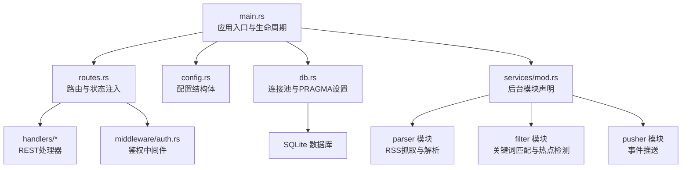
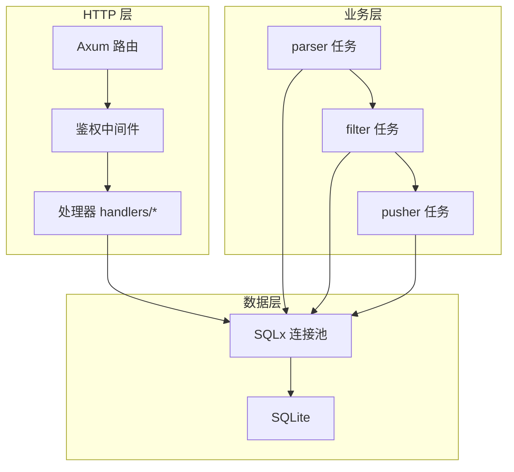
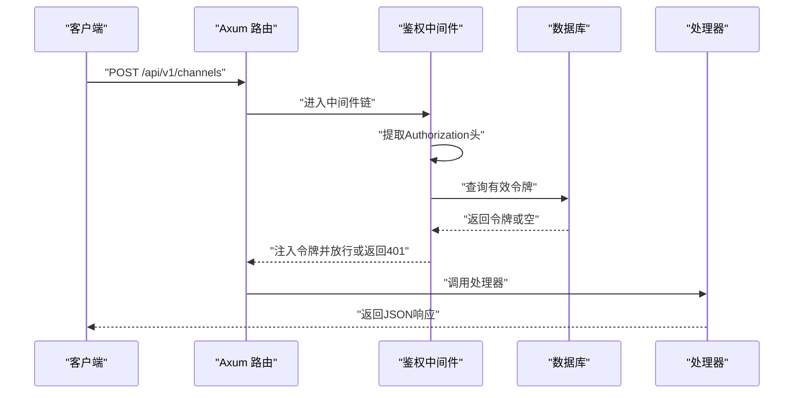
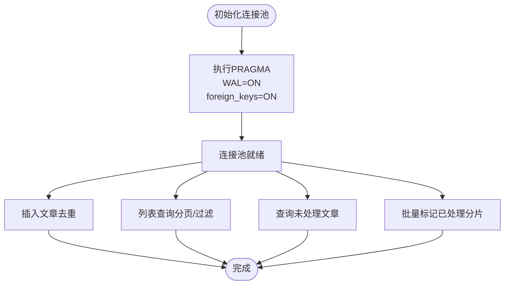
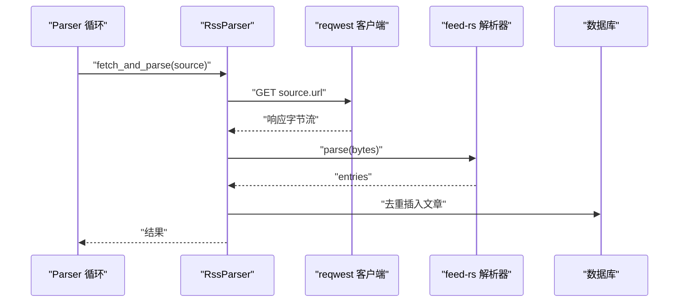
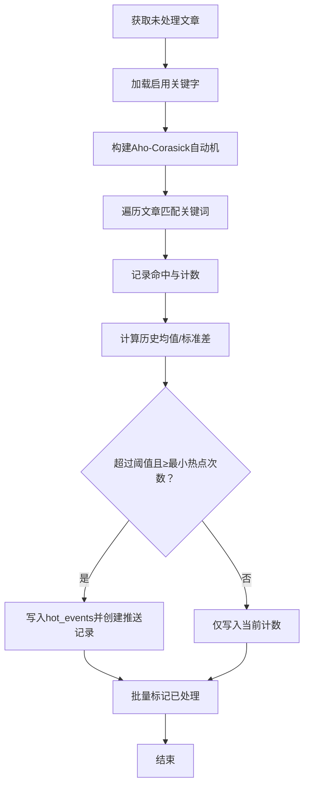
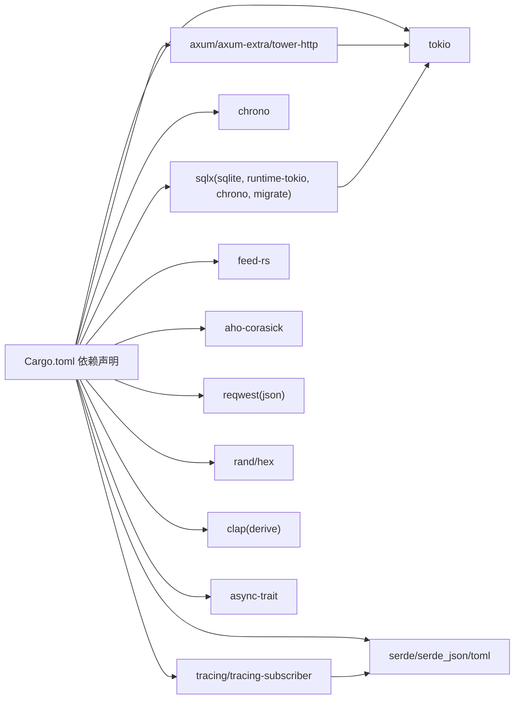

# 技术栈

<cite>
**本文引用的文件**
- [Cargo.toml](file://Cargo.toml)
- [main.rs](file://src/main.rs)
- [db.rs](file://src/db.rs)
- [routes.rs](file://src/routes.rs)
- [config.rs](file://src/config.rs)
- [auth.rs](file://src/middleware/auth.rs)
- [article.rs](file://src/db/article.rs)
- [keyword.rs](file://src/db/keyword.rs)
- [channel.rs](file://src/handlers/channel.rs)
- [config.toml](file://config.toml)
- [05-query-apis-and-background-modules.md](file://docs/plans/05-query-apis-and-background-modules.md)
- [spec.md](file://openspec/changes/query-apis-and-background-modules/spec.md)
- [design.md](file://openspec/changes/query-apis-and-background-modules/design.md)
</cite>

## 目录
1. [引言](#引言)
2. [项目结构](#项目结构)
3. [核心组件](#核心组件)
4. [架构总览](#架构总览)
5. [详细组件分析](#详细组件分析)
6. [依赖关系分析](#依赖关系分析)
7. [性能考量](#性能考量)
8. [故障排查指南](#故障排查指南)
9. [结论](#结论)
10. [附录](#附录)

## 引言
本技术栈文档面向“AI趋势监控系统”，系统采用Rust作为核心开发语言，结合Axum Web框架、SQLite数据库、feed-rs与Aho-Corasick算法库、reqwest HTTP客户端、serde序列化、chrono时间处理、tracing日志体系等关键组件，构建一个高性能、可扩展且易于维护的实时趋势发现平台。本文将从技术选型背景、组件特性、集成方式、性能与可靠性考量等方面进行系统化说明，并给出版本与兼容性信息及替代方案建议。

## 项目结构
系统采用按职责分层的模块化组织方式：
- 应用入口与生命周期管理：main.rs 负责初始化日志、加载配置、建立数据库连接池、执行迁移、启动后台任务以及启动HTTP服务器。
- 配置与状态：config.rs 定义配置结构体，config.toml 提供运行时参数；routes.rs 组装路由并注入共享状态。
- 数据访问层：db.rs 初始化SQLite连接池并开启WAL与外键约束；各实体模块（如 article.rs、keyword.rs）封装SQL操作。
- 处理器与中间件：handlers/* 提供REST接口；middleware/auth.rs 实现基于Bearer Token的鉴权中间件。
- 业务后台模块：services/mod.rs 声明 parser、filter、pusher 三类后台任务模块，配合 docs/plans 与 openspec 规划文档实现RSS抓取、关键词过滤与热点事件推送。

图表来源
- [main.rs:63-96](file://src/main.rs#L63-L96)
- [routes.rs:14-67](file://src/routes.rs#L14-L67)
- [config.rs:52-59](file://src/config.rs#L52-L59)
- [db.rs:12-27](file://src/db.rs#L12-L27)
- [services.rs:1-4](file://src/services.rs#L1-L4)

章节来源
- [main.rs:1-96](file://src/main.rs#L1-L96)
- [routes.rs:1-67](file://src/routes.rs#L1-L67)
- [config.rs:1-59](file://src/config.rs#L1-L59)
- [db.rs:1-27](file://src/db.rs#L1-L27)
- [services.rs:1-4](file://src/services.rs#L1-L4)

## 核心组件
本节概述各技术组件在系统中的角色、版本与兼容性要点。

- Rust 与 Tokio
  - 语言与运行时：Rust提供内存安全与零成本抽象；Tokio提供异步运行时与多核并发能力。
  - 版本与特性：Tokio启用full特性以支持全部运行时功能。
  - 兼容性：与async/await生态完全兼容，适合高并发I/O密集场景。

- Axum Web框架
  - 特点：类型安全路由、中间件链、提取器与响应构造器；与tower生态无缝集成。
  - 在项目中的应用：定义REST API、挂载CORS、注入AppState共享状态、绑定鉴权中间件。
  - 版本：axum 0.8，axum-extra 0.10，tower 0.5，tower-http 0.6（含CORS与trace）。

- SQLite 与 SQLx
  - 选择理由：嵌入式、零配置、事务一致性、WAL模式提升并发读写性能。
  - 配置优化：在连接池初始化时启用WAL与外键约束；通过PRAGMA调优；批量更新采用分片避免变量上限。
  - 版本：sqlx 0.7，启用sqlite、runtime-tokio、chrono、migrate特性。

- feed-rs RSS解析库
  - 作用：解析RSS/Atom源，抽取条目标题、摘要、链接与发布时间。
  - 优势：纯Rust实现、高性能、对多种Feed格式良好支持。
  - 版本：feed-rs 1。

- Aho-Corasick 关键词匹配
  - 作用：在文章标题与摘要中进行高效多模式字符串匹配，支持大小写敏感/不敏感。
  - 优势：线性时间复杂度、预编译自动机、适合大规模关键词集合。
  - 版本：aho-corasick 1。

- reqwest HTTP客户端
  - 作用：用于RSS抓取请求与Webhook推送。
  - 特性：异步、JSON支持、超时与User-Agent配置。
  - 版本：reqwest 0.12。

- 序列化与配置
  - serde/serde_json：结构化数据序列化与反序列化。
  - toml：配置文件解析。
  - 版本：serde 1（derive），serde_json 1，toml 0.8。

- 时间与时序
  - chrono：日期时间处理与序列化支持。
  - 版本：chrono 0.4（启用serde）。

- 日志与可观测性
  - tracing/tracing-subscriber：结构化日志与环境过滤。
  - 版本：tracing 0.1，tracing-subscriber 0.3（启用env-filter）。

- 随机与令牌
  - rand/hex：生成初始API令牌。
  - 版本：rand 0.8，hex 0.4。

- 命令行参数
  - clap：CLI参数解析与子命令。
  - 版本：clap 4（derive）。

- 异步trait
  - async-trait：为解析器接口提供异步方法。
  - 版本：async-trait 0.1。

章节来源
- [Cargo.toml:6-47](file://Cargo.toml#L6-L47)
- [main.rs:63-96](file://src/main.rs#L63-L96)
- [db.rs:12-27](file://src/db.rs#L12-L27)
- [routes.rs:14-67](file://src/routes.rs#L14-L67)
- [config.rs:52-59](file://src/config.rs#L52-L59)

## 架构总览
系统采用“HTTP API + 后台任务”的混合架构：
- HTTP层：Axum提供REST接口，中间件负责鉴权；路由将请求分发至对应处理器。
- 数据层：SQLx驱动SQLite，统一的连接池与PRAGMA优化保障并发与一致性。
- 业务层：后台任务分为三类——parser（定时抓取RSS）、filter（关键词匹配与热点检测）、pusher（事件推送），通过共享状态与配置协同工作。
- 可观测性：tracing输出结构化日志，便于问题定位与性能分析。

图表来源
- [routes.rs:14-67](file://src/routes.rs#L14-L67)
- [auth.rs:18-60](file://src/middleware/auth.rs#L18-L60)
- [db.rs:12-27](file://src/db.rs#L12-L27)
- [main.rs:63-96](file://src/main.rs#L63-L96)

## 详细组件分析

### Web框架：Axum
- 路由与中间件：路由通过nest组合API前缀，统一挂载CORS与鉴权中间件；中间件从Authorization头提取Bearer令牌并校验有效性与过期时间，成功后将令牌注入请求扩展以便下游使用。
- 状态传递：AppState包含SqlitePool与AppConfig，通过with_state注入到各处理器。
- 版本与特性：axum 0.8（含macros），tower-http 0.6（CORS与trace）。

图表来源
- [routes.rs:14-67](file://src/routes.rs#L14-L67)
- [auth.rs:18-60](file://src/middleware/auth.rs#L18-L60)

章节来源
- [routes.rs:14-67](file://src/routes.rs#L14-L67)
- [auth.rs:18-60](file://src/middleware/auth.rs#L18-L60)

### 数据库：SQLite与SQLx
- 连接池初始化：使用SqlitePoolOptions创建连接池，最大连接数限制为5；数据库URL采用rwc模式；初始化后执行PRAGMA开启WAL与外键约束。
- 文章表操作：提供插入（去重）、列表查询（分页与过滤）、未处理文章查询、批量标记处理完成等功能；批量更新采用分片以规避SQLite变量上限。
- 关键字表操作：支持创建、列表、启用列表、按条件更新与删除。

图表来源
- [db.rs:12-27](file://src/db.rs#L12-L27)
- [article.rs:6-177](file://src/db/article.rs#L6-L177)
- [keyword.rs:5-114](file://src/db/keyword.rs#L5-L114)

章节来源
- [db.rs:12-27](file://src/db.rs#L12-L27)
- [article.rs:6-177](file://src/db/article.rs#L6-L177)
- [keyword.rs:5-114](file://src/db/keyword.rs#L5-L114)

### RSS解析：feed-rs
- 背景与需求：系统需要周期性抓取RSS/Atom源，解析条目并去重入库；并发抓取需受控，失败应记录日志而不中断。
- 实现要点：RssParser基于reqwest发起HTTP请求，使用feed-rs解析字节流，提取链接、标题、摘要与发布时间；实现Parser trait以支持未来扩展新解析器类型。
- 配置：最大并发抓取数、默认User-Agent、默认超时秒数来自配置。

图表来源
- [05-query-apis-and-background-modules.md:357-417](file://docs/plans/05-query-apis-and-background-modules.md#L357-L417)
- [spec.md:17-26](file://openspec/changes/query-apis-and-background-modules/spec.md#L17-L26)

章节来源
- [05-query-apis-and-background-modules.md:357-417](file://docs/plans/05-query-apis-and-background-modules.md#L357-L417)
- [spec.md:17-26](file://openspec/changes/query-apis-and-background-modules/spec.md#L17-L26)

### 关键词匹配：Aho-Corasick
- 目标：在未处理文章中快速识别命中关键词，统计每小时命中次数并进行热点检测。
- 实现流程：加载启用的关键字，构建Aho-Corasick自动机；遍历文章标题与摘要，记录命中明细并累加计数；计算历史均值与标准差，设定阈值触发热点事件；最后批量标记文章为已处理。
- 性能：自动机构建一次，多模式匹配线性扫描，适合大规模关键词集合。

图表来源
- [05-query-apis-and-background-modules.md:531-740](file://docs/plans/05-query-apis-and-background-modules.md#L531-L740)

章节来源
- [05-query-apis-and-background-modules.md:531-740](file://docs/plans/05-query-apis-and-background-modules.md#L531-L740)

### HTTP客户端：reqwest
- 用途：RSS抓取与Webhook推送；支持超时、User-Agent设置与JSON。
- 集成：RssParser在初始化时根据ParserConfig构建客户端；pusher模块同样复用reqwest进行外部回调通知。

章节来源
- [05-query-apis-and-background-modules.md:357-417](file://docs/plans/05-query-apis-and-background-modules.md#L357-L417)

### 序列化与配置：serde、chrono、toml
- serde/serde_json：模型序列化与API响应/请求体处理。
- chrono：时间字段的解析与序列化，配合sqlx的chrono特性。
- toml：解析config.toml，提供服务主机、端口、数据库路径、认证初始令牌、解析器并发与超时、过滤批大小与间隔、推送间隔与重试策略等配置项。

章节来源
- [config.rs:1-59](file://src/config.rs#L1-L59)
- [config.toml:1-27](file://config.toml#L1-L27)

### 日志系统：tracing
- 用途：结构化日志输出，支持环境过滤；在主程序初始化时启用fmt与env-filter。
- 使用场景：后台任务执行日志、错误记录、热点事件告警、健康检查响应等。

章节来源
- [main.rs:63-96](file://src/main.rs#L63-L96)

### 鉴权中间件：Bearer Token
- 流程：从Authorization头提取Bearer令牌，查询数据库验证有效性与未撤销状态，检查过期时间，后台异步更新最近使用时间，将令牌注入请求扩展。
- 与API集成：所有受保护路由均通过中间件链强制鉴权。

章节来源
- [auth.rs:18-60](file://src/middleware/auth.rs#L18-L60)
- [routes.rs:50](file://src/routes.rs#L50)

### 处理器示例：频道管理
- 功能：列出、创建、更新、删除推送频道；返回标准状态码与响应体。
- 集成：使用AppState中的SqlitePool与AppConfig；通过ApiResponse封装统一响应格式。

章节来源
- [channel.rs:12-71](file://src/handlers/channel.rs#L12-L71)

## 依赖关系分析
- 组件耦合与内聚：路由与处理器通过AppState解耦；数据库访问集中在db模块；后台任务通过共享状态与配置协作。
- 外部依赖：Axum依赖Tokio与tower生态；SQLx依赖SQLite；feed-rs与reqwest分别承担解析与网络；Aho-Corasick承担字符串匹配；serde/chrono/toml提供序列化与配置；tracing提供日志。
- 版本与兼容性：所有依赖版本在Cargo.toml中明确声明，确保编译期锁定；设计文档强调trait接口与共享run_*_once函数以降低耦合并便于扩展。

图表来源
- [Cargo.toml:6-47](file://Cargo.toml#L6-L47)

章节来源
- [Cargo.toml:6-47](file://Cargo.toml#L6-L47)

## 性能考量
- 并发与调度
  - Tokio全特性启用，支持多核并行与高并发任务调度。
  - SQLx连接池最大连接数为5，适合中小规模并发；WAL模式提升读写吞吐。
- I/O与解析
  - feed-rs纯Rust实现，解析开销低；并发抓取受max_concurrent_fetches限制，避免资源争用。
  - Aho-Corasick自动机构建一次，匹配线性时间，适合高频文本扫描。
- 批处理与分片
  - 文章批量标记处理采用100条一批的分片更新，规避SQLite变量上限并减少事务开销。
- 日志与可观测性
  - tracing-subscriber启用env-filter，生产环境可通过环境变量控制日志级别，避免过度输出影响性能。

## 故障排查指南
- 启动阶段
  - 数据库目录不存在：主程序会自动创建；若权限不足，需检查路径权限。
  - 迁移失败：确认迁移脚本路径与权限，确保数据库可写。
- 鉴权失败
  - 缺少Authorization头或格式不正确：返回401；确认请求头格式为Bearer Token。
  - 令牌无效或已撤销：数据库查询不到有效令牌；检查令牌表状态。
  - 令牌过期：expires_at早于当前UTC时间时拒绝请求。
- RSS抓取异常
  - 网络超时或不可达：检查默认超时与User-Agent配置；查看日志错误信息。
  - Feed格式不兼容：feed-rs解析失败；建议检查源站RSS/Atom规范。
- 关键词过滤无结果
  - 未启用任何关键字：系统将直接标记文章为已处理；检查keywords表enabled字段。
  - 历史数据不足：低于min_history_hours时不会触发热点；增加历史窗口或放宽阈值。
- 推送失败
  - webhook回调失败：检查通道配置与目标地址；查看push_records状态与重试次数。

章节来源
- [main.rs:63-96](file://src/main.rs#L63-L96)
- [auth.rs:18-60](file://src/middleware/auth.rs#L18-L60)
- [05-query-apis-and-background-modules.md:531-740](file://docs/plans/05-query-apis-and-background-modules.md#L531-L740)

## 结论
本技术栈围绕Rust的内存安全与并发优势，结合Axum的类型安全路由、SQLx的SQLite驱动、feed-rs与Aho-Corasick的高效解析与匹配、reqwest的HTTP能力、serde/chrono/toml的序列化与配置、tracing的日志体系，构建了面向实时趋势发现的可靠系统。通过模块化设计与后台任务分离，系统具备良好的可维护性与扩展性；通过PRAGMA优化、批处理与分片、环境可控的日志策略，兼顾性能与可观测性。设计文档与规划文档明确了扩展方向（如新增解析器类型、推送通道类型），为后续演进奠定基础。

## 附录
- 版本与兼容性清单
  - Rust工具链：edition 2021
  - Tokio：1（full特性）
  - Axum：0.8（含macros）
  - Tower/Tower-HTTP：0.5/0.6（含CORS与trace）
  - SQLx：0.7（sqlite、runtime-tokio、chrono、migrate）
  - serde/serde_json：1/1（derive）
  - toml：0.8
  - chrono：0.4（启用serde）
  - tracing/tracing-subscriber：0.1/0.3（启用env-filter）
  - feed-rs：1
  - aho-corasick：1
  - reqwest：0.12（启用json）
  - rand/hex：0.8/0.4
  - clap：4（derive）
  - async-trait：0.1

- 替代方案与权衡
  - Web框架：可替换为warp或rocket，但Axum在类型安全与中间件生态上更契合当前设计。
  - 数据库：可选PostgreSQL/MySQL，但SQLite在单机部署、零配置与嵌入式场景更具优势；SQLx提供跨数据库抽象。
  - RSS解析：可选rss-parser等，但feed-rs在Rust生态中成熟度更高。
  - 字符串匹配：可选regex或fst，但Aho-Corasick在多模式匹配场景性能更优。
  - HTTP客户端：可选isahc或surf，但reqwest生态完善、易用性强。
  - 日志：可选slog或flexi_logger，但tracing生态与Rust社区契合度更高。