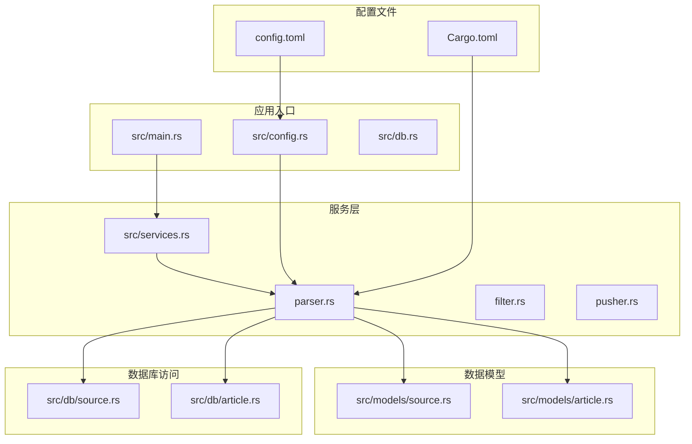
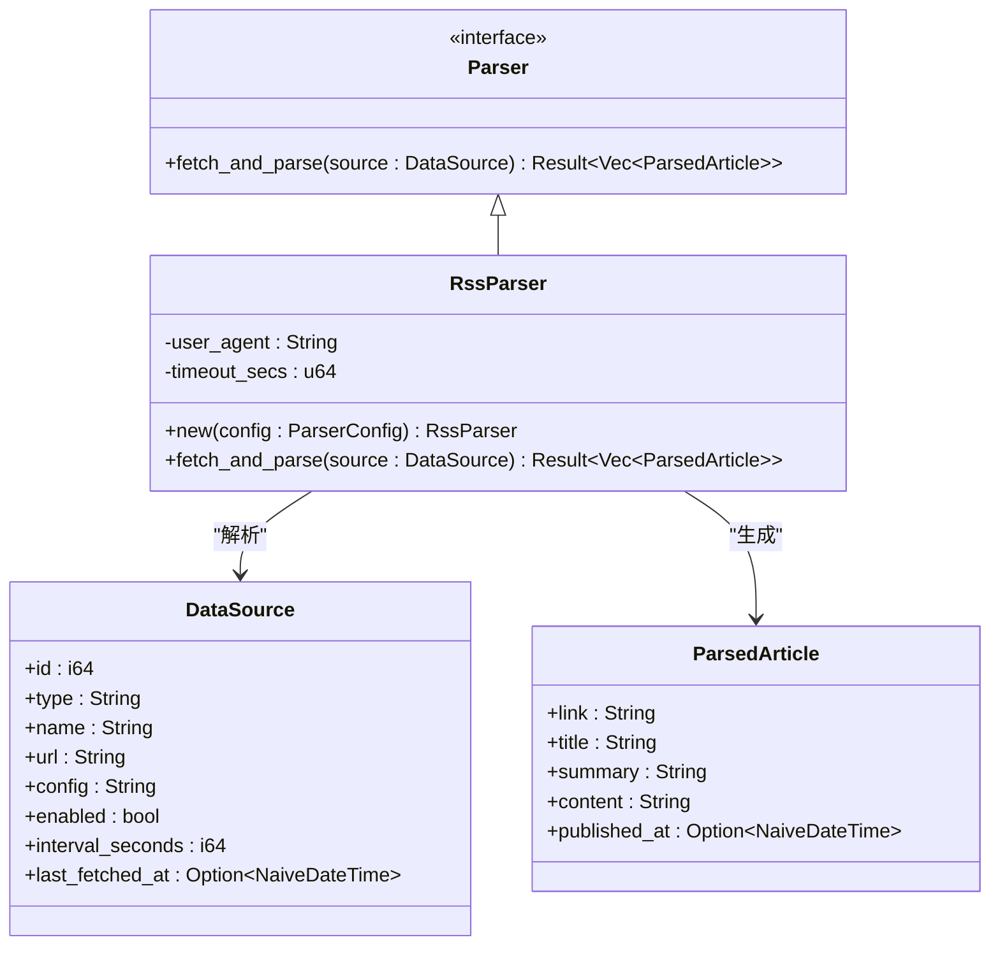
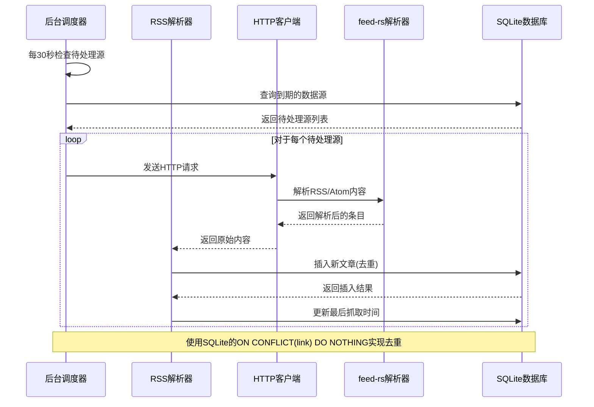
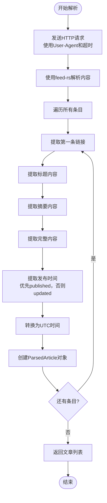
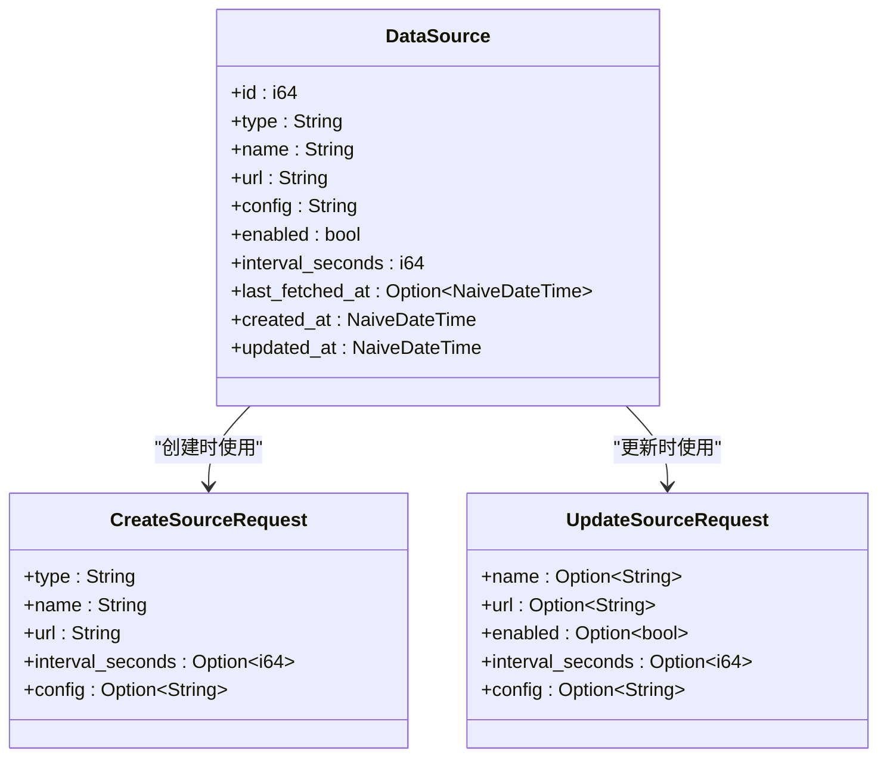
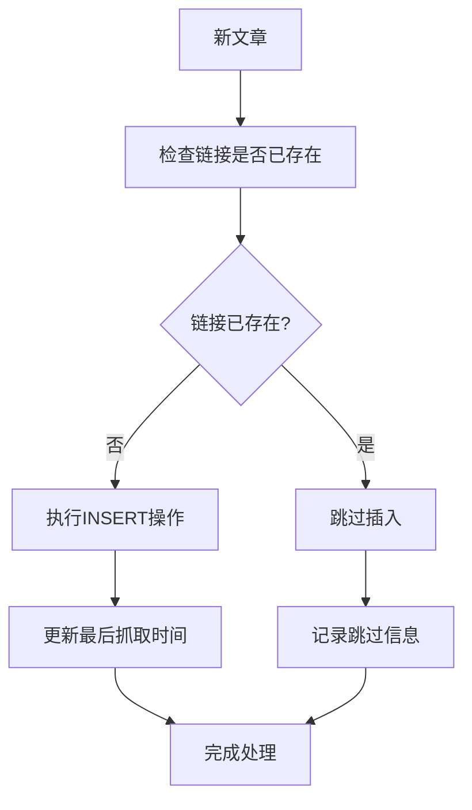
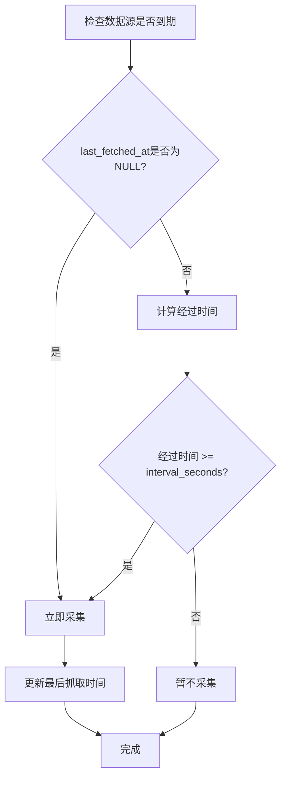
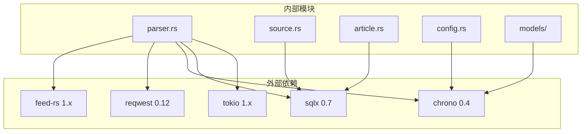

# RSS内容采集功能

<cite>
**本文档引用的文件**
- [src/main.rs](file://src/main.rs)
- [src/services.rs](file://src/services.rs)
- [src/services/parser.rs](file://src/services/parser.rs)
- [src/config.rs](file://src/config.rs)
- [config.toml](file://config.toml)
- [Cargo.toml](file://Cargo.toml)
- [src/models/source.rs](file://src/models/source.rs)
- [src/db/source.rs](file://src/db/source.rs)
- [src/models/article.rs](file://src/models/article.rs)
- [src/db/article.rs](file://src/db/article.rs)
- [src/db.rs](file://src/db.rs)
- [docs/plans/05-query-apis-and-background-modules.md](file://docs/plans/05-query-apis-and-background-modules.md)
</cite>

## 目录
1. [简介](#简介)
2. [项目结构](#项目结构)
3. [核心组件](#核心组件)
4. [架构概览](#架构概览)
5. [详细组件分析](#详细组件分析)
6. [依赖关系分析](#依赖关系分析)
7. [性能考虑](#性能考虑)
8. [故障排除指南](#故障排除指南)
9. [结论](#结论)
10. [附录](#附录)

## 简介

AI趋势监控工具的RSS内容采集功能是一个基于Rust构建的异步数据采集系统，专门用于从RSS、Atom等订阅源中自动抓取和解析内容。该系统采用模块化设计，支持多种数据源格式，具备智能去重、并发控制和错误处理机制。

本功能的核心目标是建立一个可靠的内容采集管道，通过feed-rs库解析各种RSS/Atom格式，结合SQLite数据库存储，为后续的内容过滤和推送功能提供高质量的数据基础。

## 项目结构

该项目采用清晰的模块化架构，RSS采集功能主要分布在以下关键目录中：



**图表来源**
- [src/main.rs:1-164](file://src/main.rs#L1-L164)
- [src/services.rs:1-4](file://src/services.rs#L1-L4)
- [src/services/parser.rs:1-132](file://src/services/parser.rs#L1-L132)

**章节来源**
- [src/main.rs:1-164](file://src/main.rs#L1-L164)
- [src/services.rs:1-4](file://src/services.rs#L1-L4)
- [src/config.rs:1-58](file://src/config.rs#L1-L58)

## 核心组件

RSS内容采集功能由多个相互协作的组件构成，每个组件都有明确的职责分工：

### 解析器接口系统

系统采用trait接口设计，支持多种解析器类型的扩展：



**图表来源**
- [src/services/parser.rs:11-97](file://src/services/parser.rs#L11-L97)
- [src/models/source.rs:5-19](file://src/models/source.rs#L5-L19)

### 配置管理系统

系统通过配置文件管理所有可调参数，包括网络设置、并发控制和时间间隔等：

| 配置类别 | 关键参数 | 默认值 | 作用描述 |
|---------|---------|--------|----------|
| 服务器配置 | host, port | 0.0.0.0, 3000 | API服务监听地址和端口 |
| 数据库配置 | path | ./docs/data/hotspot.db | SQLite数据库文件路径 |
| 认证配置 | initial_token | 自动生成 | 初始管理员令牌 |
| 解析器配置 | max_concurrent_fetches | 10 | 并发抓取限制 |
| 解析器配置 | default_user_agent | HotspotMonitor/1.0 | HTTP请求用户代理 |
| 解析器配置 | default_timeout_seconds | 30 | 请求超时时间(秒) |
| 过滤器配置 | batch_size | 1000 | 批处理大小 |
| 过滤器配置 | interval_seconds | 300 | 过滤间隔(秒) |
| 推送器配置 | interval_seconds | 10 | 推送间隔(秒) |
| 推送器配置 | max_retries | 3 | 最大重试次数 |
| 推送器配置 | retry_base_seconds | 60 | 基础重试等待时间 |

**章节来源**
- [src/config.rs:29-49](file://src/config.rs#L29-L49)
- [config.toml:12-27](file://config.toml#L12-L27)

## 架构概览

RSS内容采集系统采用异步事件驱动架构，通过后台循环实现定时数据采集：



**图表来源**
- [src/services/parser.rs:103-132](file://src/services/parser.rs#L103-L132)
- [src/db/article.rs:6-29](file://src/db/article.rs#L6-L29)

## 详细组件分析

### RSS解析器实现

RSS解析器是整个系统的核心组件，负责从各种RSS/Atom格式中提取有用信息：

#### 数据解析算法

解析器采用多步骤数据提取策略：

1. **HTTP请求处理**: 使用配置的User-Agent和超时设置进行网络请求
2. **内容解析**: 通过feed-rs库解析XML/JSON Feed内容
3. **字段提取**: 从每个条目中提取必要字段
4. **时间处理**: 统一转换为UTC时间格式



**图表来源**
- [src/services/parser.rs:48-97](file://src/services/parser.rs#L48-L97)

#### 字段提取规则

| 字段 | 提取来源 | 处理逻辑 | 示例 |
|------|----------|----------|------|
| 链接 | entry.links[0].href | 必需字段，不存在则跳过条目 | https://example.com/article |
| 标题 | entry.title.content | 可选，为空时使用空字符串 | "文章标题" |
| 摘要 | entry.summary.content | 可选，为空时使用空字符串 | "文章摘要内容" |
| 内容 | entry.content.body | 可选，为空时使用空字符串 | "完整文章内容" |
| 发布时间 | entry.published 或 entry.updated | 时间戳转换为UTC | 2024-01-01 12:00:00 UTC |

**章节来源**
- [src/services/parser.rs:48-97](file://src/services/parser.rs#L48-L97)

### 数据源管理功能

系统提供了完整的数据源生命周期管理：

#### 数据源模型



**图表来源**
- [src/models/source.rs:5-39](file://src/models/source.rs#L5-L39)

#### CRUD操作流程

系统支持标准的CRUD操作，每个操作都经过严格的参数验证：

1. **创建数据源**: 验证必需字段，设置默认配置
2. **查询数据源**: 支持分页和排序，按创建时间倒序
3. **更新数据源**: 支持部分更新，动态构建SQL语句
4. **删除数据源**: 完全移除相关记录

**章节来源**
- [src/db/source.rs:5-101](file://src/db/source.rs#L5-L101)

### 去重策略实现

系统采用数据库层面的去重机制，确保相同链接的文章只被存储一次：

#### 去重算法



**图表来源**
- [src/db/article.rs:6-29](file://src/db/article.rs#L6-L29)

#### 数据库约束

使用SQLite的`ON CONFLICT(link) DO NOTHING`语法实现智能去重：
- 主键约束: `link`字段作为唯一标识
- 自动跳过重复: 避免手动检查和冲突处理
- 性能优化: 数据库层面的索引和约束检查

**章节来源**
- [src/db/article.rs:6-29](file://src/db/article.rs#L6-L29)

### 采集频率控制

系统实现了智能的采集频率控制系统：

#### 频率控制算法



**图表来源**
- [src/db/source.rs:127-142](file://src/db/source.rs#L127-L142)

#### 并发控制机制

系统使用信号量实现并发限制：
- 最大并发数: 通过配置参数控制
- 资源管理: 自动释放获取的许可
- 性能平衡: 避免过度并发导致资源耗尽

**章节来源**
- [src/services/parser.rs:103-132](file://src/services/parser.rs#L103-L132)

## 依赖关系分析

RSS内容采集功能涉及多个外部库和内部模块的复杂交互：



**图表来源**
- [Cargo.toml:29-47](file://Cargo.toml#L29-L47)
- [src/services/parser.rs:1-10](file://src/services/parser.rs#L1-L10)

### 关键依赖特性

| 依赖库 | 版本 | 主要功能 | 在系统中的作用 |
|--------|------|----------|----------------|
| feed-rs | 1.x | RSS/Atom解析 | 内容格式解析 |
| reqwest | 0.12 | HTTP客户端 | 网络请求处理 |
| chrono | 0.4 | 时间处理 | 时间戳转换和格式化 |
| sqlx | 0.7 | 数据库ORM | 数据持久化 |
| tokio | 1.x | 异步运行时 | 异步任务调度 |
| async-trait | 0.1 | 异步trait支持 | 解析器接口定义 |

**章节来源**
- [Cargo.toml:29-47](file://Cargo.toml#L29-L47)

## 性能考虑

RSS内容采集系统在设计时充分考虑了性能优化：

### 并发优化策略

1. **信号量控制**: 限制最大并发请求数量，避免资源争用
2. **异步I/O**: 使用Tokio异步运行时提高I/O密集型操作效率
3. **批量处理**: 数据库操作采用批量插入减少往返开销

### 内存管理

1. **流式处理**: 使用Bytes流处理HTTP响应，避免内存峰值
2. **延迟解析**: 只解析必要的字段，减少内存占用
3. **及时释放**: 异步任务完成后及时释放资源

### 数据库优化

1. **索引设计**: 为常用查询字段建立索引
2. **连接池**: 使用SQLx连接池管理数据库连接
3. **事务优化**: 合理使用事务减少锁竞争

## 故障排除指南

### 常见问题及解决方案

#### 网络请求失败

**问题症状**: 解析器报告HTTP请求错误
**可能原因**:
- 网络连接超时
- 目标服务器不可达
- 用户代理被拒绝

**解决步骤**:
1. 检查网络连接状态
2. 验证URL格式正确性
3. 调整超时参数
4. 修改User-Agent设置

#### 解析器异常

**问题症状**: feed-rs解析失败
**可能原因**:
- RSS/Atom格式不符合标准
- 编码问题
- 内容损坏

**解决步骤**:
1. 验证RSS源的有效性
2. 检查内容编码格式
3. 查看详细的错误日志

#### 数据库连接问题

**问题症状**: 数据无法保存到数据库
**可能原因**:
- 数据库文件权限不足
- 磁盘空间不足
- 数据库锁定

**解决步骤**:
1. 检查数据库文件权限
2. 确认磁盘空间充足
3. 重启数据库连接

### 日志记录和监控

系统使用tracing框架进行全面的日志记录：

| 日志级别 | 用途 | 示例消息 |
|----------|------|----------|
| INFO | 一般信息 | "Parser: 2个数据源到期抓取" |
| WARN | 警告信息 | "未知模式 'test'，默认使用'all'" |
| ERROR | 错误信息 | "Parser: 无法获取数据源 'Example': Network error" |

**章节来源**
- [src/services/parser.rs:110-116](file://src/services/parser.rs#L110-L116)
- [src/main.rs:107-110](file://src/main.rs#L107-L110)

## 结论

RSS内容采集功能通过精心设计的架构和实现，成功构建了一个高效、可靠的异步内容采集系统。系统的主要优势包括：

1. **模块化设计**: 清晰的组件分离和接口定义
2. **异步处理**: 高效的并发控制和资源管理
3. **智能去重**: 数据库层面的自动去重机制
4. **灵活配置**: 可调整的参数和行为控制
5. **健壮性**: 完善的错误处理和故障恢复

该系统为AI趋势监控工具提供了坚实的数据基础，能够稳定地从各种RSS/Atom源中获取高质量的内容数据。

## 附录

### 配置示例

完整的配置文件示例：
```toml
[server]
host = "0.0.0.0"
port = 3000

[database]
path = "./docs/data/hotspot.db"

[auth]
initial_token = ""

[parser]
max_concurrent_fetches = 10
default_user_agent = "HotspotMonitor/1.0"
default_timeout_seconds = 30

[filter]
batch_size = 1000
interval_seconds = 300
history_hours = 24
min_history_hours = 6

[pusher]
interval_seconds = 10
max_retries = 3
retry_base_seconds = 60
```

### 最佳实践建议

1. **合理设置并发数**: 根据服务器性能和目标网站的限制调整`max_concurrent_fetches`
2. **监控资源使用**: 定期检查CPU、内存和网络使用情况
3. **备份数据库**: 定期备份SQLite数据库文件
4. **日志分析**: 定期查看日志文件识别潜在问题
5. **性能测试**: 在生产部署前进行压力测试