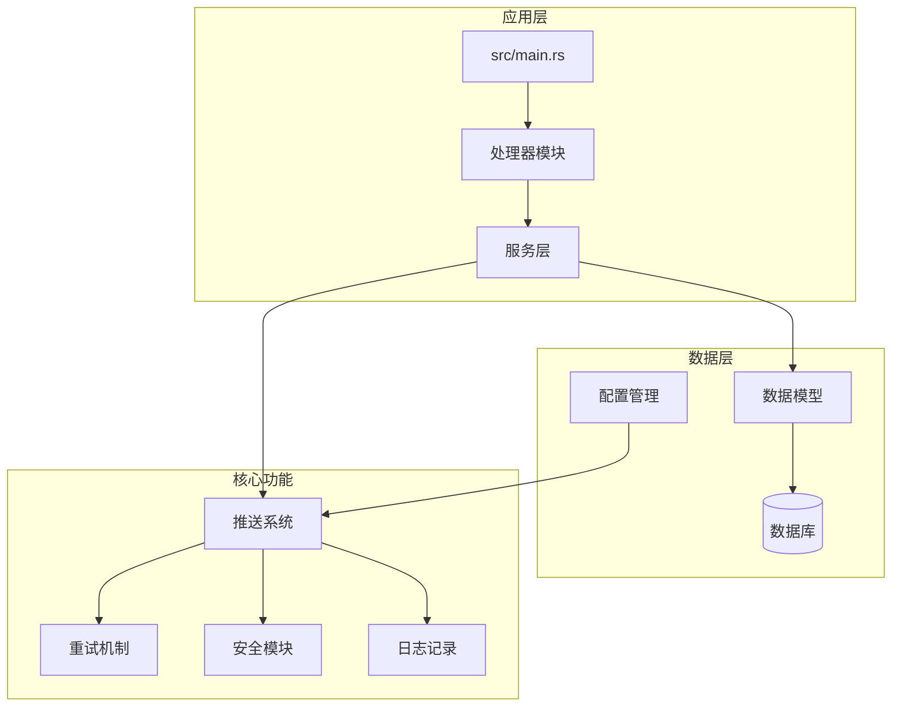
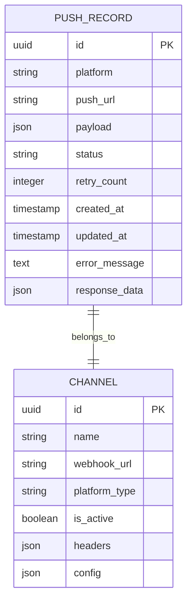
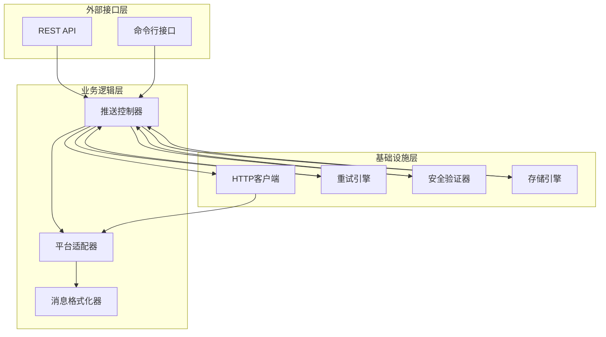
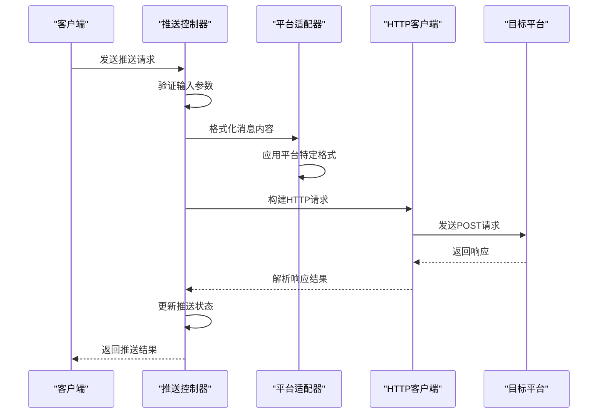
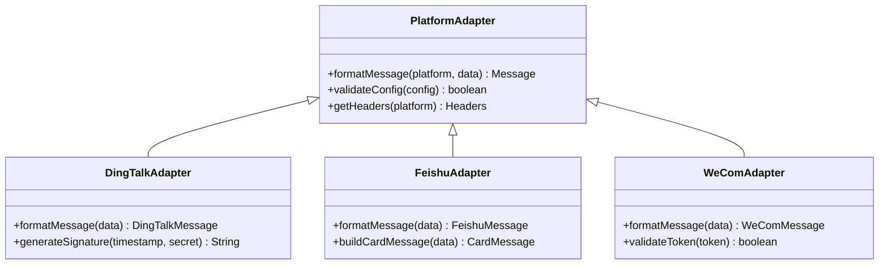
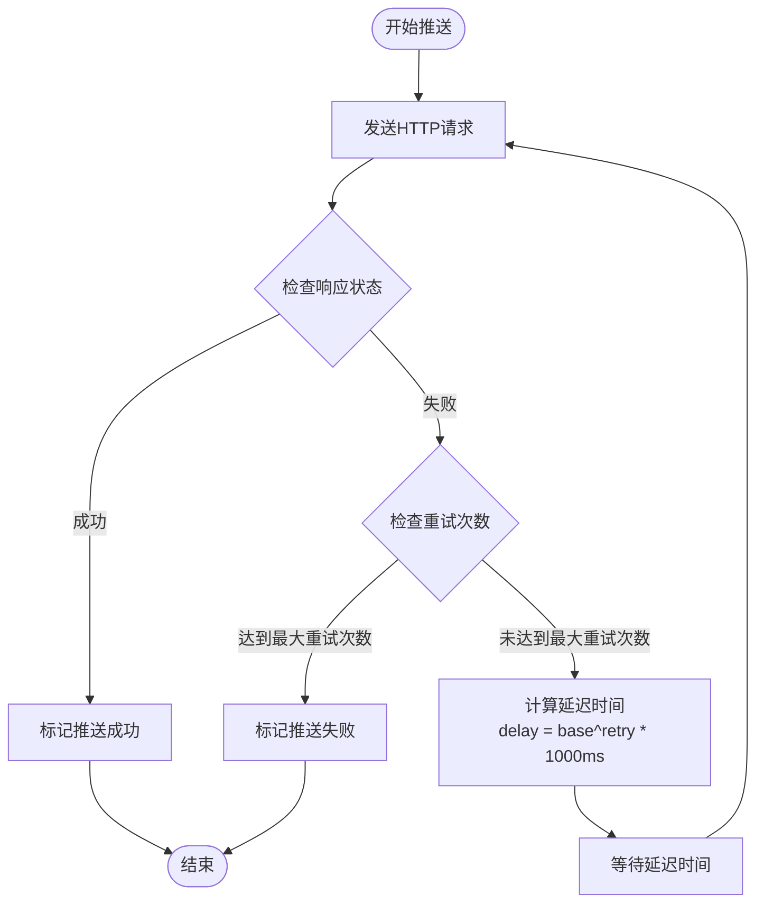
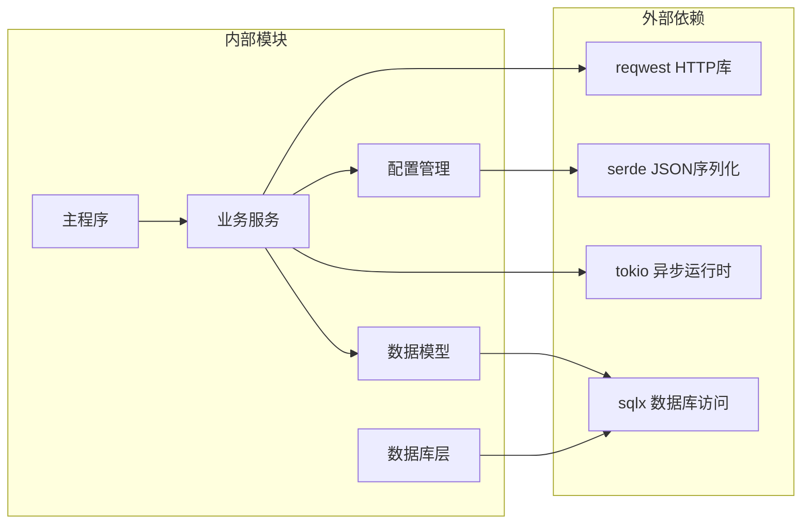

# Webhook推送系统

<cite>
**本文档引用的文件**
- [src/main.rs](file://src/main.rs)
- [src/config.rs](file://src/config.rs)
- [src/db.rs](file://src/db.rs)
- [src/models/push_record.rs](file://src/models/push_record.rs)
- [src/db/push_record.rs](file://src/db/push_record.rs)
- [src/services.rs](file://src/services.rs)
- [src/error.rs](file://src/error.rs)
- [config.toml](file://config.toml)
- [openspec/specs/data-models/spec.md](file://openspec/specs/data-models/spec.md)
- [openspec/specs/database-schema/spec.md](file://openspec/specs/database-schema/spec.md)
</cite>

## 目录
1. [简介](#简介)
2. [项目结构](#项目结构)
3. [核心组件](#核心组件)
4. [架构概览](#架构概览)
5. [详细组件分析](#详细组件分析)
6. [依赖关系分析](#依赖关系分析)
7. [性能考虑](#性能考虑)
8. [故障排除指南](#故障排除指南)
9. [结论](#结论)

## 简介

Webhook推送系统是AI趋势工具项目中的一个关键模块，负责向外部平台发送实时通知和数据更新。该系统实现了对多种企业通讯工具的集成支持，包括钉钉、飞书、企业微信等平台的API适配和消息格式转换。

系统的核心功能包括：
- HTTP请求构建和发送
- 多平台API适配和消息格式转换
- 推送策略配置管理
- 指数退避重试机制
- 推送记录管理和统计分析
- 安全认证和防护机制

## 项目结构

基于项目结构分析，Webhook推送系统主要分布在以下模块中：

**图表来源**
- [src/main.rs](file://src/main.rs)
- [src/services.rs](file://src/services.rs)
- [src/config.rs](file://src/config.rs)

**章节来源**
- [src/main.rs](file://src/main.rs)
- [src/config.rs](file://src/config.rs)
- [src/db.rs](file://src/db.rs)

## 核心组件

### 数据模型设计

推送记录系统采用完整的数据模型设计，支持推送状态跟踪和历史记录管理：

**图表来源**
- [src/models/push_record.rs](file://src/models/push_record.rs)
- [src/db/push_record.rs](file://src/db/push_record.rs)

### 配置管理系统

系统通过配置文件管理推送相关的参数设置：

| 配置项 | 类型 | 描述 | 默认值 |
|--------|------|------|--------|
| max_retry_count | integer | 最大重试次数 | 3 |
| base_delay_ms | integer | 基础延迟毫秒数 | 1000 |
| max_delay_ms | integer | 最大延迟毫秒数 | 60000 |
| timeout_seconds | integer | 请求超时秒数 | 30 |
| enable_ssl_verify | boolean | 启用SSL验证 | true |

**章节来源**
- [config.toml](file://config.toml)
- [src/config.rs](file://src/config.rs)

## 架构概览

Webhook推送系统采用分层架构设计，确保了模块间的松耦合和高内聚：

**图表来源**
- [src/services.rs](file://src/services.rs)
- [src/main.rs](file://src/main.rs)

## 详细组件分析

### HTTP请求构建与发送

推送系统的核心是HTTP请求的构建和发送机制：

**图表来源**
- [src/services.rs](file://src/services.rs)
- [src/models/push_record.rs](file://src/models/push_record.rs)

### 平台适配器设计

系统支持多平台的消息格式转换，每个平台都有专门的适配器：

**图表来源**
- [src/services.rs](file://src/services.rs)

### 指数退避重试机制

系统实现了智能的重试机制，采用指数退避算法避免对目标服务器造成压力：

**图表来源**
- [src/services.rs](file://src/services.rs)

**章节来源**
- [src/services.rs](file://src/services.rs)
- [src/models/push_record.rs](file://src/models/push_record.rs)

### 安全验证机制

系统实现了多层次的安全验证机制：

| 安全特性 | 实现方式 | 验证方法 |
|----------|----------|----------|
| HTTPS要求 | 强制使用TLS连接 | 自动检测URL协议 |
| 签名验证 | 平台特定签名算法 | 验证响应签名完整性 |
| 认证令牌 | OAuth/Bearer Token | 验证访问令牌有效性 |
| IP白名单 | 防止恶意请求 | 验证请求来源IP |

**章节来源**
- [src/services.rs](file://src/services.rs)
- [src/config.rs](file://src/config.rs)

## 依赖关系分析

系统的关键依赖关系如下：

**图表来源**
- [Cargo.toml](file://Cargo.toml)
- [src/main.rs](file://src/main.rs)

**章节来源**
- [Cargo.toml](file://Cargo.toml)
- [src/main.rs](file://src/main.rs)

## 性能考虑

### 异步处理优化

系统采用异步编程模型提高并发处理能力：
- 使用Tokio运行时管理异步任务
- 实现非阻塞HTTP请求处理
- 支持批量推送队列管理

### 缓存策略

- 推送记录缓存减少数据库查询
- 平台配置缓存避免重复解析
- 令牌缓存提高认证效率

### 资源管理

- 连接池管理HTTP连接复用
- 内存使用监控防止泄漏
- 超时控制避免资源占用

## 故障排除指南

### 常见问题诊断

| 问题类型 | 症状描述 | 可能原因 | 解决方案 |
|----------|----------|----------|----------|
| 推送失败 | HTTP 4xx/5xx错误 | 网络连接或认证问题 | 检查URL和认证配置 |
| 超时错误 | 请求超时 | 网络延迟或服务器繁忙 | 调整超时参数和重试策略 |
| 格式错误 | 平台返回格式错误 | 消息格式不兼容 | 验证平台特定格式要求 |
| 签名验证失败 | 平台拒绝请求 | 签名算法或密钥错误 | 检查签名生成和验证逻辑 |

### 调试信息收集

系统提供了详细的调试信息输出：
- 请求和响应的完整日志
- 重试过程的详细记录
- 错误堆栈跟踪信息
- 性能指标监控数据

**章节来源**
- [src/error.rs](file://src/error.rs)
- [src/services.rs](file://src/services.rs)

## 结论

Webhook推送系统通过模块化设计和分层架构，实现了对多种企业通讯平台的高效集成。系统具备完善的错误处理、安全验证和性能优化机制，能够满足生产环境的高可用性要求。

关键优势包括：
- 支持多平台统一接口
- 智能重试和故障恢复
- 完善的安全防护机制
- 详细的日志和监控支持
- 可扩展的架构设计

未来可以考虑的功能增强：
- 更灵活的推送策略配置
- 更丰富的平台适配支持
- 更强大的监控和告警功能
- 更高效的批量处理能力