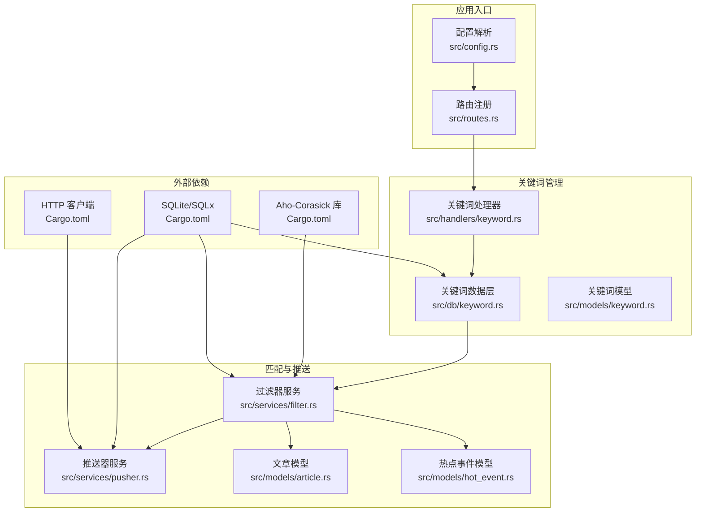
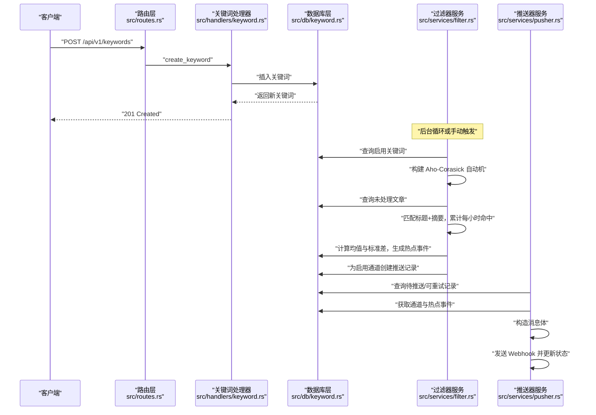
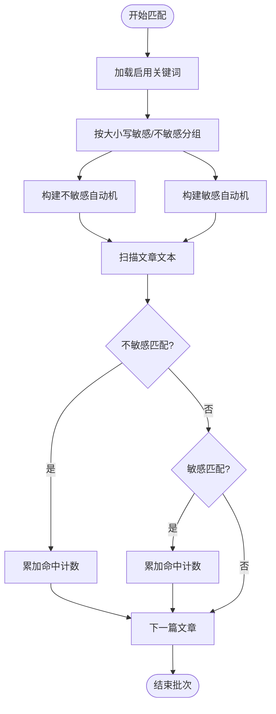
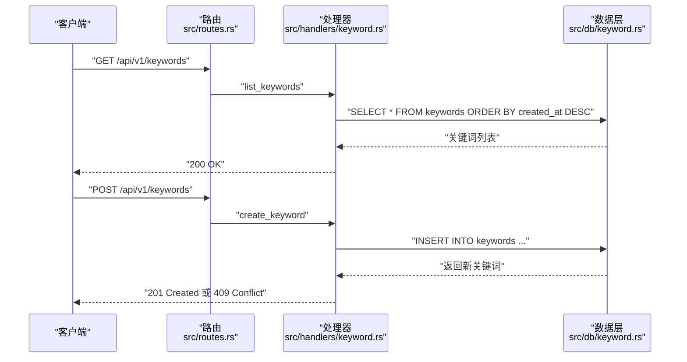
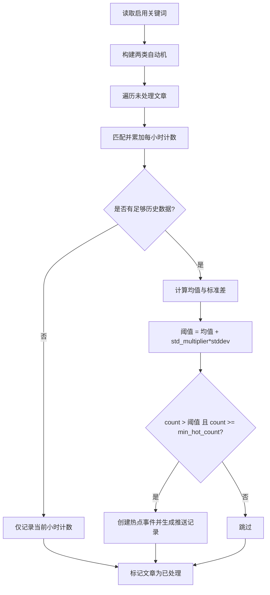
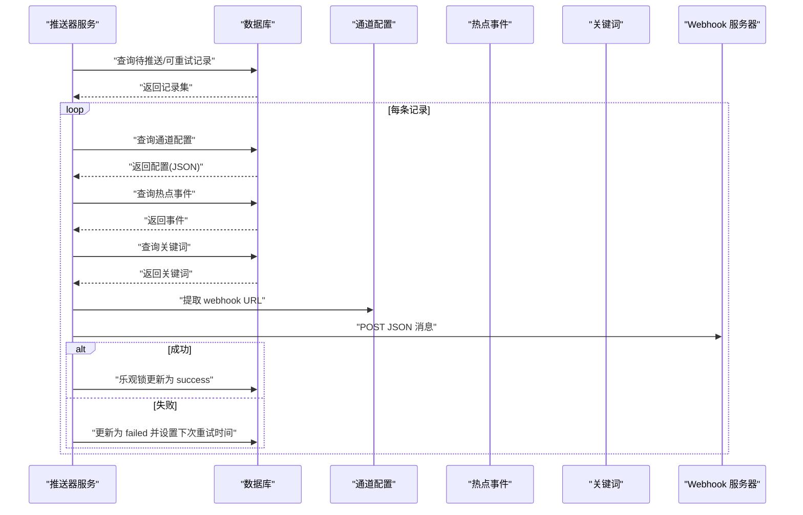
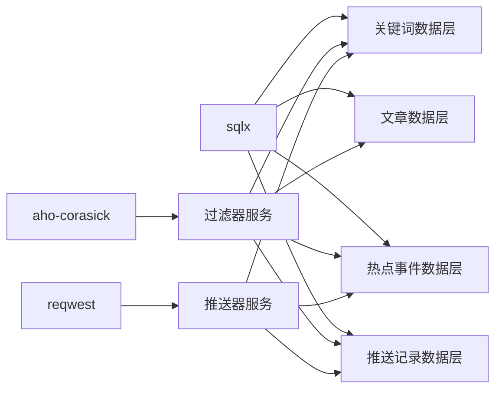

# 关键词匹配功能

<cite>
**本文引用的文件**
- [Cargo.toml](file://Cargo.toml)
- [src/config.rs](file://src/config.rs)
- [src/routes.rs](file://src/routes.rs)
- [src/handlers/keyword.rs](file://src/handlers/keyword.rs)
- [src/db/keyword.rs](file://src/db/keyword.rs)
- [src/models/keyword.rs](file://src/models/keyword.rs)
- [src/services/filter.rs](file://src/services/filter.rs)
- [src/services/pusher.rs](file://src/services/pusher.rs)
- [src/models/article.rs](file://src/models/article.rs)
- [src/models/hot_event.rs](file://src/models/hot_event.rs)
- [openspec/specs/database-schema/spec.md](file://openspec/specs/database-schema/spec.md)
- [openspec/specs/module-organization/spec.md](file://openspec/specs/module-organization/spec.md)
- [openspec/changes/query-apis-and-background-modules/specs/filter-module/spec.md](file://openspec/changes/query-apis-and-background-modules/specs/filter-module/spec.md)
- [openspec/changes/query-apis-and-background-modules/specs/pusher-module/spec.md](file://openspec/changes/query-apis-and-background-modules/specs/pusher-module/spec.md)
- [docs/Live-Artifact/template.html](file://docs/Live-Artifact/template.html)
</cite>

## 目录
1. [简介](#简介)
2. [项目结构](#项目结构)
3. [核心组件](#核心组件)
4. [架构总览](#架构总览)
5. [详细组件分析](#详细组件分析)
6. [依赖关系分析](#依赖关系分析)
7. [性能考量](#性能考量)
8. [故障排查指南](#故障排查指南)
9. [结论](#结论)
10. [附录](#附录)

## 简介
本文件系统化阐述关键词匹配功能的设计与实现，重点覆盖以下方面：
- 多关键词匹配：基于 Aho-Corasick 算法构建自动机，实现线性时间复杂度的多模式匹配。
- 关键词配置管理：提供关键词的增删改查、批量导入能力（通过 API）与运行时参数控制。
- 匹配策略：支持大小写敏感与不敏感两种模式；提供统计阈值触发热点事件。
- 结果处理：命中计数、去重与热点评分（均值+标准差）。
- 性能优化：关键词分组、批量处理、数据库索引与配置化参数。
- 使用案例与配置示例：从关键词管理到触发与推送的完整流程。

## 项目结构
项目采用 Rust 2018 edition 的“非 mod.rs”模块组织方式，关键词匹配相关代码主要分布在以下模块：
- 配置与路由：解析配置、定义 API 路由与中间件。
- 关键词 API：提供关键词的 CRUD 接口。
- 数据访问层：封装 SQL 查询与更新。
- 业务服务：关键词匹配与热点检测（Filter）、推送（Pusher）。
- 数据模型：Article、Keyword、HotEvent 等实体定义。

图表来源
- [src/config.rs:1-58](file://src/config.rs#L1-L58)
- [src/routes.rs:14-67](file://src/routes.rs#L14-L67)
- [src/handlers/keyword.rs:12-82](file://src/handlers/keyword.rs#L12-L82)
- [src/db/keyword.rs:1-115](file://src/db/keyword.rs#L1-L115)
- [src/services/filter.rs:13-284](file://src/services/filter.rs#L13-L284)
- [src/services/pusher.rs:11-243](file://src/services/pusher.rs#L11-L243)
- [Cargo.toml:32-36](file://Cargo.toml#L32-L36)

章节来源
- [openspec/specs/module-organization/spec.md:1-50](file://openspec/specs/module-organization/spec.md#L1-L50)
- [src/routes.rs:14-67](file://src/routes.rs#L14-L67)

## 核心组件
- 关键词模型与请求体：包含关键词文本、大小写敏感标志、启用状态、统计阈值等字段，以及创建/更新请求体。
- 关键词 API：提供列出、创建、更新、删除关键词的接口，并对重复关键词进行冲突处理。
- 过滤器服务：加载启用的关键词，按大小写敏感与不敏感分别构建 Aho-Corasick 自动机，匹配文章标题与摘要，累计每小时命中次数，进行统计阈值检测并生成推送记录。
- 推送器服务：轮询待推送与可重试记录，向各通道发送 Webhook，支持指数退避重试与乐观锁更新状态。
- 配置：包含过滤器批大小、间隔、历史窗口、最小历史小时数，以及推送器间隔、最大重试次数与基础重试秒数。

章节来源
- [src/models/keyword.rs:5-32](file://src/models/keyword.rs#L5-L32)
- [src/handlers/keyword.rs:12-82](file://src/handlers/keyword.rs#L12-L82)
- [src/db/keyword.rs:5-115](file://src/db/keyword.rs#L5-L115)
- [src/services/filter.rs:13-284](file://src/services/filter.rs#L13-L284)
- [src/services/pusher.rs:11-243](file://src/services/pusher.rs#L11-L243)
- [src/config.rs:36-49](file://src/config.rs#L36-L49)

## 架构总览
关键词匹配与热点检测的整体流程如下：

图表来源
- [src/routes.rs:31-35](file://src/routes.rs#L31-L35)
- [src/handlers/keyword.rs:27-43](file://src/handlers/keyword.rs#L27-L43)
- [src/services/filter.rs:13-219](file://src/services/filter.rs#L13-L219)
- [src/services/pusher.rs:11-190](file://src/services/pusher.rs#L11-L190)

## 详细组件分析

### Aho-Corasick 多关键词匹配
- 状态机构建：根据启用关键词集合，按大小写敏感与不敏感两类分别构建自动机，避免不必要的大小写转换开销。
- 匹配效率：对每篇文章的标题与摘要进行一次扫描，时间复杂度近似 O(n+m+z)，其中 n 为文本长度，m 为模式总数，z 为匹配数。
- 内存优化：仅在需要时构建两类自动机；对大小写不敏感模式统一转小写，减少模式数量与匹配分支。

图表来源
- [src/services/filter.rs:48-129](file://src/services/filter.rs#L48-L129)

章节来源
- [src/services/filter.rs:48-129](file://src/services/filter.rs#L48-L129)
- [openspec/changes/query-apis-and-background-modules/specs/filter-module/spec.md:31-45](file://openspec/changes/query-apis-and-background-modules/specs/filter-module/spec.md#L31-L45)

### 关键词配置管理
- 字段与默认值：关键词表包含 word、case_sensitive、enabled、std_multiplier、min_hot_count 等字段；API 创建时提供默认值。
- API 行为：
  - 列出：按创建时间倒序返回。
  - 创建：若关键词重复（唯一约束），返回冲突错误。
  - 更新：可选字段增量更新。
  - 删除：存在性检查后删除。
- 批量导入：可通过批量创建接口实现（见路由注册）。

图表来源
- [src/routes.rs:31-35](file://src/routes.rs#L31-L35)
- [src/handlers/keyword.rs:12-82](file://src/handlers/keyword.rs#L12-L82)
- [src/db/keyword.rs:5-115](file://src/db/keyword.rs#L5-L115)

章节来源
- [src/handlers/keyword.rs:12-82](file://src/handlers/keyword.rs#L12-L82)
- [src/db/keyword.rs:5-115](file://src/db/keyword.rs#L5-L115)
- [src/models/keyword.rs:5-32](file://src/models/keyword.rs#L5-L32)

### 匹配策略与结果处理
- 匹配策略：
  - 大小写敏感：直接使用原文模式构建自动机。
  - 大小写不敏感：统一转小写后构建自动机。
- 命中记录：每次匹配成功即插入命中明细记录，便于后续审计与回溯。
- 去重与聚合：
  - 每小时为单位进行聚合（hour_bucket），避免重复计算。
  - 使用 upsert 保证幂等，防止重复键导致的异常。
- 热点评分与阈值：
  - 基于历史小时计数计算均值与标准差。
  - 阈值 = 均值 + std_multiplier × 标准差。
  - 当前小时计数同时满足阈值与最小触发计数时，判定为热点事件并创建推送记录。

图表来源
- [src/services/filter.rs:131-213](file://src/services/filter.rs#L131-L213)
- [openspec/changes/query-apis-and-background-modules/specs/filter-module/spec.md:65-87](file://openspec/changes/query-apis-and-background-modules/specs/filter-module/spec.md#L65-L87)

章节来源
- [src/services/filter.rs:131-213](file://src/services/filter.rs#L131-L213)
- [openspec/changes/query-apis-and-background-modules/specs/filter-module/spec.md:65-87](file://openspec/changes/query-apis-and-background-modules/specs/filter-module/spec.md#L65-L87)

### 推送流程与重试机制
- 轮询策略：优先处理“待推送”，再处理“可重试”的记录。
- 乐观锁更新：成功后以期望状态为条件更新，避免并发覆盖。
- 指数退避：失败时按 retry_count × retry_base_seconds 延迟下次重试，达到上限后放弃。
- Webhook 构造：从通道配置 JSON 中提取 URL，构造文本消息体并发送。

图表来源
- [src/services/pusher.rs:11-190](file://src/services/pusher.rs#L11-L190)
- [openspec/changes/query-apis-and-background-modules/specs/pusher-module/spec.md:17-45](file://openspec/changes/query-apis-and-background-modules/specs/pusher-module/spec.md#L17-L45)

章节来源
- [src/services/pusher.rs:11-243](file://src/services/pusher.rs#L11-L243)
- [openspec/changes/query-apis-and-background-modules/specs/pusher-module/spec.md:17-45](file://openspec/changes/query-apis-and-background-modules/specs/pusher-module/spec.md#L17-L45)

## 依赖关系分析
- 外部库：
  - aho-corasick：实现多模式字符串匹配。
  - sqlx：异步数据库访问与迁移。
  - reqwest：HTTP 客户端，用于 Webhook 推送。
- 内部模块耦合：
  - 过滤器服务依赖关键词数据层与热点事件模型，间接依赖文章模型。
  - 推送器服务依赖通道、热点事件与关键词模型。
  - 关键词 API 与数据层解耦，便于独立扩展。

图表来源
- [Cargo.toml:32-36](file://Cargo.toml#L32-L36)
- [src/services/filter.rs:13-284](file://src/services/filter.rs#L13-L284)
- [src/services/pusher.rs:11-243](file://src/services/pusher.rs#L11-L243)

章节来源
- [Cargo.toml:32-36](file://Cargo.toml#L32-L36)
- [src/services/filter.rs:13-284](file://src/services/filter.rs#L13-L284)
- [src/services/pusher.rs:11-243](file://src/services/pusher.rs#L11-L243)

## 性能考量
- 关键词数量与模式构建：
  - 将大小写敏感与不敏感关键词分离，减少自动机规模与匹配分支。
  - 控制关键词数量上限，避免模式过多导致构建与匹配成本上升。
- 批量处理：
  - 过滤器按批加载未处理文章，降低一次性内存占用。
  - 文章处理完成后分批更新 processed_at，避免 SQLite 批量 IN 参数限制。
- 数据库索引与查询：
  - hot_events 表按 keyword_id 与 hour_bucket 建立索引，加速历史小时计数查询与范围查询。
- 缓存与配置：
  - 可考虑在进程内缓存启用关键词列表与自动机，结合配置热更新与定期刷新。
  - 调整过滤器与推送器的轮询间隔、批大小与历史窗口，平衡实时性与资源消耗。

章节来源
- [openspec/specs/database-schema/spec.md:131-133](file://openspec/specs/database-schema/spec.md#L131-L133)
- [src/services/filter.rs:131-219](file://src/services/filter.rs#L131-L219)
- [src/services/pusher.rs:11-243](file://src/services/pusher.rs#L11-L243)
- [src/config.rs:36-49](file://src/config.rs#L36-L49)

## 故障排查指南
- 关键词创建冲突：
  - 现象：返回 409 Conflict。
  - 排查：确认关键词是否已存在，或调整唯一约束策略。
- 自动机构建失败：
  - 现象：日志报错“Failed to build ... automaton”。
  - 排查：检查关键词是否为空或包含非法字符，必要时清理无效模式。
- 历史数据不足：
  - 现象：热点检测未触发但计数已记录。
  - 排查：确认历史小时数配置与最小历史小时数是否合理。
- 推送失败：
  - 现象：记录状态为 failed，出现重试延迟。
  - 排查：检查通道配置 JSON 是否包含有效 URL，网络连通性与目标服务可用性。

章节来源
- [src/handlers/keyword.rs:33-40](file://src/handlers/keyword.rs#L33-L40)
- [src/services/filter.rs:64-83](file://src/services/filter.rs#L64-L83)
- [src/services/pusher.rs:108-120](file://src/services/pusher.rs#L108-L120)

## 结论
该关键词匹配功能以 Aho-Corasick 为核心，结合统计阈值与 Webhook 推送，形成从关键词管理到热点告警的闭环。通过模块化设计与配置化参数，系统具备良好的可维护性与可扩展性。建议在生产环境中配合缓存、索引与合理的批处理策略，持续监控性能指标并迭代优化。

## 附录

### 实际使用案例
- 新增关键词并启用：
  - 通过关键词 API 创建关键词，设置大小写敏感与统计阈值。
  - 在管理界面中启用关键词，使其参与匹配。
- 触发过滤器：
  - 通过手动触发或等待后台循环，系统自动匹配文章并检测热点。
- 查看热点与推送：
  - 在热点查询接口查看当前小时的热点事件，确认推送记录状态。

章节来源
- [src/routes.rs:47-48](file://src/routes.rs#L47-L48)
- [docs/Live-Artifact/template.html:724-734](file://docs/Live-Artifact/template.html#L724-L734)

### 配置示例
- 关键词字段与默认值：
  - word：必填。
  - case_sensitive：默认 false。
  - std_multiplier：默认 2.0。
  - min_hot_count：默认 3。
- 过滤器配置：
  - batch_size：批处理大小。
  - interval_seconds：轮询间隔。
  - history_hours：历史小时窗口。
  - min_history_hours：最小历史小时数。
- 推送器配置：
  - interval_seconds：轮询间隔。
  - max_retries：最大重试次数。
  - retry_base_seconds：基础重试秒数。

章节来源
- [src/models/keyword.rs:16-31](file://src/models/keyword.rs#L16-L31)
- [src/config.rs:36-49](file://src/config.rs#L36-L49)
- [src/handlers/keyword.rs:22-26](file://src/handlers/keyword.rs#L22-L26)