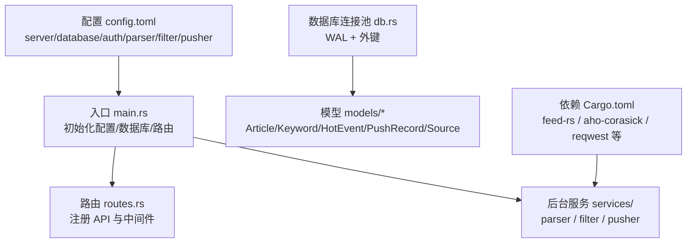
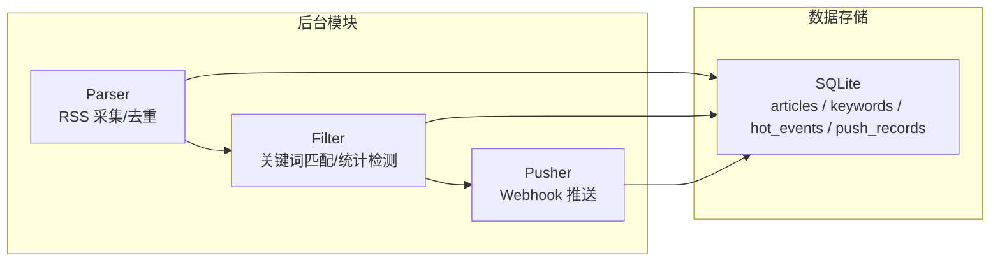
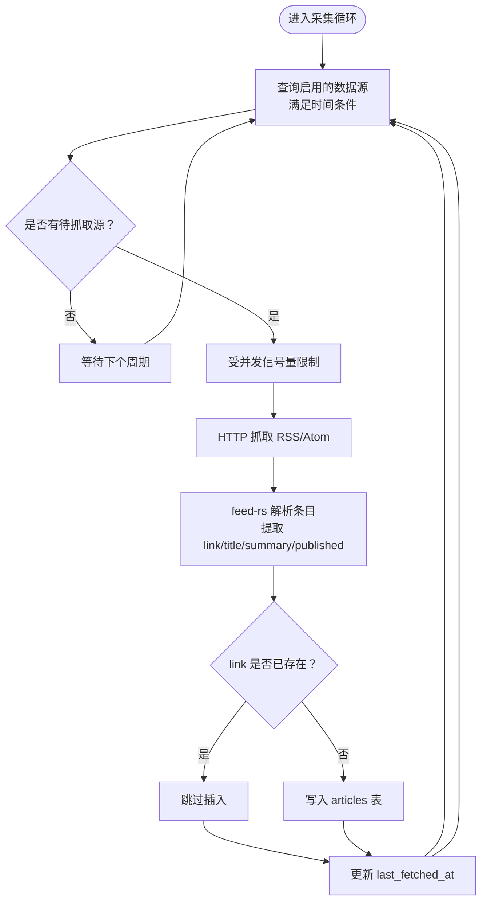
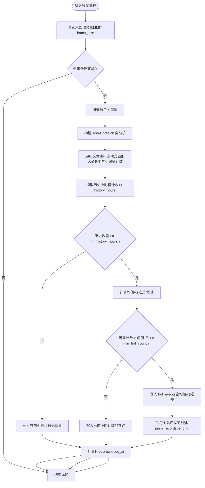
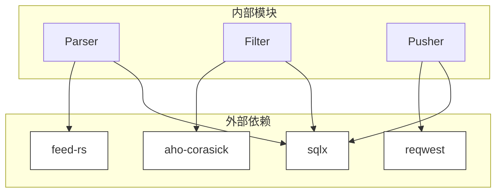

# 核心功能特性

<cite>
**本文引用的文件**
- [README.md](file://README.md)
- [config.toml](file://config.toml)
- [Cargo.toml](file://Cargo.toml)
- [src/main.rs](file://src/main.rs)
- [src/db.rs](file://src/db.rs)
- [src/models/article.rs](file://src/models/article.rs)
- [src/models/keyword.rs](file://src/models/keyword.rs)
- [src/models/hot_event.rs](file://src/models/hot_event.rs)
- [src/models/push_record.rs](file://src/models/push_record.rs)
- [src/models/source.rs](file://src/models/source.rs)
- [src/db/keyword.rs](file://src/db/keyword.rs)
- [openspec/changes/query-apis-and-background-modules/specs/parser-module/spec.md](file://openspec/changes/query-apis-and-background-modules/specs/parser-module/spec.md)
- [openspec/changes/query-apis-and-background-modules/specs/filter-module/spec.md](file://openspec/changes/query-apis-and-background-modules/specs/filter-module/spec.md)
- [openspec/changes/query-apis-and-background-modules/specs/pusher-module/spec.md](file://openspec/changes/query-apis-and-background-modules/specs/pusher-module/spec.md)
- [docs/plans/05-query-apis-and-background-modules.md](file://docs/plans/05-query-apis-and-background-modules.md)
- [src/handlers/channel.rs](file://src/handlers/channel.rs)
</cite>

## 目录
1. [简介](#简介)
2. [项目结构](#项目结构)
3. [核心组件](#核心组件)
4. [架构总览](#架构总览)
5. [详细组件分析](#详细组件分析)
6. [依赖分析](#依赖分析)
7. [性能考虑](#性能考虑)
8. [故障排查指南](#故障排查指南)
9. [结论](#结论)
10. [附录](#附录)

## 简介
本系统是一个基于 Rust 的 AI 趋势监控平台，采用“管道模式”将采集、过滤与推送三大模块解耦运行。其核心能力包括：
- RSS 内容采集：按配置周期抓取 RSS/Atom 源，去重入库。
- 关键词匹配：基于 Aho-Corasick 多模式匹配，快速定位热点相关文章。
- 统计突发检测：以滑动平均与标准差构建阈值，识别小时级异常增长。
- Webhook 推送：按渠道配置向企业通讯工具推送告警，具备指数退避重试与乐观锁防重复。

## 项目结构
系统采用模块化组织，入口负责初始化与路由装配，后台服务模块独立运行，数据库连接池与 WAL 模式保障一致性与性能。



图表来源
- [src/main.rs:63-95](file://src/main.rs#L63-L95)
- [src/db.rs:11-25](file://src/db.rs#L11-L25)
- [config.toml:1-27](file://config.toml#L1-L27)
- [Cargo.toml:29-36](file://Cargo.toml#L29-L36)

章节来源
- [src/main.rs:63-95](file://src/main.rs#L63-L95)
- [src/db.rs:11-25](file://src/db.rs#L11-L25)
- [config.toml:1-27](file://config.toml#L1-L27)
- [Cargo.toml:29-36](file://Cargo.toml#L29-L36)

## 核心组件
- Parser（采集模块）：按数据源周期抓取 RSS/Atom，解析标题、摘要、发布时间，按链接去重写入 articles 表，并更新最近抓取时间。
- Filter（过滤模块）：周期性扫描未处理文章，构建 Aho-Corasick 自动机进行多关键词匹配；按小时桶统计命中数；对历史窗口计算均值与标准差，判定是否触发热点并生成 hot_events 与 push_records。
- Pusher（推送模块）：轮询待推送记录，按渠道配置发送 Webhook，2xx 成功则标记成功，否则指数退避重试，最大重试次数与基础退避秒数可配置。

章节来源
- [openspec/changes/query-apis-and-background-modules/specs/parser-module/spec.md:1-55](file://openspec/changes/query-apis-and-background-modules/specs/parser-module/spec.md#L1-L55)
- [openspec/changes/query-apis-and-background-modules/specs/filter-module/spec.md:1-87](file://openspec/changes/query-apis-and-background-modules/specs/filter-module/spec.md#L1-L87)
- [openspec/changes/query-apis-and-background-modules/specs/pusher-module/spec.md:1-88](file://openspec/changes/query-apis-and-background-modules/specs/pusher-module/spec.md#L1-L88)
- [docs/plans/05-query-apis-and-background-modules.md:531-740](file://docs/plans/05-query-apis-and-background-modules.md#L531-L740)
- [docs/plans/05-query-apis-and-background-modules.md:753-909](file://docs/plans/05-query-apis-and-background-modules.md#L753-L909)

## 架构总览
系统采用后台三段式流水线：Parser → Filter → Pusher。各模块独立调度，通过数据库共享状态，支持按需单独运行。



图表来源
- [README.md:7-23](file://README.md#L7-L23)
- [docs/plans/05-query-apis-and-background-modules.md:531-740](file://docs/plans/05-query-apis-and-background-modules.md#L531-L740)
- [docs/plans/05-query-apis-and-background-modules.md:753-909](file://docs/plans/05-query-apis-and-background-modules.md#L753-L909)

## 详细组件分析

### RSS 内容采集（Parser）
- 支持的数据源类型：RSS/Atom（通过 feed-rs 解析）。
- 采集策略：
  - 周期扫描：按数据源 last_fetched_at 与 interval_seconds 判断是否需要抓取。
  - 并发控制：使用信号量限制最大并发抓取数量。
  - 超时与 UA：可配置默认超时与 User-Agent。
  - 成功后更新 last_fetched_at。
- 去重机制：以文章链接 link 作为唯一键，若已存在则跳过插入。
- 错误处理：抓取失败仅记录日志并继续，避免单点故障影响整体。



图表来源
- [openspec/changes/query-apis-and-background-modules/specs/parser-module/spec.md:3-55](file://openspec/changes/query-apis-and-background-modules/specs/parser-module/spec.md#L3-L55)
- [docs/plans/05-query-apis-and-background-modules.md:357-417](file://docs/plans/05-query-apis-and-background-modules.md#L357-L417)

章节来源
- [openspec/changes/query-apis-and-background-modules/specs/parser-module/spec.md:1-55](file://openspec/changes/query-apis-and-background-modules/specs/parser-module/spec.md#L1-L55)
- [docs/plans/05-query-apis-and-background-modules.md:357-417](file://docs/plans/05-query-apis-and-background-modules.md#L357-L417)

### 关键词匹配与统计突发检测（Filter）
- Aho-Corasick 优势：
  - 多模式一次性匹配，适合大量关键词场景。
  - 时间复杂度近似 O(n+m)，n 为文本长度，m 为模式总长。
  - 支持大小写不敏感模式，降低预处理成本。
- 匹配流程：
  - 读取未处理文章批次（按配置 batch_size）。
  - 加载启用关键词，构建自动机。
  - 对每篇文章的标题+摘要进行匹配，记录命中明细并按小时桶累加计数。
- 统计突发检测：
  - 从 hot_events 中取历史小时桶计数（history_hours）。
  - 至少 min_history_hours 小时的历史数据才进行检测。
  - 计算均值与标准差，阈值 = mean + std_multiplier × stddev。
  - 当前小时计数同时满足“超过阈值”和“不低于 min_hot_count”时，判定为热点。
- 去重策略：同一关键词在同一小时桶内仅生成一条热点事件。



图表来源
- [openspec/changes/query-apis-and-background-modules/specs/filter-module/spec.md:17-87](file://openspec/changes/query-apis-and-background-modules/specs/filter-module/spec.md#L17-L87)
- [docs/plans/05-query-apis-and-background-modules.md:531-740](file://docs/plans/05-query-apis-and-background-modules.md#L531-L740)

章节来源
- [openspec/changes/query-apis-and-background-modules/specs/filter-module/spec.md:1-87](file://openspec/changes/query-apis-and-background-modules/specs/filter-module/spec.md#L1-L87)
- [docs/plans/05-query-apis-and-background-modules.md:531-740](file://docs/plans/05-query-apis-and-background-modules.md#L531-L740)

### Webhook 推送（Pusher）
- 推送策略：
  - 轮询策略：按 interval_seconds 轮询 push_records，优先处理 status='pending'，其次处理 retry_count<max_retries 且已到期的 failed 记录。
  - 渠道配置：从 push_channels 的 config JSON 中解析 webhook URL。
  - 内容构造：包含关键词与当前小时计数等信息。
- 重试机制：
  - 指数退避：next_retry_at = now + retry_count × retry_base_seconds。
  - 最大重试：max_retries 次；超过后不再重试。
  - 乐观锁：更新时限定当前状态与重试次数，避免并发重复推送。
- 成功/失败处理：
  - 2xx：标记为 success。
  - 非 2xx 或网络错误：增加 retry_count 并更新下次重试时间。

```mermaid
sequenceDiagram
participant Loop as "Pusher 循环"
participant DB as "数据库"
participant Ch as "推送渠道"
participant Hook as "Webhook 服务器"
Loop->>DB : 查询待推送记录pending 或 retry-due
DB-->>Loop : 返回记录列表
loop 对每条记录
Loop->>DB : 读取 push_channels / hot_events / keywords
DB-->>Loop : 返回渠道与事件详情
Loop->>Ch : 解析 config.json 获取 webhook URL
alt URL 有效
Loop->>Hook : POST JSON 负载
alt 2xx 成功
Hook-->>Loop : 200 OK
Loop->>DB : 更新为 success乐观锁
else 非 2xx 或网络错误
Hook-->>Loop : 错误
Loop->>DB : 增加重试次数与下次重试时间乐观锁
end
else URL 无效
Loop->>DB : 标记为 failed无 webhook URL
end
end
```

图表来源
- [openspec/changes/query-apis-and-background-modules/specs/pusher-module/spec.md:17-88](file://openspec/changes/query-apis-and-background-modules/specs/pusher-module/spec.md#L17-L88)
- [docs/plans/05-query-apis-and-background-modules.md:753-909](file://docs/plans/05-query-apis-and-background-modules.md#L753-L909)

章节来源
- [openspec/changes/query-apis-and-background-modules/specs/pusher-module/spec.md:1-88](file://openspec/changes/query-apis-and-background-modules/specs/pusher-module/spec.md#L1-L88)
- [docs/plans/05-query-apis-and-background-modules.md:753-909](file://docs/plans/05-query-apis-and-background-modules.md#L753-L909)

### 模块化设计与运行机制
- 独立运行：支持 hotspot all|api|parser|filter|pusher 组合启动。
- Parser：按数据源各自间隔抓取，去重写入 articles。
- Filter：每 5 分钟运行一次，Aho-Corasick 匹配 + 统计检测，生成 hot_events 与 push_records。
- Pusher：每 10 秒轮询，指数退避重试，乐观锁防重复。

章节来源
- [README.md:7-23](file://README.md#L7-L23)
- [src/main.rs:16-24](file://src/main.rs#L16-L24)

## 依赖分析
- 外部库：
  - feed-rs：RSS/Atom 解析。
  - aho-corasick：多模式字符串匹配。
  - reqwest：Webhook 推送 HTTP 客户端。
  - sqlx：SQLite ORM 与连接池。
- 内部模块：
  - Parser 依赖 feed-rs 与 sqlx。
  - Filter 依赖 aho-corasick、sqlx 与配置。
  - Pusher 依赖 reqwest、sqlx 与配置。



图表来源
- [Cargo.toml:29-36](file://Cargo.toml#L29-L36)
- [docs/plans/05-query-apis-and-background-modules.md:531-740](file://docs/plans/05-query-apis-and-background-modules.md#L531-L740)
- [docs/plans/05-query-apis-and-background-modules.md:753-909](file://docs/plans/05-query-apis-and-background-modules.md#L753-L909)

章节来源
- [Cargo.toml:29-36](file://Cargo.toml#L29-L36)

## 性能考虑
- Parser
  - 并发抓取上限由配置控制，避免资源争用。
  - 使用信号量限流，结合超时与 UA 设置提升稳定性。
- Filter
  - Aho-Corasick 多模式匹配显著降低多关键词扫描成本。
  - 批量处理未处理文章，减少数据库往返。
  - 历史统计仅在满足最小历史窗口时进行，避免空检测。
- Pusher
  - 轮询间隔短（默认 10 秒），保证低延迟推送。
  - 指数退避避免对下游造成冲击，最大重试次数限制防止无限重试。

## 故障排查指南
- 初始 Token 问题
  - 首次启动若未配置 initial_token，系统会自动生成并打印到日志中；请妥善保存以便后续访问 API。
- 数据库连接
  - 确认数据库路径存在且可写；系统启动时会自动创建目录并执行迁移。
- Parser 失败
  - 抓取失败会记录日志并继续；检查网络连通性、目标站点可用性与超时设置。
- Filter 未触发热点
  - 检查关键词是否启用、大小写敏感配置与阈值参数；确认历史小时桶数据是否充足（至少 min_history_hours）。
- Pusher 推送失败
  - 检查渠道配置 JSON 是否包含有效的 webhook URL；查看重试次数与下次重试时间；关注网络错误与非 2xx 响应。

章节来源
- [src/main.rs:29-61](file://src/main.rs#L29-L61)
- [src/db.rs:11-25](file://src/db.rs#L11-L25)
- [openspec/changes/query-apis-and-background-modules/specs/pusher-module/spec.md:52-88](file://openspec/changes/query-apis-and-background-modules/specs/pusher-module/spec.md#L52-L88)

## 结论
本系统通过模块化设计与明确的职责边界，实现了从 RSS 采集、关键词匹配、统计检测到 Webhook 推送的完整闭环。Aho-Corasick 与滑动窗口统计提供了高效且稳健的热点识别能力，配合指数退避与乐观锁的推送机制，确保告警的及时与可靠。

## 附录
- 使用场景示例
  - 场景一：监控 AI 学术论文发布动态
    - 添加 arXiv RSS 源，配置抓取间隔；新增关键词如“Transformer”“扩散模型”，设置合理的 std_multiplier 与 min_hot_count；配置钉钉/飞书 Webhook 渠道；观察热点事件与推送记录。
  - 场景二：企业内部技术博客监测
    - 导入多个技术博客 RSS，建立关键词库（如“Rust”“Kubernetes”），开启 Filter 与 Pusher；当某关键词在小时内异常增多时，自动推送告警至团队群组。
- 实际效果
  - 采集模块：按配置周期稳定抓取，去重避免重复入库。
  - 过滤模块：关键词命中与小时桶统计清晰可见，热点阈值可调。
  - 推送模块：Webhook 成功/失败状态与重试记录完整，便于审计与排障。