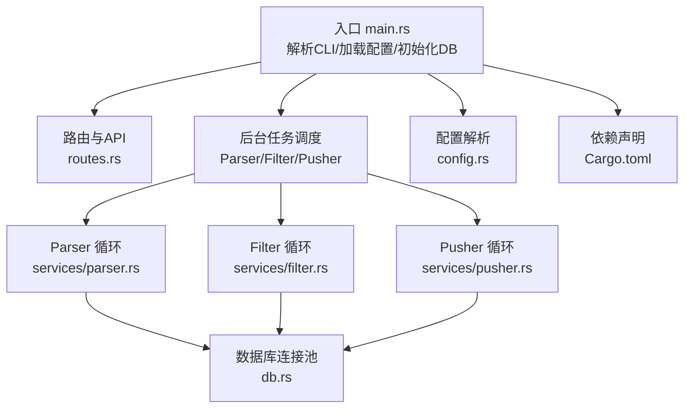
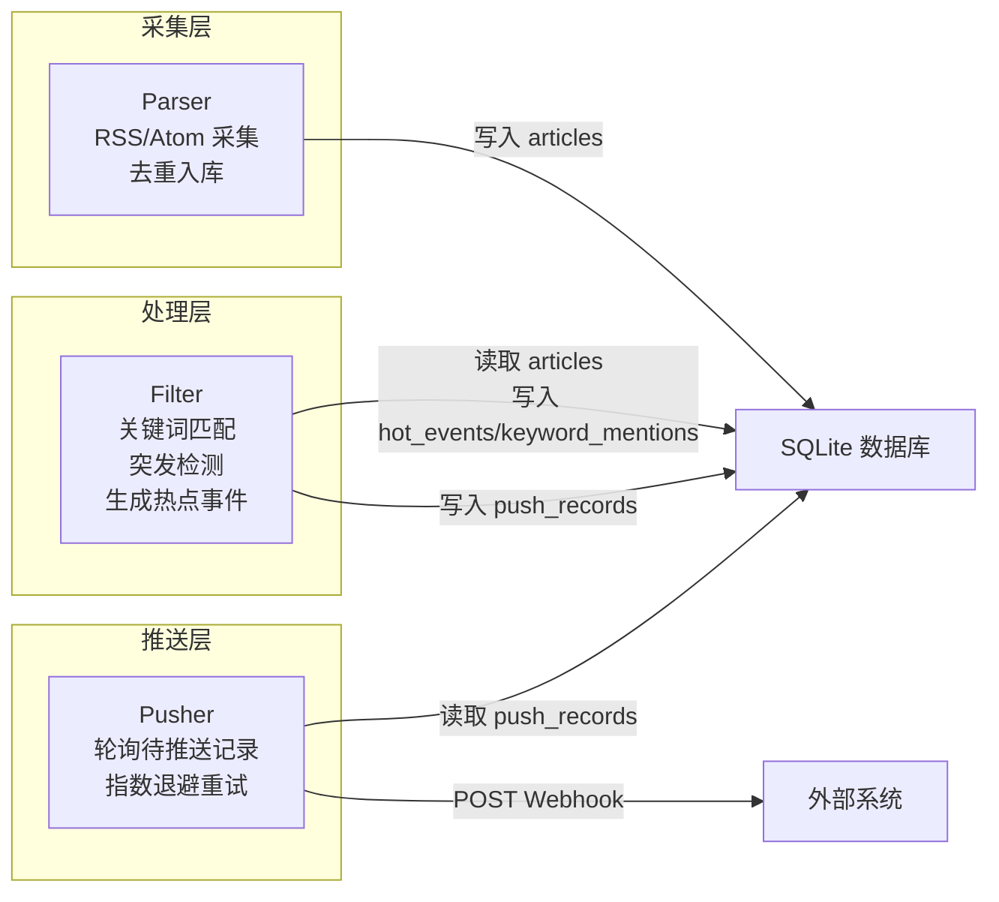
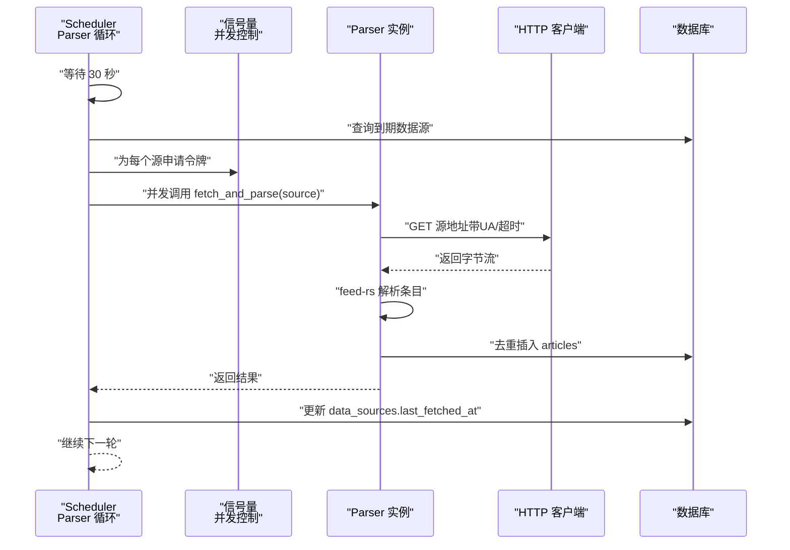
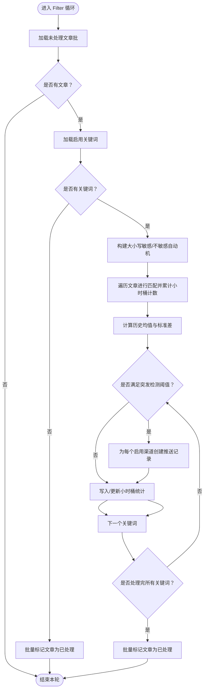
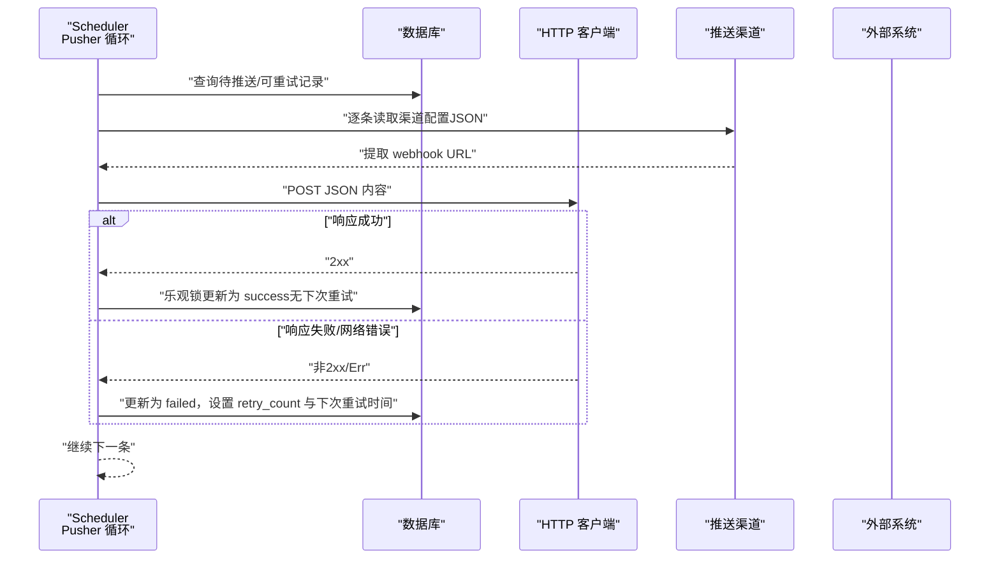
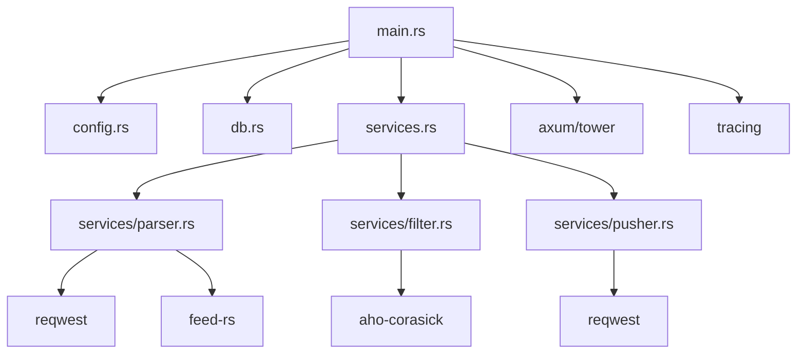

# 管道架构设计

<cite>
**本文引用的文件**
- [src/main.rs](file://src/main.rs)
- [src/config.rs](file://src/config.rs)
- [src/db.rs](file://src/db.rs)
- [src/services.rs](file://src/services.rs)
- [src/services/parser.rs](file://src/services/parser.rs)
- [src/services/filter.rs](file://src/services/filter.rs)
- [src/services/pusher.rs](file://src/services/pusher.rs)
- [README.md](file://README.md)
- [Cargo.toml](file://Cargo.toml)
</cite>

## 目录
1. [简介](#简介)
2. [项目结构](#项目结构)
3. [核心组件](#核心组件)
4. [架构总览](#架构总览)
5. [详细组件分析](#详细组件分析)
6. [依赖关系分析](#依赖关系分析)
7. [性能考虑](#性能考虑)
8. [故障排查指南](#故障排查指南)
9. [结论](#结论)
10. [附录](#附录)

## 简介
本项目采用管道（Pipeline）架构，将数据处理拆分为三个独立的后台模块：Parser（采集）、Filter（过滤与热点检测）、Pusher（推送）。各模块通过数据库作为共享存储进行解耦，彼此独立运行，支持按需组合启动。该设计具备良好的扩展性、可观测性与容错能力。

- Parser：周期性扫描待采集的数据源，限制并发抓取，解析 RSS/Atom 并去重入库。
- Filter：周期性对未处理文章进行关键词匹配与统计突发检测，生成热点事件并创建推送记录。
- Pusher：周期性轮询待推送记录，发送 Webhook，采用指数退避重试与乐观锁保证幂等。

## 项目结构
项目采用模块化组织，入口负责加载配置、初始化数据库与路由，并根据运行模式启动相应后台任务；services 子模块分别实现 Parser/Filter/Pusher 的后台循环。

图表来源
- [src/main.rs:64-164](file://src/main.rs#L64-L164)
- [src/services.rs:1-4](file://src/services.rs#L1-L4)
- [src/db.rs:10-27](file://src/db.rs#L10-L27)
- [src/config.rs:51-58](file://src/config.rs#L51-L58)
- [Cargo.toml:1-47](file://Cargo.toml#L1-L47)

章节来源
- [src/main.rs:64-164](file://src/main.rs#L64-L164)
- [src/services.rs:1-4](file://src/services.rs#L1-L4)
- [src/db.rs:10-27](file://src/db.rs#L10-L27)
- [src/config.rs:51-58](file://src/config.rs#L51-L58)
- [Cargo.toml:1-47](file://Cargo.toml#L1-L47)

## 核心组件
- 配置系统：集中管理服务器、数据库、认证、Parser/Filter/Pusher 的运行参数。
- 数据库层：SQLite 连接池、WAL 模式与外键约束，确保一致性与并发安全。
- 服务层：Parser/Filter/Pusher 三大后台循环，各自职责清晰、互不阻塞。
- API 层：基于 Axum/Tower 的 HTTP 服务，提供健康检查与 Token 管理接口。

章节来源
- [src/config.rs:3-58](file://src/config.rs#L3-L58)
- [src/db.rs:10-27](file://src/db.rs#L10-L27)
- [src/main.rs:64-164](file://src/main.rs#L64-L164)

## 架构总览
管道三段式架构：Parser → Filter → Pusher。Parser 负责“采集与入库”，Filter 负责“关键词匹配与热点检测”，Pusher 负责“Webhook 推送”。模块之间通过数据库表进行解耦，避免强耦合与长链路阻塞。

图表来源
- [README.md:5-23](file://README.md#L5-L23)
- [src/services/parser.rs:94-185](file://src/services/parser.rs#L94-L185)
- [src/services/filter.rs:13-208](file://src/services/filter.rs#L13-L208)
- [src/services/pusher.rs:11-202](file://src/services/pusher.rs#L11-L202)

## 详细组件分析

### Parser 模块
- 设计理念
  - 使用异步并发抓取，通过信号量限制最大并发，避免对上游源造成压力。
  - 以“到期即取”策略扫描数据源，减少无效工作。
  - 采用 feed-rs 解析 RSS/Atom，提取标题、摘要、发布时间等字段。
  - 基于 link 去重，避免重复入库；无论成功与否均更新 last_fetched_at，避免频繁重试。
- 数据传递机制
  - 输入：data_sources（按到期时间筛选）。
  - 输出：articles 表（去重插入），同时更新 data_sources.last_fetched_at。
- 错误传播策略
  - 抓取失败记录日志并继续；成功后更新最后抓取时间，避免立即重试。
- 并发控制与资源分配
  - 通过 tokio::sync::Semaphore 控制并发抓取数量。
  - 每个抓取任务独立 acquire/release 令牌，避免饥饿。
- 生命周期管理
  - 后台循环每 30 秒扫描一次；异常不影响后续循环。
- 通信协议
  - HTTP GET RSS/Atom 源，超时与 UA 由配置决定；解析失败记录错误并跳过。

图表来源
- [src/services/parser.rs:94-185](file://src/services/parser.rs#L94-L185)
- [src/services/parser.rs:48-97](file://src/services/parser.rs#L48-L97)

章节来源
- [src/services/parser.rs:94-185](file://src/services/parser.rs#L94-L185)
- [src/services/parser.rs:48-97](file://src/services/parser.rs#L48-L97)

### Filter 模块
- 设计理念
  - 周期性运行（默认 5 分钟），批量读取未处理文章，构建 Aho-Corasick 自动机进行多模式匹配。
  - 按关键词+小时桶统计命中次数，结合历史均值与标准差进行突发检测。
  - 当满足阈值与最小计数时，生成热点事件并为每个启用渠道创建推送记录。
- 数据传递机制
  - 输入：articles（processed_at 为空）、keywords（enabled）、push_channels（enabled）。
  - 输出：hot_events（小时桶统计）、keyword_mentions（匹配明细）、push_records（待推送）。
- 错误传播策略
  - 任一步骤失败仅记录错误并跳过该关键词或文章，不影响其他处理。
- 并发控制与资源分配
  - 采用批处理（batch_size）降低单次查询压力；大小写敏感与不敏感关键词分别构建自动机，提升匹配效率。
- 生命周期管理
  - 后台循环按配置间隔睡眠并执行一次处理；异常不影响后续循环。
- 通信协议
  - 仅数据库访问，无外部网络请求。

图表来源
- [src/services/filter.rs:13-208](file://src/services/filter.rs#L13-L208)
- [src/services/filter.rs:210-267](file://src/services/filter.rs#L210-L267)

章节来源
- [src/services/filter.rs:13-208](file://src/services/filter.rs#L13-L208)
- [src/services/filter.rs:210-267](file://src/services/filter.rs#L210-L267)

### Pusher 模块
- 设计理念
  - 周期性轮询（默认 10 秒），合并“待推送”与“可重试”的记录，逐条发送 Webhook。
  - 从渠道配置 JSON 中提取 webhook URL，构造统一文本内容。
  - 成功则标记 success；失败采用指数退避（retry_base_seconds × retry_count），最多重试 max_retries 次。
  - 使用乐观锁更新状态，避免并发重复推送。
- 数据传递机制
  - 输入：push_records（status=pending 或 failed 且到达下次重试时间）。
  - 输出：更新 push_records 状态与重试时间；外部系统收到 Webhook。
- 错误传播策略
  - 非 2xx 或网络错误均视为失败，增加 retry_count 并安排下次重试；达到上限后不再重试。
- 并发控制与资源分配
  - 逐条处理，避免并发竞争；重试时间基于当前时间线性递增。
- 生命周期管理
  - 后台循环按配置间隔睡眠并执行一次处理；异常不影响后续循环。
- 通信协议
  - HTTP POST JSON 至外部 Webhook；超时与重试策略由配置控制。

图表来源
- [src/services/pusher.rs:11-202](file://src/services/pusher.rs#L11-L202)
- [src/services/pusher.rs:207-242](file://src/services/pusher.rs#L207-L242)

章节来源
- [src/services/pusher.rs:11-202](file://src/services/pusher.rs#L11-L202)
- [src/services/pusher.rs:207-242](file://src/services/pusher.rs#L207-L242)

## 依赖关系分析
- 运行时依赖
  - 异步运行时：Tokio（full 特性）。
  - Web 框架：Axum + Tower。
  - 数据库：sqlx（SQLite，WAL 模式）。
  - RSS 解析：feed-rs。
  - 关键词匹配：Aho-Corasick。
  - HTTP 客户端：reqwest。
  - 序列化：serde/serde_json/toml。
  - 日志：tracing/tracing-subscriber。
- 模块内聚与耦合
  - Parser/Filter/Pusher 通过数据库表解耦，彼此无直接函数调用依赖。
  - 配置集中管理，便于统一调整运行参数。
  - 数据库连接池复用，避免重复连接开销。

图表来源
- [src/main.rs:64-164](file://src/main.rs#L64-L164)
- [src/config.rs:51-58](file://src/config.rs#L51-L58)
- [src/db.rs:10-27](file://src/db.rs#L10-L27)
- [src/services.rs:1-4](file://src/services.rs#L1-L4)
- [Cargo.toml:6-47](file://Cargo.toml#L6-L47)

章节来源
- [Cargo.toml:6-47](file://Cargo.toml#L6-L47)
- [src/main.rs:64-164](file://src/main.rs#L64-L164)

## 性能考虑
- 批处理策略
  - Filter 使用 batch_size 限制单次处理文章数，降低内存峰值与锁竞争。
  - Parser 使用 Semaphore 控制并发抓取，避免对上游源与本地资源造成瞬时压力。
- 内存管理
  - Parser/Filter 在处理过程中仅持有必要集合（Vec/HashMap），处理完成后释放。
  - Filter 将大小写敏感与不敏感关键词分离构建自动机，减少匹配成本。
- CPU 利用率优化
  - 使用 Aho-Corasick 进行多模式匹配，时间复杂度近似 O(n+m+k)。
  - 统计计算采用一次性聚合，避免多次扫描。
- I/O 优化
  - Parser/Filter/Pusher 均以固定间隔轮询，避免忙轮询。
  - Pusher 使用乐观锁更新状态，减少不必要的写放大。
- 数据库优化
  - SQLite WAL 模式提升并发读写性能；外键约束保障数据一致性。
  - 连接池最大连接数限制为 5，避免过度占用系统资源。

## 故障排查指南
- Parser 常见问题
  - 抓取超时/失败：检查 default_timeout_seconds 与 default_user_agent；确认网络可达。
  - 无法去重：检查 articles.link 唯一键约束；查看日志中“跳过重复”记录。
  - 并发过高：降低 max_concurrent_fetches；观察上游源限流策略。
- Filter 常见问题
  - 无热点事件：检查 keywords.enabled 与 min_history_hours/batch_size；确认文章已入库。
  - 突发检测阈值异常：检查 std_multiplier 与历史小时数；查看历史统计计算日志。
  - 批量更新失败：关注 SQLite 批量 IN 参数限制，确认分批更新逻辑。
- Pusher 常见问题
  - Webhook 4xx/5xx：检查渠道配置 JSON 中的 url 字段；查看响应状态与日志。
  - 重试过多：核对 max_retries 与 retry_base_seconds；确认外部系统恢复情况。
  - 幂等问题：确认乐观锁更新是否被其他进程抢先；查看“已被其他进程更新”的警告。
- 通用排查
  - 查看 tracing 日志级别与过滤器；确认数据库连接池可用；核对配置文件路径与权限。

章节来源
- [src/services/parser.rs:101-185](file://src/services/parser.rs#L101-L185)
- [src/services/filter.rs:13-208](file://src/services/filter.rs#L13-L208)
- [src/services/pusher.rs:11-202](file://src/services/pusher.rs#L11-L202)

## 结论
该管道架构以 Parser/Filter/Pusher 三段式为核心，通过数据库实现模块解耦，具备良好的扩展性与稳定性。模块各自独立运行，支持按需组合启动；通过批处理、并发控制与指数退避等策略，兼顾吞吐与可靠性。建议在生产环境中持续监控日志与数据库性能指标，按流量与资源情况动态调整并发与批大小。

## 附录
- 运行模式
  - all/api：启动 Parser/Filter/Pusher 三个后台任务，并启动 API 服务。
  - parser/filter/pusher：仅启动对应模块。
- 配置项参考
  - server：监听地址与端口。
  - database：SQLite 路径。
  - auth：初始 Token。
  - parser：最大并发、默认 UA、默认超时。
  - filter：批大小、间隔、历史窗口、最少历史。
  - pusher：轮询间隔、最大重试、退避基础秒数。

章节来源
- [README.md:95-121](file://README.md#L95-L121)
- [src/main.rs:87-160](file://src/main.rs#L87-L160)