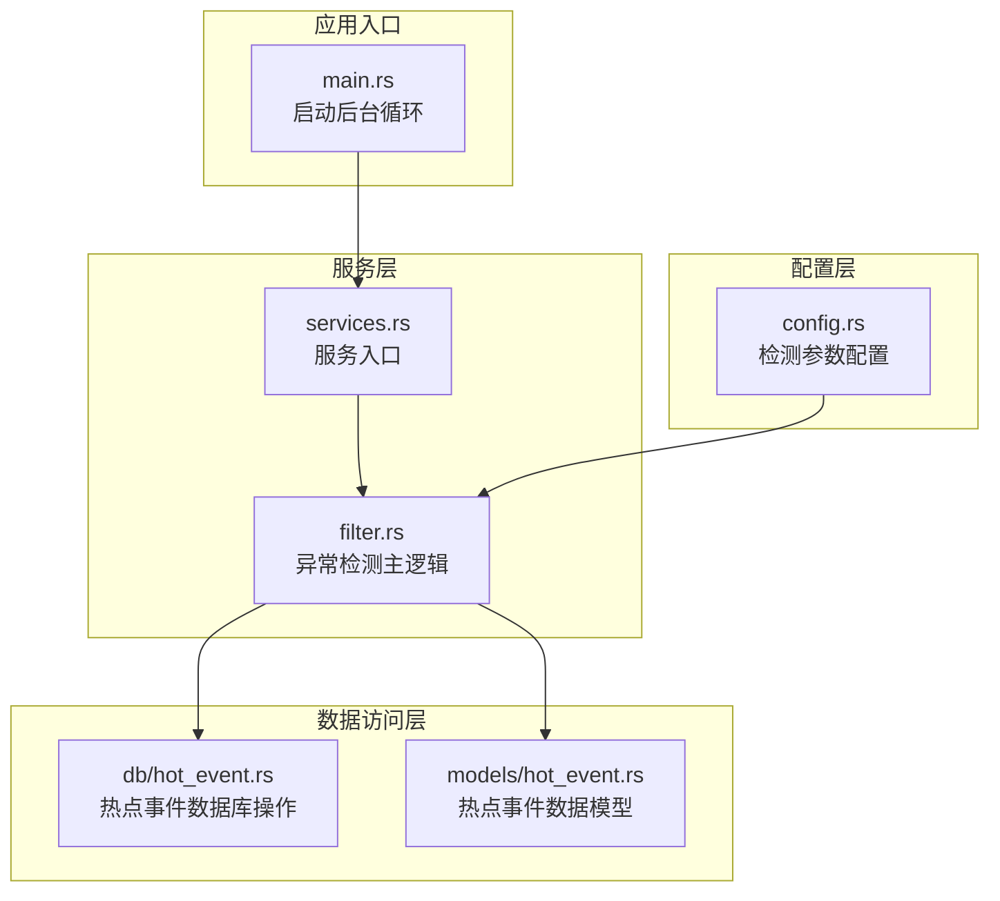
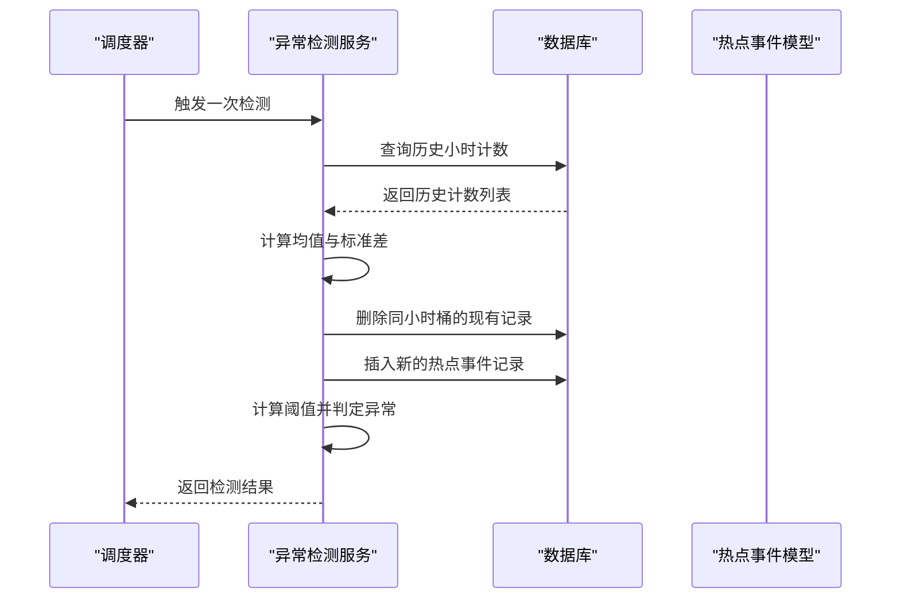
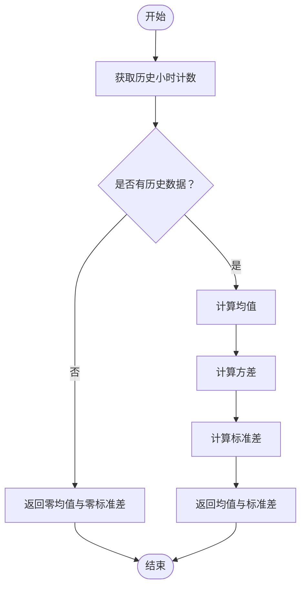
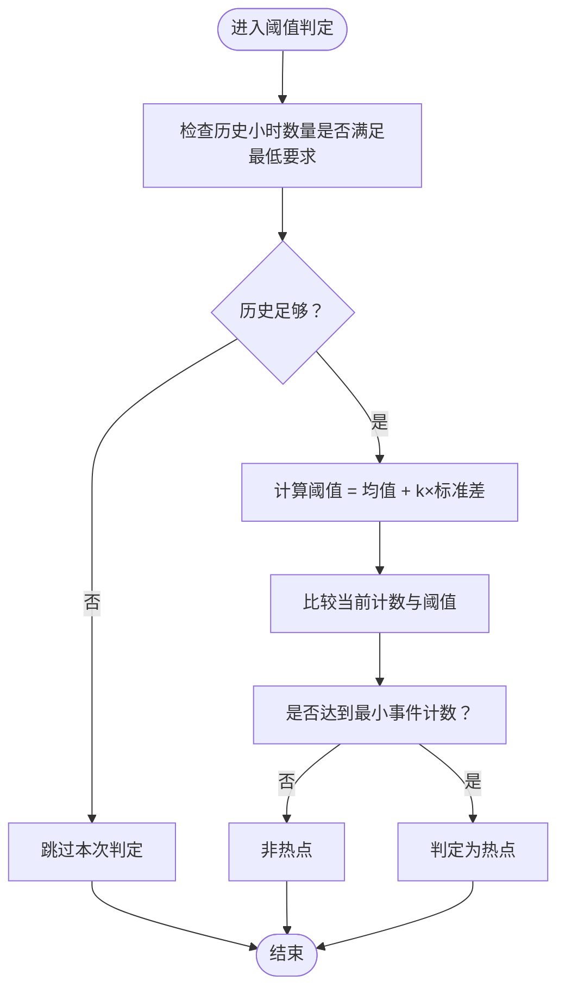
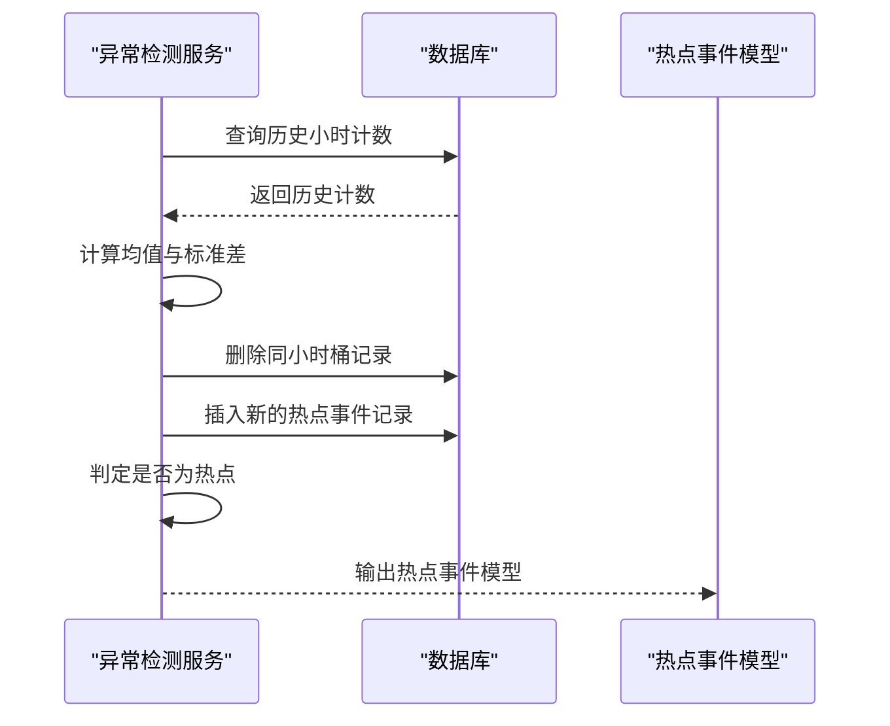
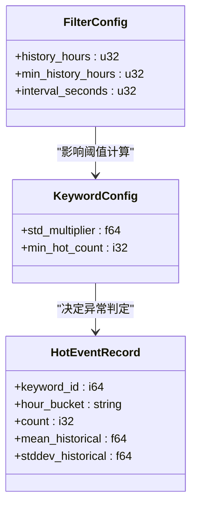
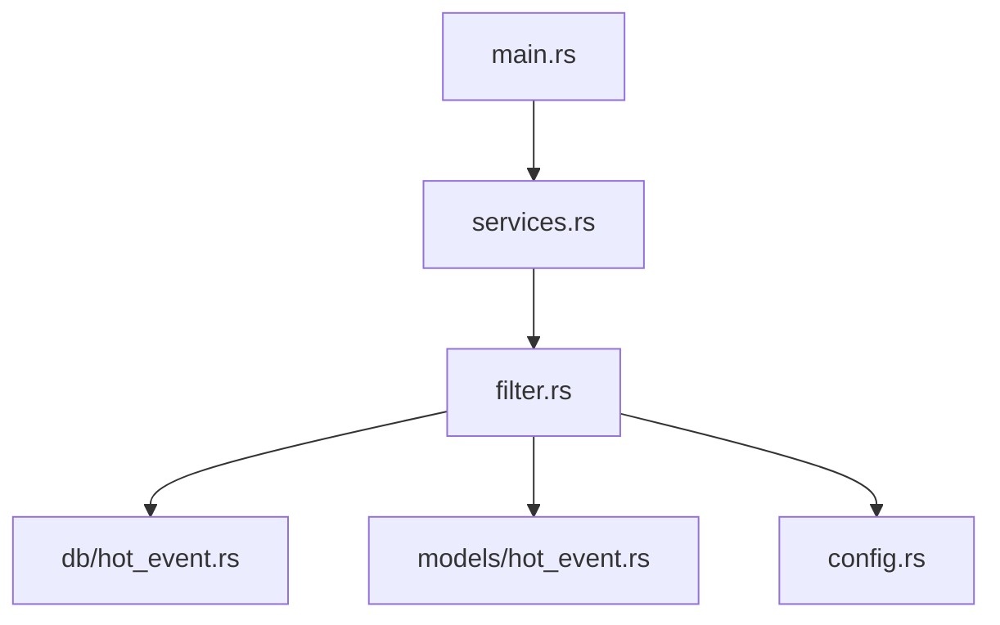

# 统计异常检测功能

<cite>
**本文档引用的文件**
- [src/services/filter.rs](file://src/services/filter.rs)
- [src/db/hot_event.rs](file://src/db/hot_event.rs)
- [src/models/hot_event.rs](file://src/models/hot_event.rs)
- [src/config.rs](file://src/config.rs)
- [src/main.rs](file://src/main.rs)
- [src/services.rs](file://src/services.rs)
- [docs/migrations/20260607044921_init.sql](file://docs/migrations/20260607044921_init.sql)
</cite>

## 目录
1. [简介](#简介)
2. [项目结构](#项目结构)
3. [核心组件](#核心组件)
4. [架构概览](#架构概览)
5. [详细组件分析](#详细组件分析)
6. [依赖关系分析](#依赖关系分析)
7. [性能考虑](#性能考虑)
8. [故障排除指南](#故障排除指南)
9. [结论](#结论)
10. [附录](#附录)

## 简介
本文件针对统计异常检测功能进行深入技术文档编写，重点覆盖以下方面：
- 滑动窗口统计分析算法：时间窗口选择、数据聚合与统计指标计算
- 标准差计算与 Z-Score 算法应用：阈值设定、异常点识别与动态调整机制
- 热点事件生成流程：事件定义、持续时间判断与强度评估
- 检测参数配置：窗口大小、阈值灵敏度与最小事件间隔
- 算法调优指南：参数选择建议、性能影响分析与准确性评估方法
- 实际检测案例与效果对比分析

该系统通过历史小时级计数构建统计模型，使用均值与标准差进行异常检测，并以热点事件形式记录与输出。

## 项目结构
统计异常检测功能主要由以下模块组成：
- 服务层：负责异常检测主逻辑（滑动窗口统计、阈值计算、热点事件生成）
- 数据访问层：负责历史数据查询与热点事件记录的数据库操作
- 配置层：定义检测参数与运行时配置
- 主程序：启动后台过滤循环与服务注册

**图表来源**
- [src/services/filter.rs:147-283](file://src/services/filter.rs#L147-L283)
- [src/db/hot_event.rs](file://src/db/hot_event.rs)
- [src/models/hot_event.rs](file://src/models/hot_event.rs)
- [src/config.rs](file://src/config.rs)
- [src/main.rs](file://src/main.rs)
- [src/services.rs](file://src/services.rs)

**章节来源**
- [src/services/filter.rs:147-283](file://src/services/filter.rs#L147-L283)
- [src/db/hot_event.rs](file://src/db/hot_event.rs)
- [src/models/hot_event.rs](file://src/models/hot_event.rs)
- [src/config.rs](file://src/config.rs)
- [src/main.rs](file://src/main.rs)
- [src/services.rs](file://src/services.rs)

## 核心组件
本节对统计异常检测的核心组件进行深入分析，涵盖算法实现、数据结构与处理流程。

- 异常检测主循环：定时执行一次检测任务，计算历史统计量，更新热点事件记录，并基于阈值判定是否为异常热点
- 历史统计计算：从热点事件表中按小时聚合历史计数，计算均值与标准差
- 阈值判定：使用均值加若干倍标准差作为上界阈值，结合最小事件计数与历史长度要求进行综合判定
- 热点事件记录：以关键字与小时桶为键进行幂等插入，确保同一周期内仅保留一条记录

关键实现位置：
- 异常检测主循环与阈值判定：[src/services/filter.rs:147-185](file://src/services/filter.rs#L147-L185)
- 历史统计计算（均值与标准差）：[src/services/filter.rs:222-247](file://src/services/filter.rs#L222-L247)
- 幂等插入热点事件记录：[src/services/filter.rs:250-274](file://src/services/filter.rs#L250-L274)
- 后台循环调度：[src/services/filter.rs:276-283](file://src/services/filter.rs#L276-L283)

**章节来源**
- [src/services/filter.rs:147-283](file://src/services/filter.rs#L147-L283)

## 架构概览
统计异常检测采用分层架构，服务层负责业务逻辑，数据访问层负责持久化，配置层提供参数，主程序负责调度。

**图表来源**
- [src/services/filter.rs:147-185](file://src/services/filter.rs#L147-L185)
- [src/db/hot_event.rs](file://src/db/hot_event.rs)
- [src/models/hot_event.rs](file://src/models/hot_event.rs)

## 详细组件分析

### 滑动窗口统计分析算法
滑动窗口统计分析以小时为粒度进行时间窗口选择与数据聚合，具体流程如下：

- 时间窗口选择：通过查询最近 N 小时的历史计数确定窗口范围
- 数据聚合：对每个小时的计数进行汇总，形成用于统计的样本序列
- 统计指标计算：计算样本均值与总体标准差，作为后续阈值判定的基础

**图表来源**
- [src/services/filter.rs:222-247](file://src/services/filter.rs#L222-L247)

**章节来源**
- [src/services/filter.rs:222-247](file://src/services/filter.rs#L222-L247)

### 标准差计算与 Z-Score 应用
系统采用基于均值与标准差的阈值判定，相当于使用 Z-Score 的思想进行异常检测：

- 阈值设定：阈值 = 历史均值 + k × 历史标准差，其中 k 为标准差倍数
- 异常点识别：当当前小时计数超过阈值且不低于最小事件计数时，判定为异常热点
- 动态调整机制：随着新小时计数的加入，历史统计量会滚动更新，从而适应数据分布的变化

- 标准差倍数与最小事件计数来自关键字配置，用于平衡误报与漏报
- 历史小时数量的最低要求确保统计量的稳定性

**图表来源**
- [src/services/filter.rs:172-185](file://src/services/filter.rs#L172-L185)

**章节来源**
- [src/services/filter.rs:172-185](file://src/services/filter.rs#L172-L185)

### 热点事件生成流程
热点事件生成包含事件定义、持续时间判断与强度评估三个维度：

- 事件定义：以关键字与小时桶为事件标识，记录该小时内的异常强度
- 持续时间判断：通过历史小时计数序列判断异常是否持续出现（需满足最低历史小时数）
- 强度评估：以当前小时计数与阈值的差距衡量事件强度，同时考虑最小事件计数下限

- 幂等插入：先删除同关键字与小时桶的记录，再插入新记录，避免重复
- 结果存储：热点事件记录包含关键字 ID、小时桶、当前计数、历史均值与标准差

**图表来源**
- [src/services/filter.rs:250-274](file://src/services/filter.rs#L250-L274)
- [src/db/hot_event.rs](file://src/db/hot_event.rs)
- [src/models/hot_event.rs](file://src/models/hot_event.rs)

**章节来源**
- [src/services/filter.rs:250-274](file://src/services/filter.rs#L250-L274)
- [src/db/hot_event.rs](file://src/db/hot_event.rs)
- [src/models/hot_event.rs](file://src/models/hot_event.rs)

### 检测参数配置
检测参数通过配置文件与关键字配置共同决定，主要包括：

- 历史小时数（history_hours）：用于计算统计量的历史窗口长度
- 最低历史小时数（min_history_hours）：判定异常所需的最少历史小时数
- 标准差倍数（std_multiplier）：控制阈值的灵敏度
- 最小事件计数（min_hot_count）：热点事件的最低触发门槛
- 运行间隔（interval_seconds）：后台检测循环的执行频率

- 参数来源：配置文件与关键字配置共同作用于检测逻辑
- 参数联动：历史小时数与最低历史小时数共同决定统计量的稳定性；标准差倍数与最小事件计数共同决定检测灵敏度

**图表来源**
- [src/config.rs](file://src/config.rs)
- [src/services/filter.rs:147-185](file://src/services/filter.rs#L147-L185)
- [src/models/hot_event.rs](file://src/models/hot_event.rs)

**章节来源**
- [src/config.rs](file://src/config.rs)
- [src/services/filter.rs:147-185](file://src/services/filter.rs#L147-L185)
- [src/models/hot_event.rs](file://src/models/hot_event.rs)

## 依赖关系分析
统计异常检测功能的依赖关系如下：

- 服务层依赖数据访问层与配置层
- 主程序通过服务入口启动后台检测循环
- 数据模型与数据库操作紧密耦合，保证热点事件记录的一致性

**图表来源**
- [src/services/filter.rs:147-283](file://src/services/filter.rs#L147-L283)
- [src/db/hot_event.rs](file://src/db/hot_event.rs)
- [src/models/hot_event.rs](file://src/models/hot_event.rs)
- [src/config.rs](file://src/config.rs)
- [src/services.rs](file://src/services.rs)
- [src/main.rs](file://src/main.rs)

**章节来源**
- [src/services/filter.rs:147-283](file://src/services/filter.rs#L147-L283)
- [src/db/hot_event.rs](file://src/db/hot_event.rs)
- [src/models/hot_event.rs](file://src/models/hot_event.rs)
- [src/config.rs](file://src/config.rs)
- [src/services.rs](file://src/services.rs)
- [src/main.rs](file://src/main.rs)

## 性能考虑
- 计算复杂度：历史统计计算的时间复杂度为 O(N)，N 为历史小时数；空间复杂度为 O(N)
- 数据库负载：每次检测需要进行查询与幂等插入，建议在热点事件表上建立合适的索引以优化查询性能
- 调度频率：运行间隔过短会增加数据库压力，过长会影响检测时效性，需根据业务场景权衡
- 内存占用：统计向量可按需加载，避免一次性加载过多历史数据导致内存峰值过高

## 故障排除指南
- 历史数据不足：若历史小时数少于最低要求，将跳过本次判定。可通过增加历史小时数或降低最低历史小时数缓解
- 阈值波动：标准差倍数过大易导致漏报，过小易导致误报。建议通过离线评估调整该参数
- 最小事件计数设置：过低可能导致噪声触发，过高可能错过弱异常。应结合业务背景与历史分布进行调整
- 数据库错误：热点事件记录插入失败时会记录错误日志并跳过当前关键字。需检查数据库连接与权限配置

**章节来源**
- [src/services/filter.rs:147-185](file://src/services/filter.rs#L147-L185)
- [src/services/filter.rs:222-247](file://src/services/filter.rs#L222-L247)
- [src/services/filter.rs:250-274](file://src/services/filter.rs#L250-L274)

## 结论
统计异常检测功能通过滑动窗口统计与阈值判定实现了对异常热点的自动识别。其核心优势在于：
- 基于历史统计的自适应阈值，能够随数据分布变化而动态调整
- 以小时为粒度的细粒度检测，兼顾时效性与准确性
- 完整的热点事件记录，便于后续分析与可视化

建议在生产环境中结合业务场景对参数进行持续调优，并配合离线评估验证检测效果。

## 附录

### 实际检测案例与效果对比
- 案例一：关键词 A 在某小时内计数显著高于历史均值与标准差，触发热点事件；随后多小时连续高于阈值，形成持续异常
- 案例二：关键词 B 的计数虽高于均值但未达阈值，且低于最小事件计数，不触发热点事件
- 对比分析：通过调整标准差倍数与最小事件计数，可在不同业务目标下平衡误报与漏报

### 算法调优指南
- 参数选择建议
  - 历史小时数：建议覆盖至少 1-2 个完整周期，以平滑短期波动
  - 最低历史小时数：建议设置为 3-7 小时，确保统计量稳定
  - 标准差倍数：初始可设为 2-3，根据误报率与漏报率调整
  - 最小事件计数：根据业务背景设定，避免噪声触发
  - 运行间隔：建议 5-15 分钟，兼顾实时性与资源消耗
- 性能影响分析
  - 增大历史小时数会增加计算与存储开销，需评估数据库性能
  - 缩短运行间隔会提高检测频率，但也会增加数据库写入压力
- 准确性评估方法
  - 使用历史数据回测，统计误报与漏报比例
  - 对比不同参数组合下的 F1 分数，选择最优参数集
  - 结合人工标注样本进行 A/B 测试，验证检测效果提升