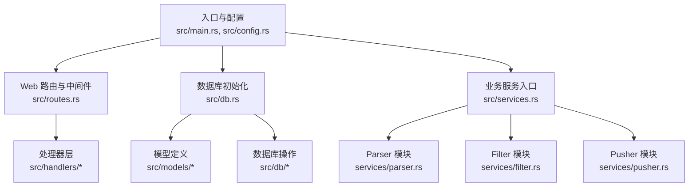
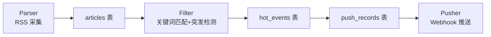
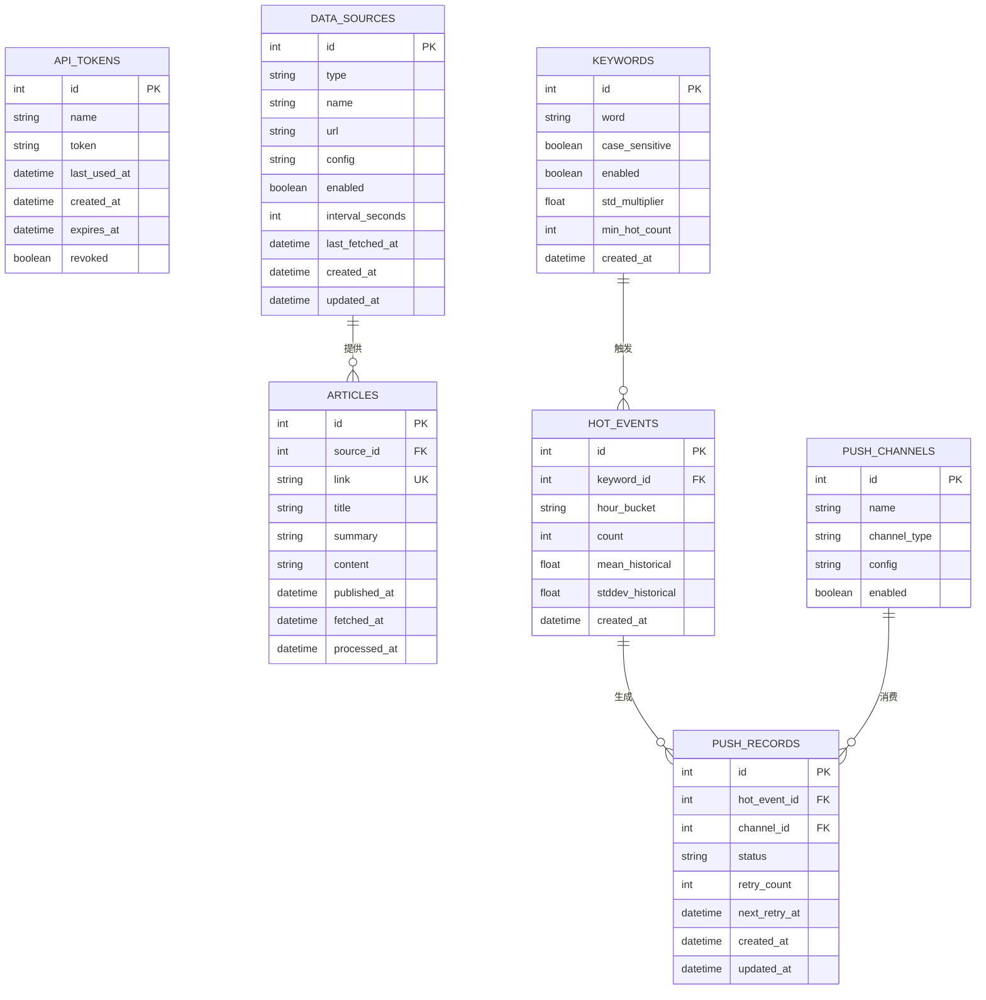
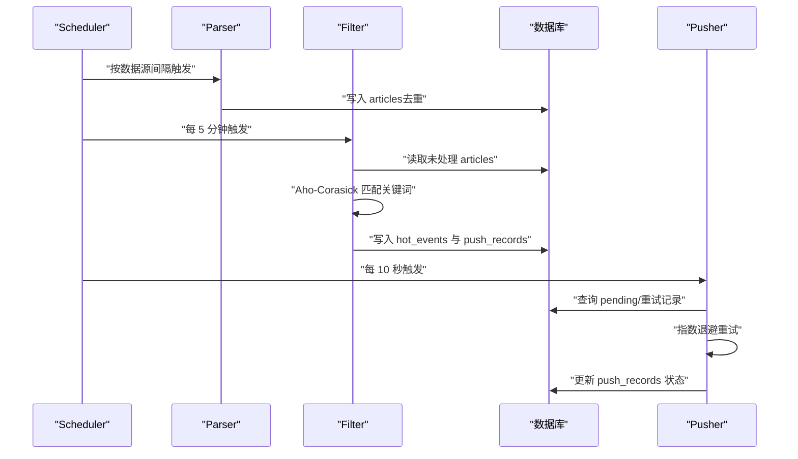
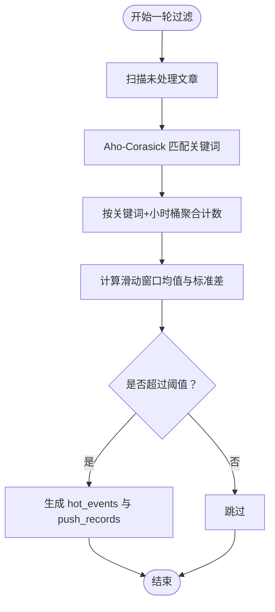
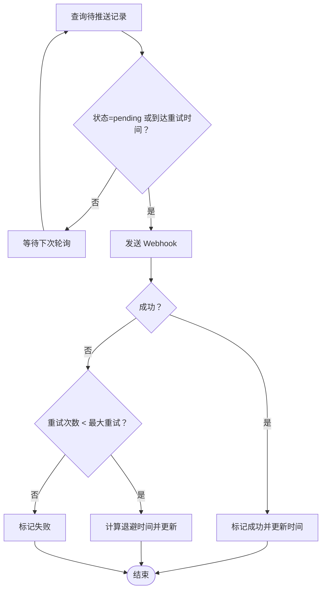
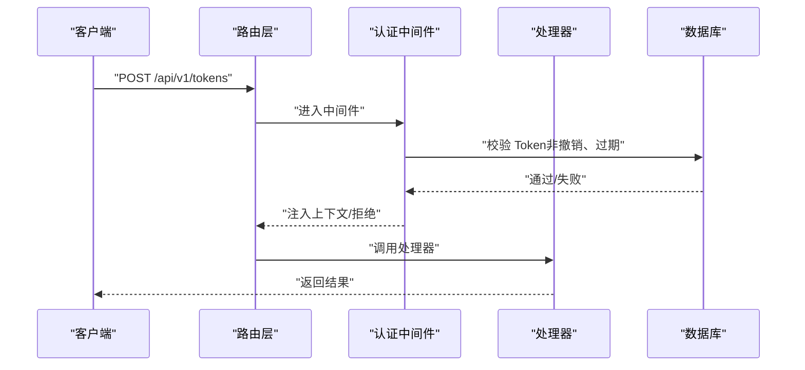
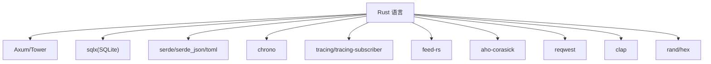

# 系统介绍

<cite>
**本文引用的文件**
- [README.md](file://README.md)
- [Cargo.toml](file://Cargo.toml)
- [src/main.rs](file://src/main.rs)
- [src/config.rs](file://src/config.rs)
- [src/db.rs](file://src/db.rs)
- [src/routes.rs](file://src/routes.rs)
- [src/services.rs](file://src/services.rs)
- [src/models/token.rs](file://src/models/token.rs)
- [src/models/article.rs](file://src/models/article.rs)
- [src/models/keyword.rs](file://src/models/keyword.rs)
- [src/models/hot_event.rs](file://src/models/hot_event.rs)
- [src/models/push_record.rs](file://src/models/push_record.rs)
- [src/models/source.rs](file://src/models/source.rs)
- [src/models/channel.rs](file://src/models/channel.rs)
- [docs/plans/05-query-apis-and-background-modules.md](file://docs/plans/05-query-apis-and-background-modules.md)
</cite>

## 目录
1. [引言](#引言)
2. [项目结构](#项目结构)
3. [核心组件](#核心组件)
4. [架构总览](#架构总览)
5. [详细组件分析](#详细组件分析)
6. [依赖分析](#依赖分析)
7. [性能考虑](#性能考虑)
8. [故障排查指南](#故障排查指南)
9. [结论](#结论)
10. [附录](#附录)

## 引言
本系统是一个基于 Rust 的 AI 热点监控平台，旨在自动采集 RSS 内容，通过关键词匹配与统计突发检测识别趋势热点，并通过钉钉/飞书 Webhook 实时推送告警。系统采用管道模式（Pipeline）将采集、过滤与推送三大环节解耦，既保证高吞吐与低延迟，又便于扩展与维护。

系统的核心价值在于：
- 降低人工巡检成本，自动化发现 AI 领域热点与趋势
- 提供可配置的关键词体系与统计阈值，适配不同业务场景
- 以 SQLite+WAL 模式与轻量级后端实现稳定可靠的生产部署
- 通过指数退避与乐观锁保障推送可靠性

选择 Rust 的原因与收益：
- 性能：零成本抽象、内存安全、无 GC 延迟，适合高并发与长生命周期服务
- 安全：编译期内存安全与类型安全，减少运行时漏洞
- 生态：Tokio 异步运行时、Axum Web 框架、sqlx 数据库访问、feed-rs RSS 解析、Aho-Corasick 多模式匹配、reqwest HTTP 客户端等成熟库支撑
- 可运维：CLI 模式支持单模块调试与组合运行，便于在容器与边缘环境部署

应用场景举例：
- AI 领域热点监控：对技术博客、新闻站、社区动态进行持续采集与关键词命中
- 趋势预警：基于滑动窗口统计与标准差阈值，快速识别异常增长
- 内容聚合：将同一时段内多来源相关文章汇总，形成热点事件报告

## 项目结构
系统采用“分层 + 功能模块”组织方式：
- 入口与配置：main.rs 负责 CLI、日志、数据库初始化与路由装配；config.rs 解析 TOML 配置
- Web 层：routes.rs 定义路由与中间件，handlers/ 下为各资源处理器
- 业务层：services/ 下为后台模块入口（Parser/Filter/Pusher），当前为占位声明，具体实现在开发计划中
- 数据层：models/ 定义数据模型，db/ 定义数据库操作，db.rs 初始化连接池与 WAL/外键
- 文档与规范：docs/ 与 openspec/ 提供迁移、API 设计与实施计划

图表来源
- [src/main.rs:63-96](file://src/main.rs#L63-L96)
- [src/config.rs:52-59](file://src/config.rs#L52-L59)
- [src/routes.rs:14-50](file://src/routes.rs#L14-L50)
- [src/db.rs:9-25](file://src/db.rs#L9-L25)
- [src/services.rs:1-6](file://src/services.rs#L1-L6)

章节来源
- [README.md:216-257](file://README.md#L216-L257)
- [src/main.rs:63-96](file://src/main.rs#L63-L96)
- [src/config.rs:52-59](file://src/config.rs#L52-L59)
- [src/db.rs:9-25](file://src/db.rs#L9-L25)
- [src/routes.rs:14-50](file://src/routes.rs#L14-L50)
- [src/services.rs:1-6](file://src/services.rs#L1-L6)

## 核心组件
- API 服务：基于 Axum 提供健康检查、Token 管理与后续的数据源/关键词/渠道管理接口
- 数据库：SQLite（WAL 模式 + 外键约束），通过 sqlx 访问，迁移脚本位于 docs/migrations
- 认证与授权：Bearer Token，支持创建、列表、撤销，中间件注入上下文
- 后台模块（开发中）：Parser（RSS 采集）、Filter（关键词匹配+热点检测）、Pusher（Webhook 推送）

章节来源
- [README.md:123-203](file://README.md#L123-L203)
- [src/db.rs:9-25](file://src/db.rs#L9-L25)
- [src/models/token.rs:5-46](file://src/models/token.rs#L5-L46)
- [docs/plans/05-query-apis-and-background-modules.md:913-959](file://docs/plans/05-query-apis-and-background-modules.md#L913-L959)

## 架构总览
系统采用管道模式，三个后台模块独立运行，通过数据库共享状态：
- Parser：按配置周期拉取 RSS，去重写入 articles 表
- Filter：每 5 分钟运行，Aho-Corasick 匹配关键词，小时桶计数，统计突发检测，生成 hot_events 与待推送记录
- Pusher：每 10 秒轮询 pending 推送记录，POST Webhook，指数退避重试，乐观锁防重复

图表来源
- [README.md:7-23](file://README.md#L7-L23)
- [README.md:273-289](file://README.md#L273-L289)

章节来源
- [README.md:7-23](file://README.md#L7-L23)
- [README.md:273-289](file://README.md#L273-L289)

## 详细组件分析

### 数据模型与表关系
系统围绕以下核心表构建：
- api_tokens：存储 Bearer Token（可撤销、可选过期）
- data_sources：RSS 数据源配置（URL、拉取间隔）
- articles：采集的文章（link 去重，processed_at 追踪过滤状态）
- keywords：关键词及敏感度参数（std_multiplier、min_hot_count）
- hot_events：检测到的热点事件（小时桶统计）
- push_channels：推送渠道配置（Webhook URL）
- push_records：每热点每渠道推送状态与重试追踪

图表来源
- [README.md:204-215](file://README.md#L204-L215)
- [src/models/token.rs:5-46](file://src/models/token.rs#L5-L46)
- [src/models/article.rs:5-25](file://src/models/article.rs#L5-L25)
- [src/models/keyword.rs:5-32](file://src/models/keyword.rs#L5-L32)
- [src/models/hot_event.rs:5-15](file://src/models/hot_event.rs#L5-L15)
- [src/models/channel.rs:4-26](file://src/models/channel.rs#L4-L26)
- [src/models/push_record.rs:5-16](file://src/models/push_record.rs#L5-L16)
- [src/models/source.rs:5-39](file://src/models/source.rs#L5-L39)

章节来源
- [README.md:204-215](file://README.md#L204-L215)
- [src/models/token.rs:5-46](file://src/models/token.rs#L5-L46)
- [src/models/article.rs:5-25](file://src/models/article.rs#L5-L25)
- [src/models/keyword.rs:5-32](file://src/models/keyword.rs#L5-L32)
- [src/models/hot_event.rs:5-15](file://src/models/hot_event.rs#L5-L15)
- [src/models/channel.rs:4-26](file://src/models/channel.rs#L4-L26)
- [src/models/push_record.rs:5-16](file://src/models/push_record.rs#L5-L16)
- [src/models/source.rs:5-39](file://src/models/source.rs#L5-L39)

### 管道模式与模块协作
- Parser：按数据源各自间隔周期性抓取 RSS，去重后写入 articles 表，标记 processed_at 用于避免重复处理
- Filter：固定周期（默认 5 分钟）扫描未处理文章，使用 Aho-Corasick 多模式匹配关键词，按小时桶聚合计数，滑动窗口计算均值与标准差，超过阈值则生成 hot_events，并为每个推送渠道生成 push_records
- Pusher：固定周期（默认 10 秒）查询 pending 或满足重试条件的 push_records，POST Webhook，指数退避重试（最多 3 次），使用乐观锁防止并发重复推送

图表来源
- [README.md:17-23](file://README.md#L17-L23)
- [README.md:273-289](file://README.md#L273-L289)
- [docs/plans/05-query-apis-and-background-modules.md:744-759](file://docs/plans/05-query-apis-and-background-modules.md#L744-L759)

章节来源
- [README.md:17-23](file://README.md#L17-L23)
- [README.md:273-289](file://README.md#L273-L289)
- [docs/plans/05-query-apis-and-background-modules.md:744-759](file://docs/plans/05-query-apis-and-background-modules.md#L744-L759)

### 关键词匹配与统计突发检测
- 关键词匹配：使用 Aho-Corasick 多模式匹配算法，对未处理文章进行高效扫描，支持大小写敏感与启用状态控制
- 突发检测：按关键词+小时桶统计文章数，滑动窗口（默认 24 小时）计算均值与标准差，当前计数超过 mean + (std_multiplier × stddev) 且达到 min_hot_count 阈值时触发热点
- 去重：同一关键词在同一个小时内只生成一条热点事件，避免重复告警

图表来源
- [README.md:273-281](file://README.md#L273-L281)

章节来源
- [README.md:273-281](file://README.md#L273-L281)

### 推送重试机制
- 指数退避：最大重试 3 次，退避公式为 retry_after = now + retry_base_seconds × 2^retry_count
- 乐观锁：WHERE status = ? AND retry_count < ? 防止并发重复推送
- 状态管理：pending、retrying、success、failed 等状态流转，记录 next_retry_at 与 retry_count

图表来源
- [README.md:282-289](file://README.md#L282-L289)

章节来源
- [README.md:282-289](file://README.md#L282-L289)

### 认证与 API 流程
- 认证：除健康检查外，所有 /api/v1/* 路由需要 Bearer Token；中间件验证 Token（非撤销、过期检查）、更新 last_used_at 并注入上下文
- Token 管理：支持创建（返回明文一次）、列表（不返回明文）、撤销（软删除）
- 路由注册：Axum 路由嵌套 /api/v1，挂载认证中间件，CORS 放通

图表来源
- [README.md:125-134](file://README.md#L125-L134)
- [README.md:135-164](file://README.md#L135-L164)
- [src/routes.rs:14-50](file://src/routes.rs#L14-L50)
- [src/models/token.rs:5-46](file://src/models/token.rs#L5-L46)

章节来源
- [README.md:125-134](file://README.md#L125-L134)
- [README.md:135-164](file://README.md#L135-L164)
- [src/routes.rs:14-50](file://src/routes.rs#L14-L50)
- [src/models/token.rs:5-46](file://src/models/token.rs#L5-L46)

## 依赖分析
系统依赖以 Rust 生态为主，核心包括：
- Web 框架：Axum 0.8 + Tower
- 数据库：sqlx 0.7（SQLite，WAL 模式）
- 序列化：serde / serde_json / toml
- 时间：chrono 0.4
- 日志：tracing / tracing-subscriber
- RSS 解析：feed-rs
- 关键词匹配：aho-corasick
- HTTP 客户端：reqwest 0.12
- CLI：clap 4
- 随机数与编码：rand / hex

图表来源
- [Cargo.toml:6-44](file://Cargo.toml#L6-L44)

章节来源
- [Cargo.toml:6-44](file://Cargo.toml#L6-L44)

## 性能考虑
- 异步运行时：Tokio 全功能特性，支持高并发 I/O 与任务调度
- 数据库优化：SQLite 使用 WAL 模式提升并发读写能力，开启外键约束保证一致性
- 关键词匹配：Aho-Corasick 多模式匹配具备线性时间复杂度，适合大规模关键词集合
- 统计检测：滑动窗口均值/标准差计算与小时桶聚合，时间复杂度与窗口长度线性相关
- 推送重试：指数退避降低对下游压力，乐观锁避免重复推送造成的抖动

## 故障排查指南
- 初次启动无 Token：系统会在首次启动时自动生成初始管理员 Token 并打印到日志，可通过日志查看并保存
- 数据库连接：确认 SQLite 文件路径存在且可写，确保 WAL 模式与外键已正确设置
- 认证失败：核对 Bearer Token 是否有效、未撤销、未过期；检查中间件是否正确注入上下文
- 推送失败：检查 push_records 状态与 next_retry_at，确认 Webhook 地址可用与网络连通

章节来源
- [src/main.rs:26-61](file://src/main.rs#L26-L61)
- [src/db.rs:18-25](file://src/db.rs#L18-L25)
- [README.md:125-134](file://README.md#L125-L134)
- [README.md:282-289](file://README.md#L282-L289)

## 结论
本系统以 Rust 为核心语言，结合管道模式与模块化设计，实现了从 RSS 采集、关键词匹配、统计突发检测到 Webhook 推送的完整闭环。其技术特色包括高性能关键词匹配、可配置的统计阈值、指数退避与乐观锁保障的推送可靠性。系统具备良好的扩展性与可运维性，适合在企业内部署，为 AI 领域热点监控与趋势预警提供稳定支撑。

## 附录
- 快速开始与配置说明参见项目自述文件
- 后台模块（Parser/Filter/Pusher）的具体实现与启动方式见开发计划文档

章节来源
- [README.md:38-122](file://README.md#L38-L122)
- [docs/plans/05-query-apis-and-background-modules.md:921-959](file://docs/plans/05-query-apis-and-background-modules.md#L921-L959)