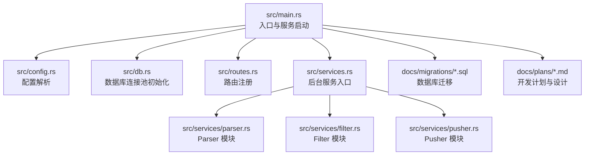
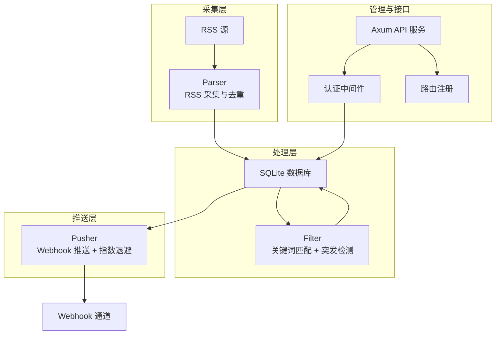
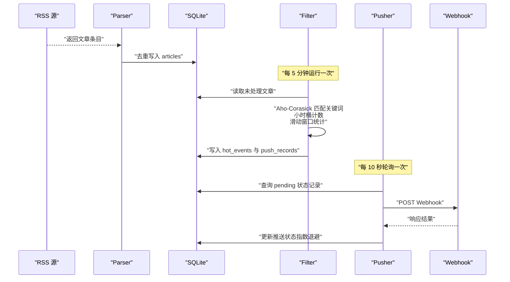
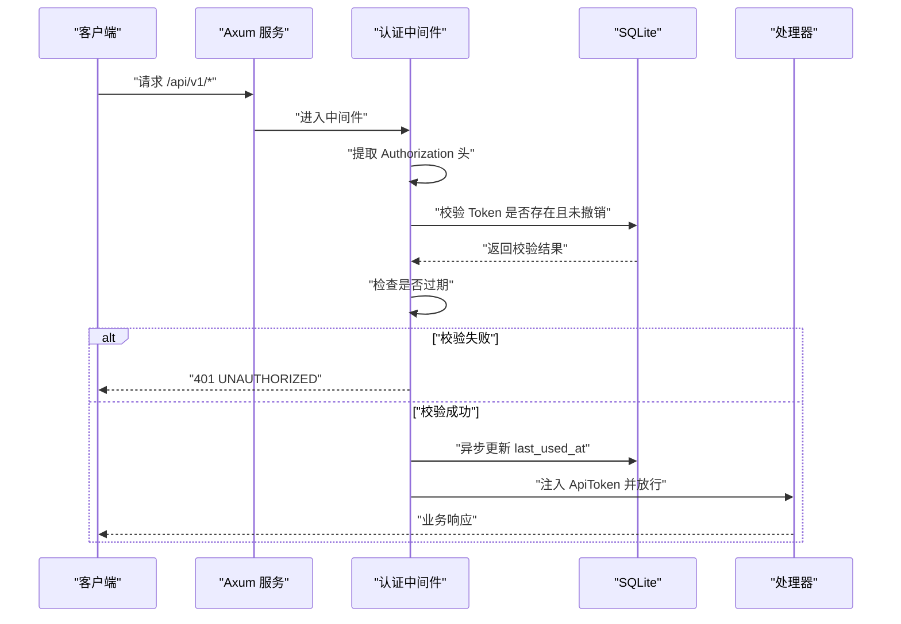
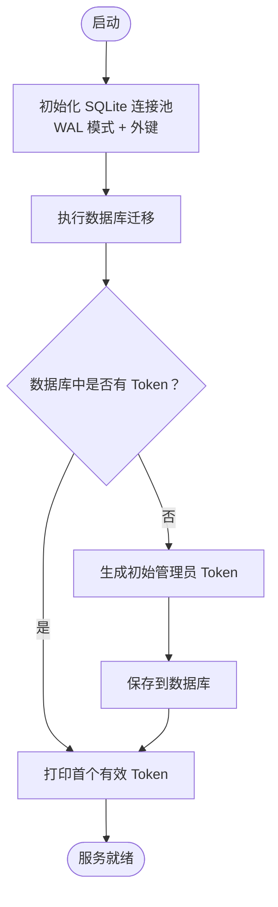
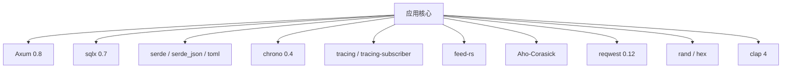

# 项目概述

<cite>
**本文引用的文件**
- [README.md](file://README.md)
- [Cargo.toml](file://Cargo.toml)
- [src/main.rs](file://src/main.rs)
- [src/config.rs](file://src/config.rs)
- [src/db.rs](file://src/db.rs)
- [src/services.rs](file://src/services.rs)
- [docs/plans/05-query-apis-and-background-modules.md](file://docs/plans/05-query-apis-and-background-modules.md)
- [openspec/specs/auth-middleware/spec.md](file://openspec/specs/auth-middleware/spec.md)
- [docs/migrations/20260607044921_init.sql](file://docs/migrations/20260607044921_init.sql)
</cite>

## 目录
1. [引言](#引言)
2. [项目结构](#项目结构)
3. [核心组件](#核心组件)
4. [架构总览](#架构总览)
5. [详细组件分析](#详细组件分析)
6. [依赖分析](#依赖分析)
7. [性能考虑](#性能考虑)
8. [故障排除指南](#故障排除指南)
9. [结论](#结论)
10. [附录](#附录)

## 引言
本项目是一个基于 Rust 的 AI 热点监控系统，旨在通过自动化管道识别 AI 领域的趋势热点并及时推送通知。系统采用“管道模式”，将后台处理拆分为三个独立模块：Parser（RSS 采集）、Filter（关键词匹配与统计突发检测）、Pusher（Webhook 推送）。该设计使得各模块职责清晰、可独立部署与扩展，同时通过 SQLite 存储与 Axum 提供的 REST API 支持管理与查询。

系统的技术选型强调高性能与可靠性：Rust 提供内存安全与零成本抽象；Axum 作为 Web 框架，结合 Tower 中间件生态；SQLite（WAL 模式 + 外键约束）用于轻量级持久化；feed-rs 用于 RSS 内容解析；Aho-Corasick 用于多关键词高效匹配；reqwest 用于 Webhook 推送；配合 chrono、serde、clap、tracing 等生态库，构建出简洁而强大的后端基础设施。

## 项目结构
项目采用模块化组织方式，入口程序负责加载配置、初始化数据库与迁移、确保初始 Token，并启动 API 服务与后台任务。核心目录与职责如下：
- src/main.rs：命令行入口、配置加载、数据库连接池初始化、迁移执行、初始 Token 引导、Axum 服务启动
- src/config.rs：配置结构体定义与 TOML 解析
- src/db.rs：SQLite 连接池初始化（WAL 模式 + 外键）
- src/services.rs：后台服务模块入口（parser/filter/pusher）
- src/handlers/、src/models/、src/middleware/：API 层相关模块
- docs/migrations/：数据库迁移脚本
- docs/plans/：开发计划与后台模块设计文档
- openspec/specs/：规范文档（如认证中间件）

图表来源
- [src/main.rs:63-96](file://src/main.rs#L63-L96)
- [src/config.rs:52-59](file://src/config.rs#L52-L59)
- [src/db.rs:11-26](file://src/db.rs#L11-L26)
- [src/services.rs:1-5](file://src/services.rs#L1-L5)
- [docs/plans/05-query-apis-and-background-modules.md:913-959](file://docs/plans/05-query-apis-and-background-modules.md#L913-L959)

章节来源
- [src/main.rs:63-96](file://src/main.rs#L63-L96)
- [src/config.rs:52-59](file://src/config.rs#L52-L59)
- [src/db.rs:11-26](file://src/db.rs#L11-L26)
- [src/services.rs:1-5](file://src/services.rs#L1-L5)
- [docs/plans/05-query-apis-and-background-modules.md:913-959](file://docs/plans/05-query-apis-and-background-modules.md#L913-L959)

## 核心组件
- 管道模式三大后台模块
  - Parser：按配置周期从 RSS 源抓取内容，去重后写入 articles 表
  - Filter：每 5 分钟运行，使用 Aho-Corasick 匹配关键词，按小时桶统计，结合滑动窗口均值与标准差进行突发检测，生成 hot_events 与待推送记录
  - Pusher：每 10 秒轮询 pending 状态的推送记录，通过 Webhook 推送，采用指数退避重试（最多 3 次），并使用乐观锁避免重复推送
- API 与认证
  - 除健康检查外，所有 /api/v1/* 路由均需 Bearer Token 认证
  - 认证中间件负责提取 Token、数据库校验（非撤销）、过期检查、异步更新 last_used_at，并将完整 Token 注入请求上下文
- 数据库与迁移
  - SQLite（WAL 模式 + 外键约束），首次启动自动执行迁移脚本创建表结构
  - 初始 Token 引导：若数据库中无 Token，则根据配置或自动生成一个管理员 Token 并打印到日志

章节来源
- [README.md:7-24](file://README.md#L7-L24)
- [README.md:273-289](file://README.md#L273-L289)
- [openspec/specs/auth-middleware/spec.md:37-72](file://openspec/specs/auth-middleware/spec.md#L37-L72)
- [src/main.rs:26-61](file://src/main.rs#L26-L61)
- [src/db.rs:18-25](file://src/db.rs#L18-L25)

## 架构总览
系统采用“管道模式”的后台处理架构，Parser、Filter、Pusher 三者通过共享数据库进行解耦协作。API 层提供 REST 接口与认证中间件，管理 Token 与查询热点事件。

图表来源
- [README.md:7-24](file://README.md#L7-L24)
- [src/services.rs:1-5](file://src/services.rs#L1-L5)
- [src/db.rs:11-26](file://src/db.rs#L11-L26)

## 详细组件分析

### 管道模式与模块职责
- Parser
  - 按数据源配置周期抓取 RSS，去重写入 articles 表，支持最大并发抓取数与超时控制
- Filter
  - 固定周期（默认 5 分钟）扫描未处理文章，使用 Aho-Corasick 多模式匹配关键词，按关键词+小时桶统计文章数
  - 使用滑动窗口（默认 24 小时）计算均值与标准差，当当前计数超过 mean + (std_multiplier × stddev) 且达到 min_hot_count 阈值时，判定为热点事件
  - 同一关键词在同一小时内仅生成一条热点事件，避免重复
- Pusher
  - 固定周期（默认 10 秒）轮询 push_records 中 status=pending 或满足重试条件的记录
  - 通过 Webhook 推送，指数退避重试（最多 3 次），乐观锁（WHERE status=? AND retry_count<?）防止并发重复推送

图表来源
- [README.md:17-24](file://README.md#L17-L24)
- [README.md:273-289](file://README.md#L273-L289)
- [docs/plans/05-query-apis-and-background-modules.md:741-959](file://docs/plans/05-query-apis-and-background-modules.md#L741-L959)

章节来源
- [README.md:7-24](file://README.md#L7-L24)
- [README.md:273-289](file://README.md#L273-L289)
- [docs/plans/05-query-apis-and-background-modules.md:741-959](file://docs/plans/05-query-apis-and-background-modules.md#L741-L959)

### 认证中间件与 API 流程
- 认证中间件
  - 提取 Authorization 头中的 Bearer Token，校验是否存在且未撤销，检查是否过期
  - 成功后异步更新 last_used_at，将完整 ApiToken 注入请求扩展，供下游处理器使用
- API 路由
  - 除 /health 外，所有 /api/v1/* 路由受保护
  - 提供 Token 管理相关接口（创建、列出、撤销）

图表来源
- [openspec/specs/auth-middleware/spec.md:17-72](file://openspec/specs/auth-middleware/spec.md#L17-L72)
- [README.md:123-142](file://README.md#L123-L142)

章节来源
- [openspec/specs/auth-middleware/spec.md:17-72](file://openspec/specs/auth-middleware/spec.md#L17-L72)
- [README.md:123-142](file://README.md#L123-L142)

### 数据库与迁移
- 连接池初始化
  - 使用 SQLite，启用 WAL 模式与外键约束，限制最大连接数
- 迁移
  - 首次启动自动执行迁移脚本，创建所有表结构（api_tokens、data_sources、articles、keywords、hot_events、push_channels、push_records）
- 初始 Token 引导
  - 若数据库中无 Token，根据配置或自动生成管理员 Token，并在日志中高亮提示

图表来源
- [src/db.rs:11-26](file://src/db.rs#L11-L26)
- [docs/migrations/20260607044921_init.sql](file://docs/migrations/20260607044921_init.sql)
- [src/main.rs:26-61](file://src/main.rs#L26-L61)

章节来源
- [src/db.rs:11-26](file://src/db.rs#L11-L26)
- [src/main.rs:26-61](file://src/main.rs#L26-L61)

## 依赖分析
- 语言与框架
  - Rust（2021 版）：提供内存安全与高性能
  - Axum 0.8 + Tower：Web 框架与中间件生态
- 数据库与序列化
  - SQLite + sqlx 0.7：轻量级持久化，支持 WAL 与迁移
  - serde / serde_json / toml：结构化数据序列化与配置解析
- 时间与日志
  - chrono 0.4：时间处理
  - tracing / tracing-subscriber：结构化日志
- 文本处理与网络
  - feed-rs：RSS 内容解析
  - Aho-Corasick：多关键词高效匹配
  - reqwest 0.12：HTTP 客户端（Webhook 推送）
- 工具与 CLI
  - rand/hex：随机 Token 生成
  - clap 4：命令行参数解析

图表来源
- [Cargo.toml:6-44](file://Cargo.toml#L6-L44)

章节来源
- [Cargo.toml:6-44](file://Cargo.toml#L6-L44)

## 性能考虑
- Parser
  - 通过最大并发抓取数限制避免对 RSS 源造成过大压力
  - 超时控制减少单次抓取阻塞
- Filter
  - Aho-Corasick 多模式匹配适合大规模关键词集合，降低匹配开销
  - 小时桶统计与滑动窗口均值/标准差计算复杂度低，适合高频批处理
- Pusher
  - 指数退避重试降低对下游 Webhook 服务的压力
  - 乐观锁避免重复推送，减少无效调用
- 数据库
  - WAL 模式提升并发读写性能
  - 外键约束保证数据一致性

## 故障排除指南
- 无法启动或连接数据库
  - 检查数据库路径配置与文件权限
  - 确认迁移脚本已正确执行
- 认证失败
  - 确认请求头 Authorization 使用 Bearer Token 格式
  - 检查 Token 是否存在、未撤销、未过期
  - 查看日志中是否异步更新了 last_used_at
- 推送失败
  - 检查 Webhook 地址与网络连通性
  - 查看重试次数与退避时间，确认乐观锁条件是否满足
- 后台模块未运行
  - 确认启动模式（all/api/parser/filter/pusher）
  - 检查 Tokio 任务是否被意外阻塞

章节来源
- [openspec/specs/auth-middleware/spec.md:17-72](file://openspec/specs/auth-middleware/spec.md#L17-L72)
- [docs/plans/05-query-apis-and-background-modules.md:741-959](file://docs/plans/05-query-apis-and-background-modules.md#L741-L959)

## 结论
本项目以管道模式为核心，将 RSS 采集、关键词匹配与统计突发检测、Webhook 推送三个环节解耦，形成可独立扩展与运维的后台处理流水线。结合 Axum 的 API 能力与 SQLite 的轻量持久化，系统在保证性能的同时具备良好的可维护性与可扩展性。通过合理的配置与重试策略，能够稳定地识别 AI 领域热点并及时通知用户。

## 附录
- 快速开始与配置参考见项目自述文件
- 数据库迁移脚本位于 docs/migrations/
- 开发计划与后台模块设计文档位于 docs/plans/

章节来源
- [README.md:38-122](file://README.md#L38-L122)
- [docs/migrations/20260607044921_init.sql](file://docs/migrations/20260607044921_init.sql)
- [docs/plans/05-query-apis-and-background-modules.md:913-959](file://docs/plans/05-query-apis-and-background-modules.md#L913-L959)